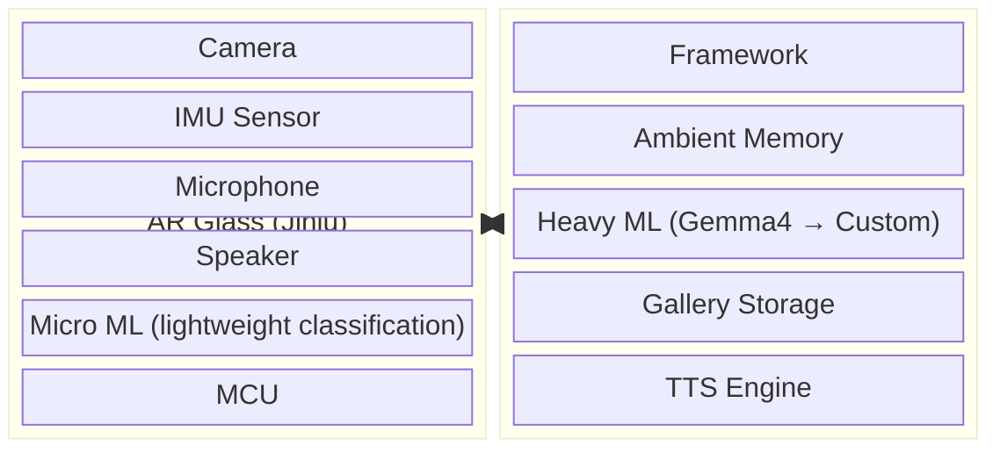
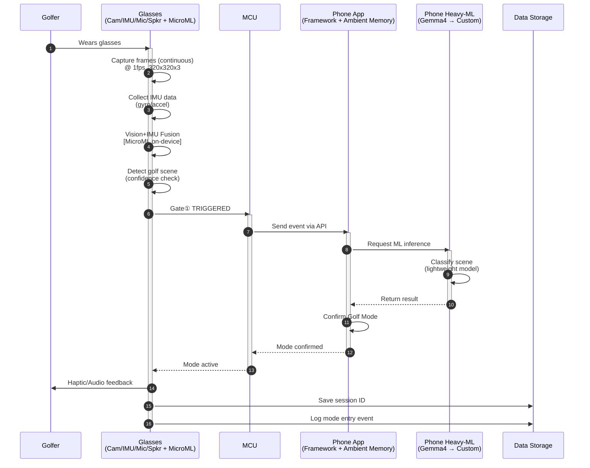
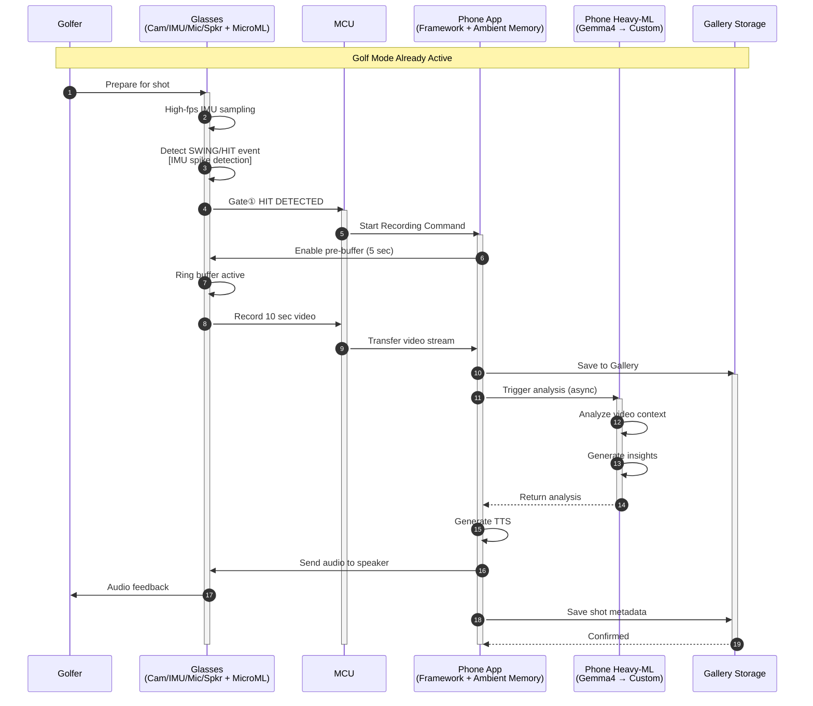
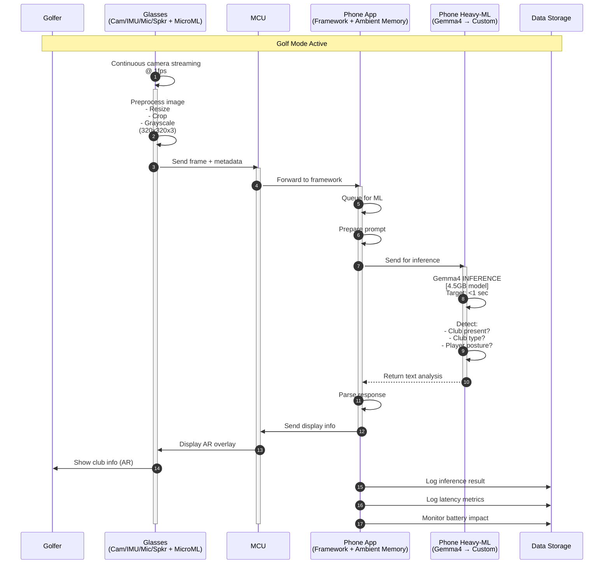
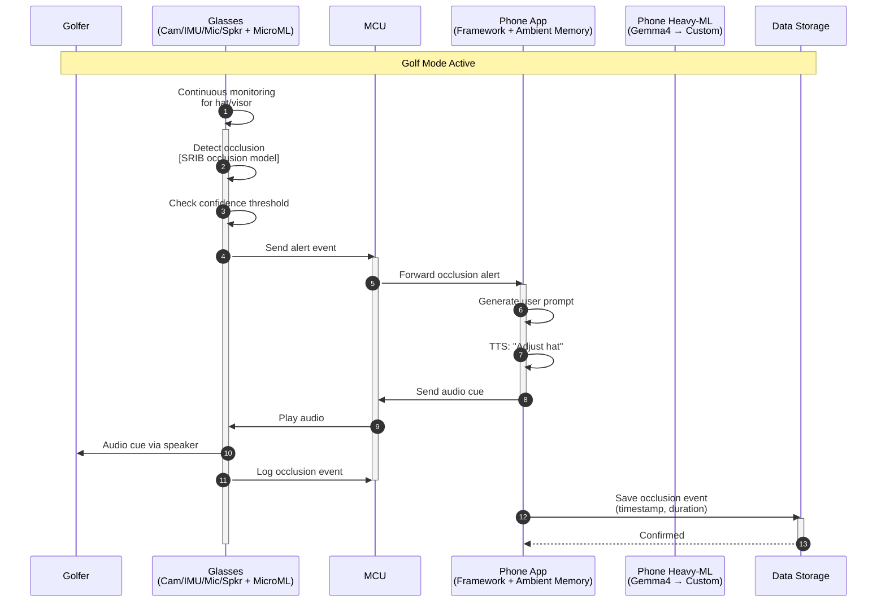
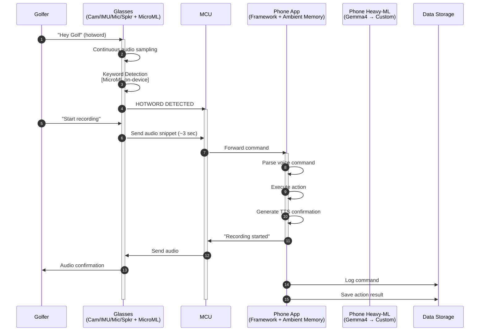
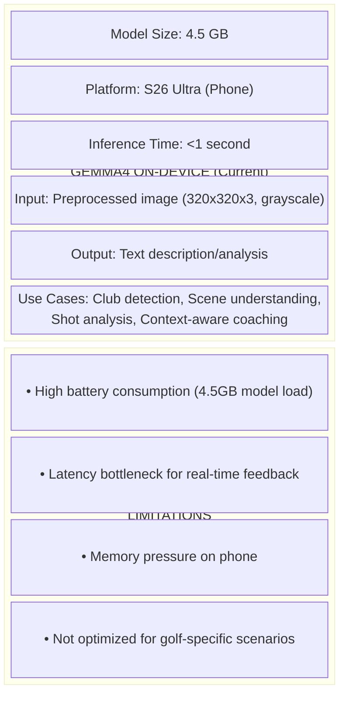
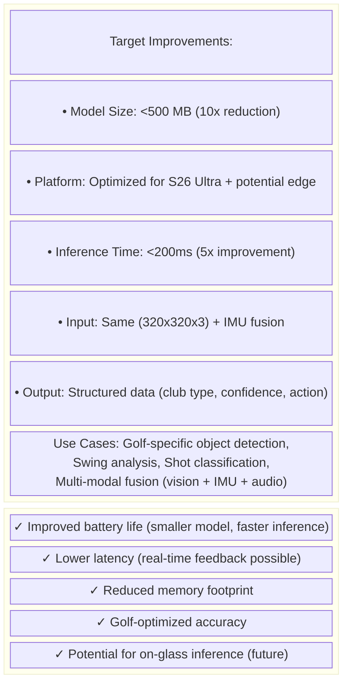
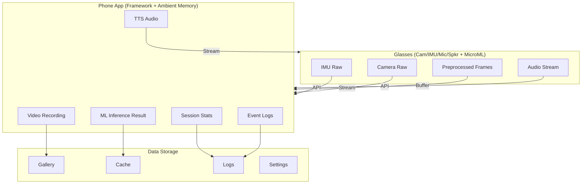

# Golf SDK - AR Glass Scenario Analysis

## Executive Summary

This document analyzes the data flow, sequence diagrams, and ML model triggering for the **Jinju AR Glass** golf application. The system uses **Gemma4** (initially) running on the phone, with plans to replace it with a custom ML model for improved battery life and latency.

---

## System Architecture Overview

---

## Mode Entry Triggers

The system supports **4 mode entry options** before any feature activation:

| # | Method | Trigger | Priority |
|---|--------|---------|----------|
| 1 | **Manual** | PUI (Physical User Interface) or Gesture Input | P1 |
| 2 | **Audio** | Voice Command (Hotword + Request) | P2 |
| 3 | **Auto** | Visual Intelligence + Sensor Fusion | P0 |
| 4 | **Auto** | Audio Intelligence (Keyword Detection + Sounds) | P2 |

---

## P0/P1 CUJs (Complete User Journeys)

Based on the Golf_SDK_CUJ_Tasks.xlsx:

| CUJ | Type | Priority | ML Feasibility Notes |
|-----|------|----------|---------------------|
| **Erase Hat** | On-Round | P0 | Occlusion Detection Model (SRIB) |
| **Start/End Video Recording + Count Shots/Score** | On-Round | P0 | Visual cues (P1) + IMU (P1) + Audio (P2) |
| **Heads-up Live Coaching** | On-Round | P1 | Human Posture Detection |
| **Live Approach Strategy** | On-Round | P1 | Scene Understanding |
| **Warm-up Tips** | Pre-Round | P1 | Activity Recognition |

---

# SCENARIO 1: Golf Mode Entry (Auto - Visual + IMU)

## Sequence Diagram

## Data Analysis for Scenario 1

| Data Type | Generated | Shared | Saved | Retention |
|-----------|-----------|--------|-------|-----------|
| IMU Raw Data | ✓ (continuous) | → Phone API | ✗ | Volatile (buffer only) |
| Camera Frames | ✓ (1fps) | → Phone API | ✗ | Volatile (preprocessing only) |
| Vision+IMU Fusion Result | ✓ | Internal | ✗ | Volatile |
| Gate Trigger Event | ✓ | → MCU → Phone | ✓ | Session log |
| ML Classification Result | ✓ (on phone) | → App | ✓ | Session log |
| Mode State | ✓ | Internal | ✓ | Until mode exit |
| Session ID | ✓ | Internal | ✓ | Until session end |

---

# SCENARIO 2: Hit Detection & Auto Video Recording

## Sequence Diagram

## Data Analysis for Scenario 2

| Data Type | Generated | Shared | Saved | Retention |
|-----------|-----------|--------|-------|-----------|
| IMU Hit Detection | ✓ | → Phone | ✗ | Volatile |
| Pre-buffer Video | ✓ (ring) | → Phone | ✗ | 5 sec overwrite |
| **Recorded Video** | ✓ (10 sec) | → Phone | ✓ **Gallery** | Permanent |
| Video Metadata | ✓ | Internal | ✓ | With video file |
| Shot Count | ✓ | Internal | ✓ | Session + Persistent |
| Gemma4 Analysis | ✓ | Internal | ✓ | Session cache |
| TTS Audio Stream | ✓ | → Glasses | ✗ | Streamed only |
| Session Statistics | ✓ | Internal | ✓ | Persistent |

---

# SCENARIO 3: Club Detection (Gemma4 ML Triggering)

## Sequence Diagram

## Data Analysis for Scenario 3

| Data Type | Generated | Shared | Saved | Retention |
|-----------|-----------|--------|-------|-----------|
| Raw Camera Frame | ✓ | → Phone | ✗ | Volatile |
| Preprocessed Image | ✓ | Internal | ✗ | Processing buffer |
| ML Prompt | ✓ | Internal | ✗ | Temporary |
| **Gemma4 Response** | ✓ | Internal | ✓ | Session cache |
| Club Detection | ✓ | → App UI | ✓ | Shot log |
| Inference Metrics | ✓ | Internal | ✓ | Performance log |
| Battery Stats | ✓ | Internal | ✓ | Session monitoring |

---

# SCENARIO 4: Occlusion Detection (Erase Hat - P0)

## Sequence Diagram

## Data Analysis for Scenario 4

| Data Type | Generated | Shared | Saved | Retention |
|-----------|-----------|--------|-------|-----------|
| Occlusion Detection | ✓ | → Phone | ✓ | Session log |
| Confidence Score | ✓ | Internal | ✓ | Event log |
| User Prompt | ✓ | → TTS | ✗ | Temporary |
| TTS Audio | ✓ | → Glasses | ✗ | Streamed |
| **Occlusion Events** | ✓ | Internal | ✓ | Session report |

---

# SCENARIO 5: Audio Trigger (Voice Command)

## Sequence Diagram

## Data Analysis for Scenario 5

| Data Type | Generated | Shared | Saved | Retention |
|-----------|-----------|--------|-------|-----------|
| Audio Stream | ✓ (continuous) | → Phone | ✗ | Volatile buffer |
| Hotword Event | ✓ | → Phone | ✓ | Event log |
| Audio Snippet | ✓ (~3 sec) | → Phone | ✗ | Processing only |
| Parsed Command | ✓ | Internal | ✓ | Session log |
| Action Result | ✓ | Internal | ✓ | Session log |
| TTS Confirmation | ✓ | → Glasses | ✗ | Streamed |

---

# ML Model Strategy: Gemma4 → Custom Model

## Current Implementation (Gemma4)

## Future Implementation (Custom Model)

## ML Model Comparison

| Aspect | Gemma4 (Current) | Custom Model (Target) |
|--------|------------------|----------------------|
| **Size** | 4.5 GB | <500 MB |
| **Inference** | <1 sec | <200 ms |
| **Battery Impact** | High | Low |
| **Accuracy (Golf)** | General | Optimized |
| **Output Format** | Text | Structured |
| **Multi-modal** | Vision only | Vision + IMU + Audio |
| **Deployment** | Phone only | Phone + Edge |

---

# Data Flow Summary

## Data Types and Destinations

## Data Flow Matrix

| Data Type | Generated | Shared | Saved | Where |
|-----------|-----------|--------|-------|-------|
| IMU Raw | Glasses | → Phone API | ✗ | Buffer |
| Camera Raw | Glasses | → Phone | ✗ | Stream |
| Camera Preprocessed | Glasses | → Phone | ✗ | Buffer |
| Video Recording | Glasses | → Phone | ✓ | Gallery |
| Audio Stream | Glasses | → Phone | ✗ | Buffer |
| ML Inference Result | Phone | → App | ✓ | Cache |
| TTS Audio | Phone | → Glasses | ✗ | Stream |
| Session Stats | Phone | Internal | ✓ | Storage |
| Event Logs | Both | → Phone | ✓ | Logs |
| User Preferences | Phone | Internal | ✓ | Settings |

## Privacy & Security Considerations

| Data Category | Sensitivity | Encryption | User Control |
|---------------|-------------|------------|--------------|
| Video Recordings | High | ✓ (at rest) | Delete/Export |
| Audio Recordings | High | ✓ (in transit) | Delete/Export |
| IMU Data | Low | ✓ (in transit) | Session only |
| ML Results | Medium | ✓ (at rest) | Delete |
| Session Logs | Medium | ✓ (at rest) | Auto-purge |
| User Preferences | Low | ✓ (at rest) | Edit/Delete |

---

# Appendix: Timing Constraints

| Operation | Target | Current (Gemma4) | Target (Custom) |
|-----------|--------|------------------|-----------------|
| Mode Detection | <5 sec | ~5 sec | <2 sec |
| Hit Detection | <100 ms | ~50 ms | ~30 ms |
| Video Start | <500 ms | ~300 ms | ~200 ms |
| ML Inference | <1 sec | ~800 ms | <200 ms |
| TTS Response | <2 sec | ~1.5 sec | <1 sec |
| End-to-End Shot Analysis | <3 sec | ~2.5 sec | <1 sec |

---

# Document Information

- **Created**: June 16, 2026
- **Author**: ML Team Analysis
- **Version**: 2.0 (Mermaid Format)
- **Status**: Draft - For Review
- **Related Documents**:
  - Golf_SDK_CUJ_Tasks.xlsx
  - 0528_XRUXLab_Golf_CUJs.pdf
  - Golf-UI-Flow.pdf
  - golf-ideation.txt (Slack transcript)
  - 42.jpg (Architecture Diagram)

---

*Note: This document is based on available project documentation and the 42.jpg architecture diagram. Some details may require validation with the development team.*
