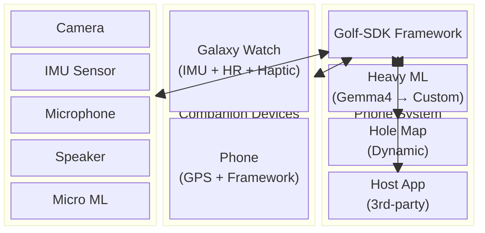
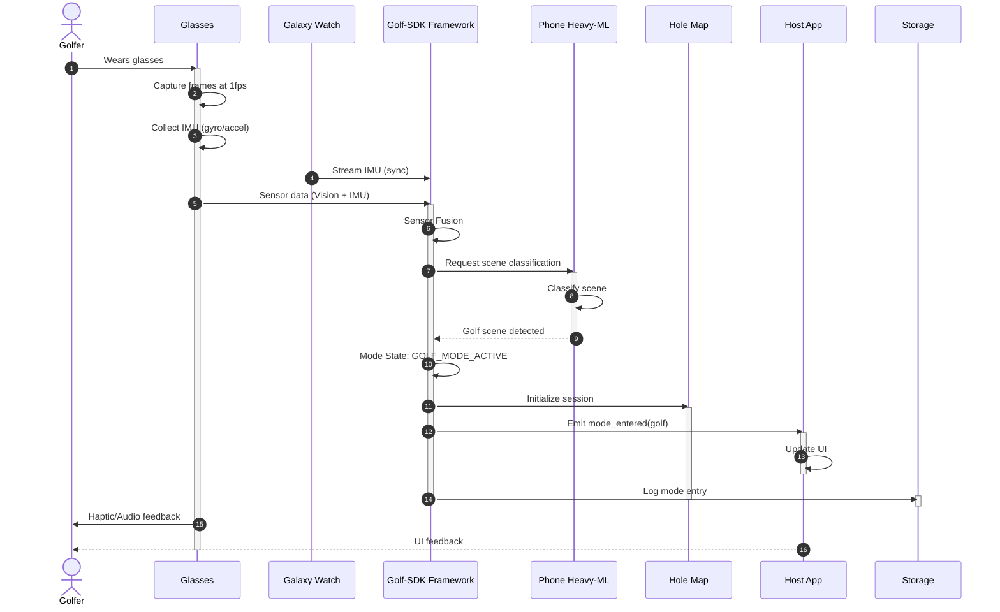
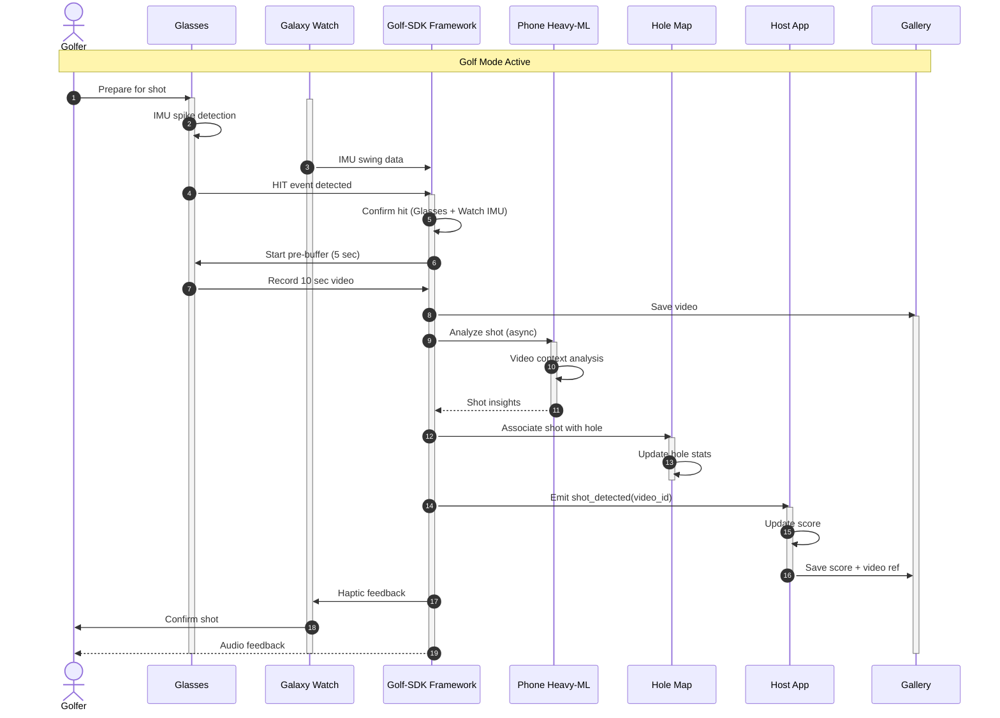
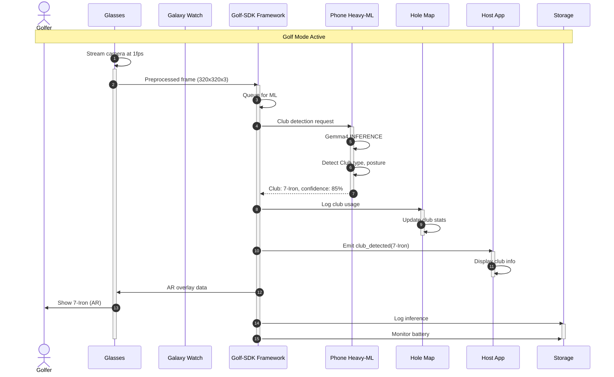
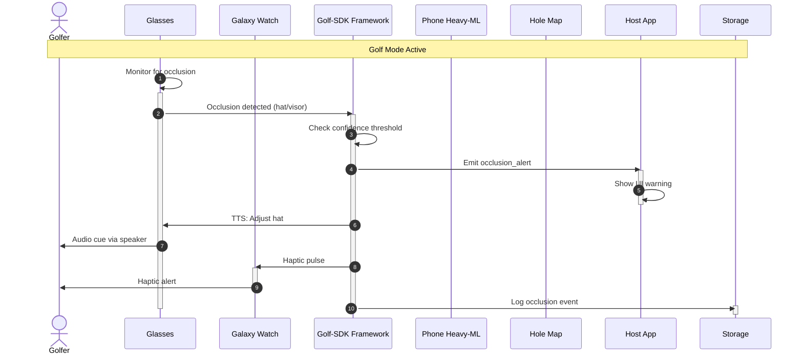
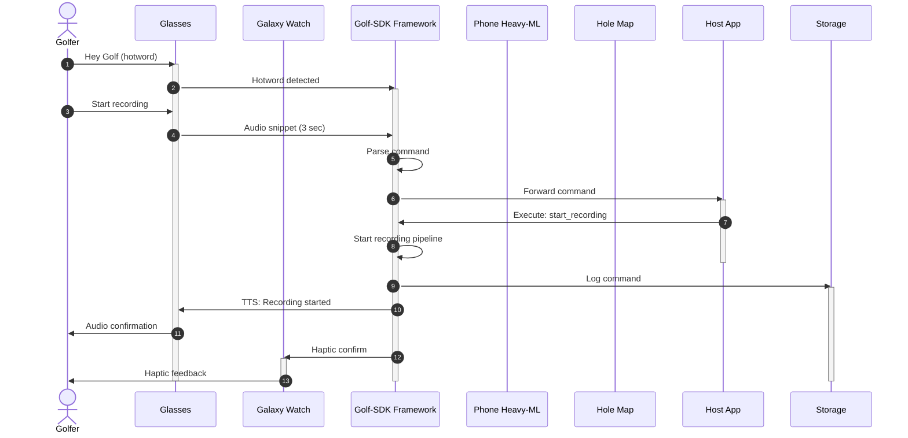
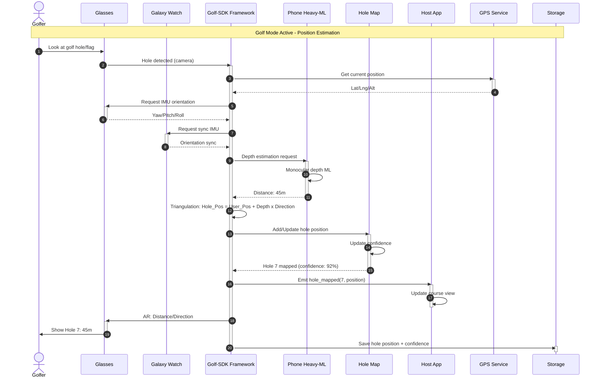

# Golf SDK - AR Glass Scenario Analysis (V5)

## Executive Summary

This document analyzes the data flow, sequence diagrams, and ML model triggering for the **Jinju AR Glass** golf application with the **Golf-SDK Framework** architecture. The system uses **Gemma4** (initially) running on the phone, with plans to replace it with a custom ML model for improved battery life and latency.

**V5 Updates:**
- Fixed all Mermaid sequence diagram activate/deactivate errors
- Added **Golf-SDK Framework** as central orchestrator
- Added **Galaxy Watch/Companion** for biometrics and motion
- Added **Golf Course Hole Map** (dynamically generated)
- Added **Host App (3rd-party)** integration model

---

## System Architecture Overview



---

## Core Participants (All Scenarios)

| Participant | Description |
|-------------|-------------|
| `actor Golfer` | End user (stick figure icon) |
| `Glasses` | AR Glass (Cam/IMU/Mic/Spkr + MicroML) |
| `Watch` | Galaxy Watch (IMU + HR + Haptic) |
| `GolfSDK` | Golf-SDK Framework (sensor fusion, mode mgmt, API) |
| `HeavyML` | Phone Heavy-ML (Gemma4 → Custom model) |
| `HoleMap` | Dynamic course map (generated during play) |
| `HostApp` | 3rd-party golf app (SDK consumer) |
| `Storage` | Data storage (Gallery, Cache, Logs) |

---

## Mode Entry Triggers

| # | Method | Trigger | Priority |
|---|--------|---------|----------|
| 1 | **Manual** | PUI or Gesture Input | P1 |
| 2 | **Audio** | Voice Command (Hotword + Request) | P2 |
| 3 | **Auto** | Visual Intelligence + Sensor Fusion | P0 |
| 4 | **Auto** | Audio Intelligence (Keyword Detection) | P2 |

---

# SCENARIO 1: Golf Mode Entry (Auto - Visual + IMU)

## Sequence Diagram



## Data Analysis for Scenario 1

| Data Type | Generated | Shared | Saved | Retention |
|-----------|-----------|--------|-------|-----------|
| IMU Raw (Glasses) | ✓ | → Golf-SDK | ✗ | Volatile |
| IMU Raw (Watch) | ✓ | → Golf-SDK | ✗ | Volatile |
| Camera Frames | ✓ | → Golf-SDK | ✗ | Volatile |
| Fused Sensor Event | ✓ | Internal | ✓ | Session log |
| Mode State | ✓ | → Host App | ✓ | Session |
| Hole Map Session | ✓ | Internal | ✓ | Session |

---

# SCENARIO 2: Hit Detection & Auto Video Recording

## Sequence Diagram



## Data Analysis for Scenario 2

| Data Type | Generated | Shared | Saved | Retention |
|-----------|-----------|--------|-------|-----------|
| IMU Hit (Glasses) | ✓ | → Golf-SDK | ✗ | Volatile |
| IMU Swing (Watch) | ✓ | → Golf-SDK | ✓ | Session analytics |
| **Recorded Video** | ✓ | → Golf-SDK | ✓ **Gallery** | Permanent |
| Shot Event | ✓ | → Host App | ✓ | Session + Persistent |
| Hole Stats | ✓ | Internal | ✓ | Persistent |
| Score Update | ✓ | → Host App | ✓ | Persistent |

---

# SCENARIO 3: Club Detection (Gemma4 ML Triggering)

## Sequence Diagram



## Data Analysis for Scenario 3

| Data Type | Generated | Shared | Saved | Retention |
|-----------|-----------|--------|-------|-----------|
| Camera Frame | ✓ | → Golf-SDK | ✗ | Volatile |
| Club Detection | ✓ | → Host App | ✓ | Shot log |
| Gemma4 Response | ✓ | Internal | ✓ | Session cache |
| Club Usage Stats | ✓ | → Hole Map | ✓ | Persistent |
| Inference Metrics | ✓ | Internal | ✓ | Performance log |

---

# SCENARIO 4: Occlusion Detection (Erase Hat - P0)

## Sequence Diagram



## Data Analysis for Scenario 4

| Data Type | Generated | Shared | Saved | Retention |
|-----------|-----------|--------|-------|-----------|
| Occlusion Event | ✓ | → Host App | ✓ | Session log |
| Confidence Score | ✓ | Internal | ✓ | Event log |
| TTS Audio | ✓ | → Glasses | ✗ | Streamed |
| Haptic Pattern | ✓ | → Watch | ✗ | Streamed |

---

# SCENARIO 5: Audio Trigger (Voice Command)

## Sequence Diagram



## Data Analysis for Scenario 5

| Data Type | Generated | Shared | Saved | Retention |
|-----------|-----------|--------|-------|-----------|
| Audio Stream | ✓ | → Golf-SDK | ✗ | Volatile |
| Hotword Event | ✓ | → Golf-SDK | ✓ | Event log |
| Parsed Command | ✓ | → Host App | ✓ | Session log |
| Command Result | ✓ | Internal | ✓ | Session log |

---

# SCENARIO 6: Whole Position Estimation (Hole Localization)

## Sequence Diagram



## Data Analysis for Scenario 6

| Data Type | Generated | Shared | Saved | Retention |
|-----------|-----------|--------|-------|-----------|
| Camera Frame | ✓ | → Golf-SDK | ✗ | Processing |
| User GPS | ✓ (Phone) | → Golf-SDK | ✓ | Session + Cache |
| IMU Orientation | ✓ | → Golf-SDK | ✗ | Processing |
| Depth Estimate (ML) | ✓ | Internal | ✓ | Per-hole cache |
| **Hole GPS Coordinates** | ✓ (calculated) | → Host App | ✓ | **Persistent Map** |
| Confidence Score | ✓ | → Hole Map | ✓ | With hole data |

## ML Model Requirements for Depth Estimation

| Factor | Description |
|--------|-------------|
| **Input** | Camera image (320x320x3) |
| **Output** | Distance to hole (meters) |
| **Model Type** | Monocular Depth Estimation |
| **Target Accuracy** | ±2 meters @ 50m range |
| **Inference Time** | <100ms |

## Position Calculation Algorithm

```
Given:
  • User_GPS = (lat_user, lng_user, alt_user)
  • Depth = d (meters from ML model)
  • Orientation = (yaw, pitch, roll) from IMU

Calculate:
  1. Convert User_GPS to ECEF
  2. Create direction vector from orientation
  3. Hole_ECEF = User_ECEF + d × direction_vector
  4. Convert Hole_ECEF back to GPS

Refinement:
  • Multiple observations (Kalman filter)
  • Confidence weighted averaging
```

---

# ML Model Strategy: Gemma4 → Custom Model

| Aspect | Gemma4 (Current) | Custom Model (Target) |
|--------|------------------|----------------------|
| **Size** | 4.5 GB | <500 MB |
| **Inference** | <1 sec | <200 ms |
| **Battery Impact** | High | Low |
| **Accuracy (Golf)** | General | Optimized |
| **Output Format** | Text | Structured |
| **Multi-modal** | Vision only | Vision + IMU + Audio |

---

# Data Flow Summary

## Data Flow Matrix

| Data Type | Generated | Shared | Saved | Where |
|-----------|-----------|--------|-------|-------|
| IMU Raw (Glasses) | Glasses | → Golf-SDK | ✗ | Buffer |
| IMU Raw (Watch) | Watch | → Golf-SDK | ✗ | Buffer |
| Camera Raw | Glasses | → Golf-SDK | ✗ | Stream |
| Video Recording | Glasses | → Golf-SDK | ✓ | Gallery |
| Fused Events | Golf-SDK | → Host App | ✓ | Logs |
| ML Inference | Heavy-ML | → Golf-SDK | ✓ | Cache |
| Hole Positions | Golf-SDK | → Hole Map | ✓ | Persistent |
| Shot Events | Golf-SDK | → Host App | ✓ | Session |

## Privacy & Security Considerations

| Data Category | Sensitivity | Encryption | User Control |
|---------------|-------------|------------|--------------|
| Video Recordings | High | ✓ (at rest) | Delete/Export |
| GPS Data | High | ✓ (in transit) | Session only |
| IMU Data | Low | ✓ (in transit) | Session only |
| ML Results | Medium | ✓ (at rest) | Delete |
| Hole Map | Low | ✓ (at rest) | Auto-purge |

---

# Appendix: Timing Constraints

| Operation | Target | Current (Gemma4) | Target (Custom) |
|-----------|--------|------------------|-----------------|
| Mode Detection | <5 sec | ~5 sec | <2 sec |
| Hit Detection | <100 ms | ~50 ms | ~30 ms |
| ML Inference | <1 sec | ~800 ms | <200 ms |
| Hole Position | <2 sec | ~1.5 sec | <500 ms |

---

# Document Information

- **Created**: June 16, 2026
- **Author**: ML Team Analysis
- **Version**: 4.0 (With Golf-SDK Framework Architecture)
- **Status**: Draft - For Review
- **Related Documents**:
  - Golf_SDK_CUJ_Tasks.xlsx
  - 0528_XRUXLab_Golf_CUJs.pdf
  - Golf-UI-Flow.pdf
  - golf-ideation.txt
  - 42.jpg (Architecture Diagram)
  - Sequence_Diagram_Column_Suggestions.md

---

*Note: This document is based on available project documentation and the 42.jpg architecture diagram. Some details may require validation with the development team.*
