# Golf-SDK Architecture Documentation

## Executive Summary

Golf-SDK is a comprehensive software development kit designed for Samsung's **Jinju AR Glasses** - a displayless AR glass with a single camera that serves as a phone accessory. The SDK enables intelligent golf activity tracking through multi-modal sensor fusion, on-device ML inference, and seamless glass-to-phone communication.

---

## 1. System Overview Architecture

```mermaid
flowchart TB
    subgraph "Jinju AR Glasses"
        subgraph "Sensors Layer"
            CAM[AR1 Camera<br/>12MP Global Shutter]
            IMU[6-Axis IMU<br/>200Hz+]
            MIC[MEMS Microphone<br/>Acoustic Transient Detection]
        end
        
        subgraph "Low-Power ASP Chip"
            AMB[Ambient Sensing Module<br/>Always-On]
            LP_CAM[Low-Power Camera<br/>1 FPS 320x320]
            MICRO_ML[Micro ML Models<br/>TFLite Micro]
            OCCLUSION[Occlusion Detection<br/>MobileNet-V2/YOLO-Nano]
            SIMPLE_CLASS[Simple Classification<br/>Human/Ball Detection]
        end
        
        subgraph "Main Application Processor"
            AP_ML[Heavy ML Processing]
            VIDEO_ENC[H.265 Video Encoder<br/>1080p/30fps]
            SENSOR_FUSION[Sensor Fusion Engine]
        end
        
        CAM --> LP_CAM
        CAM --> VIDEO_ENC
        IMU --> SENSOR_FUSION
        MIC --> SENSOR_FUSION
        LP_CAM --> MICRO_ML
        MICRO_ML --> OCCLUSION
        MICRO_ML --> SIMPLE_CLASS
        AMB --> AP_ML
        SENSOR_FUSION --> AP_ML
    end
    
    subgraph "Companion Phone"
        subgraph "Golf-SDK Core"
            GOLF_MODE[Golf Mode Manager<br/>State Machine]
            SCENE_DETECT[Scene Understanding<br/>GPS + Audio + Time]
            STROKE_COUNTER[Stroke Counter<br/>Analytics Engine]
            VIDEO_RECORDER[Video Recorder Manager]
        end
        
        subgraph "ML Inference Engine"
            GEMMA4[Gemma4 VLM<br/>Visual Context Understanding]
            CUSTOM_ML[Custom ML Models<br/>Hit Detection, Club Detection]
            SWING_ANALYSIS[Swing Analysis Model<br/>Tempo, Posture, Arc]
        end
        
        subgraph "Phone Sensors"
            GPS[GPS Module<br/>Course Positioning]
            PHONE_IMU[Phone IMU]
            PHONE_MIC[Phone Microphone]
        end
        
        subgraph "Data Services"
            CIRCULAR_BUF[Circular Pre-Buffer<br/>5-10 sec RAM]
            GALLERY[Gallery Storage<br/>Hole_X_Stroke_N.mp4]
            ANALYTICS[Analytics Database<br/>Strokes Gained, History]
        end
        
        GPS --> SCENE_DETECT
        PHONE_IMU --> SENSOR_FUSION
        PHONE_MIC --> SENSOR_FUSION
    end
    
    subgraph "Cloud Services"
        CLOUD_AI[Heavy AI Model<br/>Session-Level Analysis]
        COACH_PORTAL[Coach Portal<br/>Pattern Analysis]
        PLAYER_HISTORY[Player History DB]
    end
    
    subgraph "External Devices"
        WATCH[Samsung Watch7<br/>IMU + Mic Streaming]
        CLUB_SENSORS[BLE Club Sensors<br/>RFID/Grip Tags]
    end
    
    %% Cross-device Communication
    AMB -.UDP Stream.-> GOLF_MODE
    VIDEO_ENC -.WiFi/BLE.-> VIDEO_RECORDER
    SENSOR_FUSION -.Timestamped Data.-> GOLF_MODE
    WATCH -.IMU/Audio Stream.-> SENSOR_FUSION
    CLUB_SENSORS -.BLE Broadcast.-> CUSTOM_ML
    AP_ML -.Upload Session.-> CLOUD_AI
    GOLF_MODE -.Query Capabilities.-> WATCH
    
    style GOLF_MODE fill:#f96,stroke:#333,stroke-width:2px
    style AMB fill:#9f9,stroke:#333,stroke-width:2px
    style GEMMA4 fill:#69f,stroke:#333,stroke-width:2px
    style CLOUD_AI fill:#96f,stroke:#333,stroke-width:2px
```

---

## 2. Component Architecture Diagram

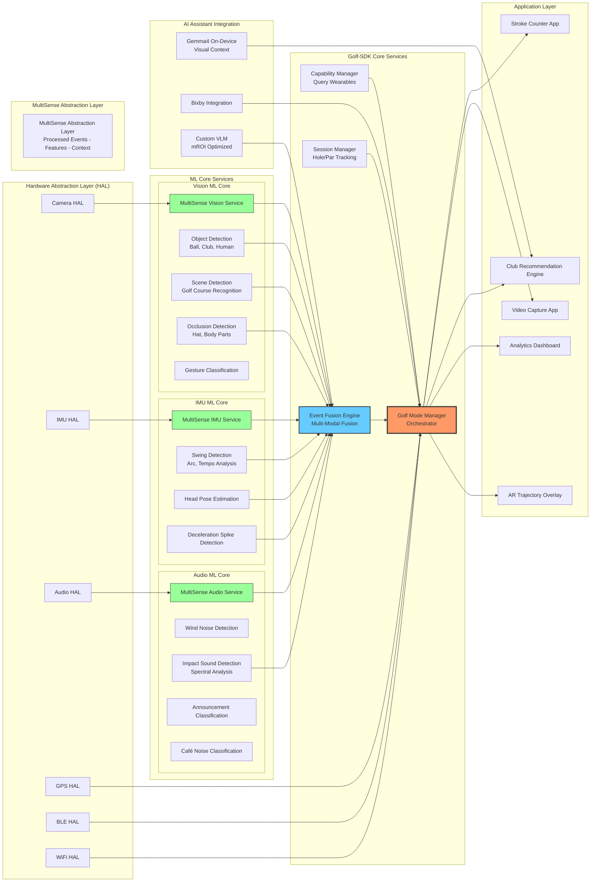
```mermaid
flowchart LR
    subgraph "Hardware Abstraction Layer (HAL)"
        CAM_HAL[Camera HAL]
        IMU_HAL[IMU HAL]
        MIC_HAL[Audio HAL]
        GPS_HAL[GPS HAL]
        BLE_HAL[BLE HAL]
        WIFI_HAL[WiFi HAL]
    end
    
    subgraph "MultiSense Abstraction Layer"
        MSAL[MultiSense Abstraction Layer<br/>Processed Events - Features - Context]
    end
    
    subgraph "ML Core Services"
        subgraph "Vision ML Core"
            MULTI_VISION[MultiSense Vision Service]
            OBJ_DETECT[Object Detection<br/>Ball, Club, Human]
            SCENE_DETECT_V[Scene Detection<br/>Golf Course Recognition]
            OCCLUSION_DET[Occlusion Detection<br/>Hat, Body Parts]
            GESTURE_CLASS[Gesture Classification]
        end
        
        subgraph "Audio ML Core"
            MULTI_AUDIO[MultiSense Audio Service]
            WIND_NOISE[Wind Noise Detection]
            IMPACT_SOUND[Impact Sound Detection<br/>Spectral Analysis]
            ANNOUNCE_PA[Announcement Classification]
            CAFE_NOISE[Café Noise Classification]
        end
        
        subgraph "IMU ML Core"
            MULTI_IMU[MultiSense IMU Service]
            SWING_DETECT[Swing Detection<br/>Arc, Tempo Analysis]
            HEADPOSE[Head Pose Estimation]
            DECELERATION[Deceleration Spike Detection]
        end
    end
    
    subgraph "Golf-SDK Core Services"
        GOLF_MODE_MGR[Golf Mode Manager<br/>Orchestrator]
        CAPABILITY_MGR[Capability Manager<br/>Query Wearables]
        EVENT_FUSION[Event Fusion Engine<br/>Multi-Modal Fusion]
        SESSION_MGR[Session Manager<br/>Hole/Par Tracking]
    end
    
    subgraph "Application Layer"
        STROKE_APP[Stroke Counter App]
        VIDEO_APP[Video Capture App]
        CLUB_RECOMMEND[Club Recommendation Engine]
        ANALYTICS_APP[Analytics Dashboard]
        AR_OVERLAY[AR Trajectory Overlay]
    end
    
    subgraph "AI Assistant Integration"
        GEMMA4_LOCAL[Gemma4 On-Device<br/>Visual Context]
        BIXBY[Bixby Integration]
        CUSTOM_VLM[Custom VLM<br/>mROI Optimized]
    end
    
    %% HAL to MultiSense
    CAM_HAL --> MULTI_VISION
    IMU_HAL --> MULTI_IMU
    MIC_HAL --> MULTI_AUDIO
    GPS_HAL --> GOLF_MODE_MGR
    BLE_HAL --> GOLF_MODE_MGR
    WIFI_HAL --> GOLF_MODE_MGR
    
    %% MultiSense to Golf-SDK
    MULTI_VISION --> EVENT_FUSION
    MULTI_AUDIO --> EVENT_FUSION
    MULTI_IMU --> EVENT_FUSION
    OBJ_DETECT --> EVENT_FUSION
    SCENE_DETECT_V --> EVENT_FUSION
    OCCLUSION_DET --> EVENT_FUSION
    IMPACT_SOUND --> EVENT_FUSION
    SWING_DETECT --> EVENT_FUSION
    HEADPOSE --> EVENT_FUSION
    DECELERATION --> EVENT_FUSION
    
    %% Golf-SDK to Applications
    EVENT_FUSION --> GOLF_MODE_MGR
    GOLF_MODE_MGR --> STROKE_APP
    GOLF_MODE_MGR --> VIDEO_APP
    GOLF_MODE_MGR --> CLUB_RECOMMEND
    GOLF_MODE_MGR --> ANALYTICS_APP
    GOLF_MODE_MGR --> AR_OVERLAY
    CAPABILITY_MGR --> GOLF_MODE_MGR
    SESSION_MGR --> GOLF_MODE_MGR
    
    %% AI Integration
    GEMMA4_LOCAL --> CLUB_RECOMMEND
    BIXBY --> GOLF_MODE_MGR
    CUSTOM_VLM --> EVENT_FUSION
    
    style GOLF_MODE_MGR fill:#f96,stroke:#333,stroke-width:3px
    style EVENT_FUSION fill:#6cf,stroke:#333,stroke-width:2px
    style MULTI_VISION fill:#9f9,stroke:#333
    style MULTI_AUDIO fill:#9f9,stroke:#333
    style MULTI_IMU fill:#9f9,stroke:#333
```

---

## 3. ML Model Deployment Architecture

```mermaid
flowchart TB
    subgraph "Jinju Glasses - ASP Chip (Low Power)"
        subgraph "Vision Models"
            MBNET[MobileNet-V2<br/>Occlusion Detection]
            YOLO_NANO[YOLO-Nano<br/>Object Detection]
            HAND_KEYPOINT[Hand Keypoint Detector<br/>Custom ML-Kit]
        end
        
        subgraph "Audio Models"
            KWS[Keyword Spotting<br/>Hotword Detection]
            IMPACT_CLASS[Impact Sound Classifier<br/>Spectral Features]
        end
        
        subgraph "IMU Models"
            SWING_SEG[Golf Swing Segmentation<br/>Single IMU ML]
            ACTIVITY_CLASS[Activity Classifier<br/>Idle/Swing/Follow-through]
        end
        
        MBNET --> OCCLUSION_OUT[Occlusion Mask]
        YOLO_NANO --> OBJ_OUT[Ball/Club/Human Detection]
        HAND_KEYPOINT --> GESTURE_OUT[Gesture Recognition]
        KWS --> HOTWORD_OUT[Hotword Detected]
        IMPACT_CLASS --> IMPACT_OUT[Impact Confidence]
        SWING_SEG --> PHASE_OUT[Swing Phase]
        ACTIVITY_CLASS --> MOTION_OUT[Motion State]
    end
    
    subgraph "Jinju Glasses - Main AP"
        subgraph "Heavy Vision Models"
            DEPTH_EST[Depth Estimation<br/>Stereo Pair]
            3D_BBOX[3D Bounding Box<br/>Player Tracking]
            SILHOUETTE[Club Silhouette Recognition]
        end
        
        DEPTH_EST --> DEPTH_OUT[3D Occlusion Zones]
        3D_BBOX --> TRACK_OUT[Player Position]
        SILHOUETTE --> CLUB_VIS[Visual Club ID]
    end
    
    subgraph "Companion Phone - On-Device"
        subgraph "Gemma4 VLM"
            GEMMA4[Gemma4 Model<br/>Visual Context Understanding]
            VISUAL_QA[Visual QA Engine]
            CONTEXT_ANALYSIS[Context Analysis]
        end
        
        subgraph "Custom ML Models"
            HIT_DETECT[Hit Detection Model<br/>Sensor Fusion]
            CLUB_CLASS[Club Classification<br/>IMU Signature + BLE]
            SWING_PLANE[Swing Plane Model<br/>AR Trajectory]
            TEMPO_ANALYSIS[Tempo Analysis<br/>Backswing/Downswing Ratio]
        end
        
        subgraph "Fusion Models"
            MULTI_MODAL[Multi-Modal Fusion<br/>Vision + IMU + Audio]
            CONFIDENCE_FUSION[Confidence Fusion<br/>Weighted Scoring]
        end
        
        GEMMA4 --> CLUB_REC[Club Recommendation]
        VISUAL_QA --> SCENE_UNDERSTAND[Scene Understanding]
        HIT_DETECT --> HIT_EVENT[Hit Confirmed Event]
        CLUB_CLASS --> CLUB_ID[Club Identity]
        SWING_PLANE --> AR_TRAJ[AR Trajectory Path]
        TEMPO_ANALYSIS --> TEMPO_FB[Tempo Feedback]
        MULTI_MODAL --> FUSION_EVENT[Fused Event]
    end
    
    subgraph "Cloud Services"
        HEAVY_AI[Heavy AI Model<br/>Session Analysis]
        PATTERN_ML[Pattern Recognition ML<br/>Long-term Trends]
        COACHING_AI[Coaching Notes Generator<br/>Personalized Tips]
    end
    
    %% Data Flow
    OCCLUSION_OUT -.Stream on Demand.-> MULTI_MODAL
    OBJ_OUT -.Stream on Demand.-> MULTI_MODAL
    IMPACT_OUT --> CONFIDENCE_FUSION
    PHASE_OUT --> CONFIDENCE_FUSION
    MOTION_OUT --> CONFIDENCE_FUSION
    DEPTH_OUT -.Heavy Processing.-> MULTI_MODAL
    CLUB_VIS --> CLUB_CLASS
    FUSION_EVENT --> HIT_DETECT
    CONFIDENCE_FUSION --> HIT_DETECT
    CLUB_ID --> CLUB_REC
    AR_TRAJ --> AR_OVERLAY
    TEMPO_FB --> HAPTIC[Haptic Feedback]
    FUSION_EVENT -.Upload.-> HEAVY_AI
    HEAVY_AI --> PATTERN_ML
    PATTERN_ML --> COACHING_AI
    
    style GEMMA4 fill:#69f,stroke:#333,stroke-width:2px
    style HIT_DETECT fill:#f96,stroke:#333,stroke-width:2px
    style HEAVY_AI fill:#96f,stroke:#333
    style MBNET fill:#9f9,stroke:#333
    style KWS fill:#9f9,stroke:#333
```

---

## 4. Data Flow Architecture

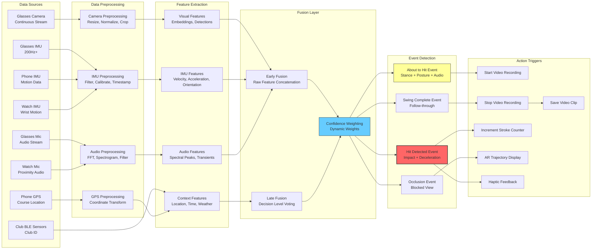
```mermaid
flowchart LR
    subgraph "Data Sources"
        GLASSES_CAM[Glasses Camera<br/>Continuous Stream]
        GLASSES_IMU[Glasses IMU<br/>200Hz+]
        GLASSES_MIC[Glasses Mic<br/>Audio Stream]
        PHONE_GPS[Phone GPS<br/>Course Location]
        PHONE_IMU[Phone IMU<br/>Motion Data]
        WATCH_IMU[Watch IMU<br/>Wrist Motion]
        WATCH_MIC[Watch Mic<br/>Proximity Audio]
        CLUB_BLE[Club BLE Sensors<br/>Club ID]
    end
    
    subgraph "Data Preprocessing"
        CAM_PREPROC[Camera Preprocessing<br/>Resize, Normalize, Crop]
        IMU_PREPROC[IMU Preprocessing<br/>Filter, Calibrate, Timestamp]
        AUDIO_PREPROC[Audio Preprocessing<br/>FFT, Spectrogram, Filter]
        GPS_PREPROC[GPS Preprocessing<br/>Coordinate Transform]
    end
    
    subgraph "Feature Extraction"
        VISUAL_FEAT[Visual Features<br/>Embeddings, Detections]
        IMU_FEAT[IMU Features<br/>Velocity, Acceleration, Orientation]
        AUDIO_FEAT[Audio Features<br/>Spectral Peaks, Transients]
        CONTEXT_FEAT[Context Features<br/>Location, Time, Weather]
    end
    
    subgraph "Fusion Layer"
        EARLY_FUSION[Early Fusion<br/>Raw Feature Concatenation]
        LATE_FUSION[Late Fusion<br/>Decision Level Voting]
        CONFIDENCE_WEIGHT[Confidence Weighting<br/>Dynamic Weights]
    end
    
    subgraph "Event Detection"
        ABOUT_TO_HIT[About to Hit Event<br/>Stance + Posture + Audio]
        HIT_DETECTED[Hit Detected Event<br/>Impact + Deceleration]
        SWING_COMPLETE[Swing Complete Event<br/>Follow-through]
        OCCLUSION_EVENT[Occlusion Event<br/>Blocked View]
    end
    
    subgraph "Action Triggers"
        START_RECORD[Start Video Recording]
        STOP_RECORD[Stop Video Recording]
        INCREMENT_STROKE[Increment Stroke Counter]
        SAVE_CLIP[Save Video Clip]
        AR_FEEDBACK[AR Trajectory Display]
        HAPTIC_FB[Haptic Feedback]
    end
    
    GLASSES_CAM --> CAM_PREPROC
    GLASSES_IMU --> IMU_PREPROC
    GLASSES_MIC --> AUDIO_PREPROC
    PHONE_GPS --> GPS_PREPROC
    PHONE_IMU --> IMU_PREPROC
    WATCH_IMU --> IMU_PREPROC
    WATCH_MIC --> AUDIO_PREPROC
    CLUB_BLE --> CONTEXT_FEAT
    
    CAM_PREPROC --> VISUAL_FEAT
    IMU_PREPROC --> IMU_FEAT
    AUDIO_PREPROC --> AUDIO_FEAT
    GPS_PREPROC --> CONTEXT_FEAT
    
    VISUAL_FEAT --> EARLY_FUSION
    IMU_FEAT --> EARLY_FUSION
    AUDIO_FEAT --> EARLY_FUSION
    CONTEXT_FEAT --> LATE_FUSION
    
    EARLY_FUSION --> CONFIDENCE_WEIGHT
    LATE_FUSION --> CONFIDENCE_WEIGHT
    
    CONFIDENCE_WEIGHT --> ABOUT_TO_HIT
    CONFIDENCE_WEIGHT --> HIT_DETECTED
    CONFIDENCE_WEIGHT --> SWING_COMPLETE
    CONFIDENCE_WEIGHT --> OCCLUSION_EVENT
    
    ABOUT_TO_HIT --> START_RECORD
    HIT_DETECTED --> INCREMENT_STROKE
    SWING_COMPLETE --> STOP_RECORD
    STOP_RECORD --> SAVE_CLIP
    OCCLUSION_EVENT --> AR_FEEDBACK
    HIT_DETECTED --> HAPTIC_FB
    
    style HIT_DETECTED fill:#f66,stroke:#333,stroke-width:2px
    style ABOUT_TO_HIT fill:#ff9,stroke:#333
    style CONFIDENCE_WEIGHT fill:#6cf,stroke:#333
```

---

## 5. State Machine / Transition Diagram

```mermaid
stateDiagram-v2
    [*] --> IDLE: System Boot
    
    state IDLE {
        [*] --> LOW_POWER: ASP Active
        LOW_POWER --> AMBIENT_SENSING: Always-On Mode
        AMBIENT_SENSING --> EVENT_DETECTION: Motion/Sound Detected
        EVENT_DETECTION --> WAKE_REQUEST: Significant Event
    }
    
    IDLE --> SCENE_EVALUATION: Wake Request Received
    SCENE_EVALUATION --> GOLF_MODE_ENTRY: Golf Scene Detected
    SCENE_EVALUATION --> IDLE: Non-Golf Scene
    
    state GOLF_MODE_ENTRY {
        [*] --> ENTRY_TRIGGER
        ENTRY_TRIGGER --> MANUAL_ENTRY: Voice/Gesture Input
        ENTRY_TRIGGER --> AUTO_VISUAL: Visual Intelligence
        ENTRY_TRIGGER --> AUTO_AUDIO: Audio Intelligence
        ENTRY_TRIGGER --> AUTO_SENSOR: Sensor Fusion GPS + IMU
    }
    
    GOLF_MODE_ENTRY --> GOLF_MODE_ACTIVE: All Devices Connected
    
    state GOLF_MODE_ACTIVE {
        [*] --> SESSION_INIT: Initialize Hole/Par
        SESSION_INIT --> SENSOR_STREAMING: Start All Sensors
        SENSOR_STREAMING --> WAITING_FOR_SWING: Monitoring
        
        state WAITING_FOR_SWING {
            [*] --> MONITORING
            MONITORING --> STANCE_DETECTED: Vision Club+Ball+Posture
            STANCE_DETECTED --> PRE_SHOT_AUDIO: Audio Pre-shot Sounds
            PRE_SHOT_AUDIO --> IDLE_POSTURE: IMU Address Posture
            IDLE_POSTURE --> ABOUT_TO_HIT_CONFIRMED: Fusion Greater Than Threshold
        }
        
        ABOUT_TO_HIT_CONFIRMED --> PREPARING_RECORD: Buffer Pre-allocated
        PREPARING_RECORD --> RECORDING_PRE_SWING: Start Pre-Buffer
        RECORDING_PRE_SWING --> SWING_INITIATED: IMU Swing Motion
        SWING_INITIATED --> IMPACT_DETECTED: Audio Impact Sound
        IMPACT_DETECTED --> FOLLOW_THROUGH: IMU Follow-through
        FOLLOW_THROUGH --> SWING_COMPLETE: Vision Post-swing Posture
    }
    
    GOLF_MODE_ACTIVE --> SWING_COMPLETE: Swing Sequence
    
    state SWING_COMPLETE {
        [*] --> STOP_RECORDING
        STOP_RECORDING --> COMMIT_VIDEO: Save Pre-buffer + Post
        COMMIT_VIDEO --> INCREMENT_STROKE: Stroke Counter++
        INCREMENT_STROKE --> ANALYZE_SWING: Run Swing Analysis
        ANALYZE_SWING --> GENERATE_FEEDBACK: AR Overlay + Haptic
        GENERATE_FEEDBACK --> UPLOAD_CLOUD: Session Upload Optional
        UPLOAD_CLOUD --> READY_NEXT_STROKE: Loop
    }
    
    SWING_COMPLETE --> GOLF_MODE_ACTIVE: Ready for Next Stroke
    
    GOLF_MODE_ACTIVE --> GOLF_MODE_EXIT: Exit Command
    GOLF_MODE_EXIT --> SESSION_SUMMARY: Generate Summary
    SESSION_SUMMARY --> SAVE_SESSION: Persist Data
    SAVE_SESSION --> IDLE: Return to Low Power
    
    GOLF_MODE_ACTIVE --> PAUSED_STATE: Temporary Pause
    PAUSED_STATE --> GOLF_MODE_ACTIVE: Resume
    PAUSED_STATE --> GOLF_MODE_EXIT: Exit During Pause
    
    state GOLF_MODE_EXIT {
        [*] --> STOP_ALL_SENSORS
        STOP_ALL_SENSORS --> FINALIZE_SESSION
        FINALIZE_SESSION --> DISCONNECT_DEVICES
    }
    
    state PAUSED_STATE {
        [*] --> SENSORS_SUSPENDED
        SENSORS_SUSPENDED --> PERIODIC_CHECK: Heartbeat
        PERIODIC_CHECK --> SENSORS_SUSPENDED: No Activity
        PERIODIC_CHECK --> CHECK_EXIT: Check Exit Condition
        CHECK_EXIT --> GOLF_MODE_EXIT: Exit Requested
        CHECK_EXIT --> SENSORS_SUSPENDED: Continue Paused
    }
    
    note right of IDLE
        Low-power ASP chip active
        Ambient sensing at 1 FPS
        Keyword spotting enabled
    end note
    
    note right of GOLF_MODE_ACTIVE
        All sensors streaming
        ML models active
        Video pre-buffering
        Multi-device sync
    end note
    
    note right of SWING_COMPLETE
        Video encoding H.265
        Analytics computation
        Cloud sync optional
        Haptic feedback
    end note
    
    style GOLF_MODE_ACTIVE fill:#9f9,stroke:#333,stroke-width:3px
    style SWING_COMPLETE fill:#f96,stroke:#333,stroke-width:2px
    style IDLE fill:#ccc,stroke:#333
    style PAUSED_STATE fill:#ff9,stroke:#333
```

---

## 6. State Transition Table

| Current State | Trigger/Condition | Guard Condition | Next State | Actions |
|--------------|-------------------|-----------------|------------|---------|
| IDLE | Wake Request | Event Confidence > Threshold | SCENE_EVALUATION | Wake AP, Enable Sensors |
| SCENE_EVALUATION | Golf Scene Detected | GPS + Vision + Audio Fusion | GOLF_MODE_ENTRY | Load Golf Mode Config |
| SCENE_EVALUATION | Non-Golf Scene | Scene != Golf | IDLE | Return to Sleep |
| GOLF_MODE_ENTRY | All Devices Connected | Capability Discovery Complete | GOLF_MODE_ACTIVE | Initialize Session |
| GOLF_MODE_ACTIVE | Stance Detected | Vision: Club✓ Ball✓ Posture✓ | WAITING_FOR_SWING | Enable Pre-Buffer |
| WAITING_FOR_SWING | About to Hit Confirmed | Fusion Confidence > 0.85 | PREPARING_RECORD | Allocate Buffer Memory |
| PREPARING_RECORD | Swing Initiated | IMU: Angular Velocity Spike | RECORDING_PRE_SWING | Start Circular Buffer |
| RECORDING_PRE_SWING | Impact Detected | Audio: Spectral Peak + IMU Deceleration | IMPACT_DETECTED | Mark Impact Timestamp |
| IMPACT_DETECTED | Follow-through Complete | IMU: Motion Decay Pattern | FOLLOW_THROUGH | Continue Recording |
| FOLLOW_THROUGH | Post-swing Posture | Vision: Follow-through Pose | SWING_COMPLETE | Stop Recording |
| SWING_COMPLETE | Recording Stopped | Video Duration > Min | COMMIT_VIDEO | Encode + Save to Gallery |
| COMMIT_VIDEO | Video Saved | Storage Write Complete | INCREMENT_STROKE | Update Stroke Counter |
| INCREMENT_STROKE | Stroke Logged | Analytics Updated | ANALYZE_SWING | Run Swing Analysis |
| ANALYZE_SWING | Analysis Complete | Metrics Computed | GENERATE_FEEDBACK | Prepare AR Overlay |
| GENERATE_FEEDBACK | Feedback Ready | Haptic + Visual Ready | READY_NEXT_STROKE | Display Feedback |
| READY_NEXT_STROKE | Next Swing Sequence | Mode Active | WAITING_FOR_SWING | Reset Detection |
| GOLF_MODE_ACTIVE | Exit Command | Voice/Gesture/App | GOLF_MODE_EXIT | Begin Shutdown |
| GOLF_MODE_ACTIVE | Timeout | No Activity > 5min | PAUSED | Suspend Sensors |
| PAUSED | Activity Detected | Motion/Sound | GOLF_MODE_ACTIVE | Resume Sensors |
| PAUSED | Exit Command | User Request | GOLF_MODE_EXIT | Shutdown |

---

## 7. Comprehensive Sequence Diagrams

### 7.1 Golf Mode Entry - Auto (Visual + IMU + GPS Fusion)

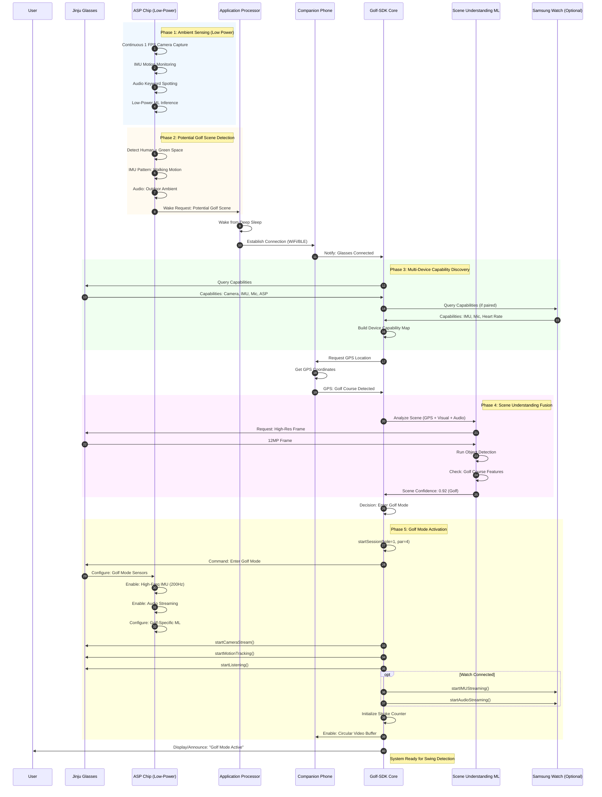
```mermaid
sequenceDiagram
    autonumber
    participant User
    participant Glasses as Jinju Glasses
    participant ASP as ASP Chip (Low-Power)
    participant AP as Application Processor
    participant Phone as Companion Phone
    participant GolfSDK as Golf-SDK Core
    participant SceneML as Scene Understanding ML
    participant Watch as Samsung Watch (Optional)
    
    rect rgb(240, 248, 255)
        note right of ASP: Phase 1: Ambient Sensing (Low Power)
        ASP->>ASP: Continuous 1 FPS Camera Capture
        ASP->>ASP: IMU Motion Monitoring
        ASP->>ASP: Audio Keyword Spotting
        ASP->>ASP: Low-Power ML Inference
    end
    
    rect rgb(255, 250, 240)
        note right of ASP: Phase 2: Potential Golf Scene Detection
        ASP->>ASP: Detect Human + Green Space
        ASP->>ASP: IMU Pattern: Walking Motion
        ASP->>ASP: Audio: Outdoor Ambient
        ASP->>AP: Wake Request: Potential Golf Scene
    end
    
    AP->>AP: Wake from Deep Sleep
    AP->>Phone: Establish Connection (WiFi/BLE)
    Phone->>GolfSDK: Notify: Glasses Connected
    
    rect rgb(240, 255, 240)
        note right of GolfSDK: Phase 3: Multi-Device Capability Discovery
        GolfSDK->>Glasses: Query Capabilities
        Glasses->>GolfSDK: Capabilities: Camera, IMU, Mic, ASP
        GolfSDK->>Watch: Query Capabilities (if paired)
        Watch->>GolfSDK: Capabilities: IMU, Mic, Heart Rate
        GolfSDK->>GolfSDK: Build Device Capability Map
    end
    
    GolfSDK->>Phone: Request GPS Location
    Phone->>Phone: Get GPS Coordinates
    Phone->>GolfSDK: GPS: Golf Course Detected
    
    rect rgb(255, 240, 255)
        note right of SceneML: Phase 4: Scene Understanding Fusion
        GolfSDK->>SceneML: Analyze Scene (GPS + Visual + Audio)
        SceneML->>Glasses: Request: High-Res Frame
        Glasses->>SceneML: 12MP Frame
        SceneML->>SceneML: Run Object Detection
        SceneML->>SceneML: Check: Golf Course Features
        SceneML->>GolfSDK: Scene Confidence: 0.92 (Golf)
    end
    
    GolfSDK->>GolfSDK: Decision: Enter Golf Mode
    
    rect rgb(255, 255, 224)
        note right of GolfSDK: Phase 5: Golf Mode Activation
        GolfSDK->>GolfSDK: startSession(hole=1, par=4)
        GolfSDK->>Glasses: Command: Enter Golf Mode
        Glasses->>ASP: Configure: Golf Mode Sensors
        ASP->>ASP: Enable: High-Freq IMU (200Hz)
        ASP->>ASP: Enable: Audio Streaming
        ASP->>ASP: Configure: Golf-Specific ML
        
        GolfSDK->>Glasses: startCameraStream()
        GolfSDK->>Glasses: startMotionTracking()
        GolfSDK->>Glasses: startListening()
        
        opt Watch Connected
            GolfSDK->>Watch: startIMUStreaming()
            GolfSDK->>Watch: startAudioStreaming()
        end
        
        GolfSDK->>GolfSDK: Initialize Stroke Counter
        GolfSDK->>Phone: Enable: Circular Video Buffer
    end
    
    GolfSDK->>User: Display/Announce: "Golf Mode Active"
    
    note right of GolfSDK: System Ready for Swing Detection
```

---

### 7.2 Golf Mode Entry - Manual (Voice Command)

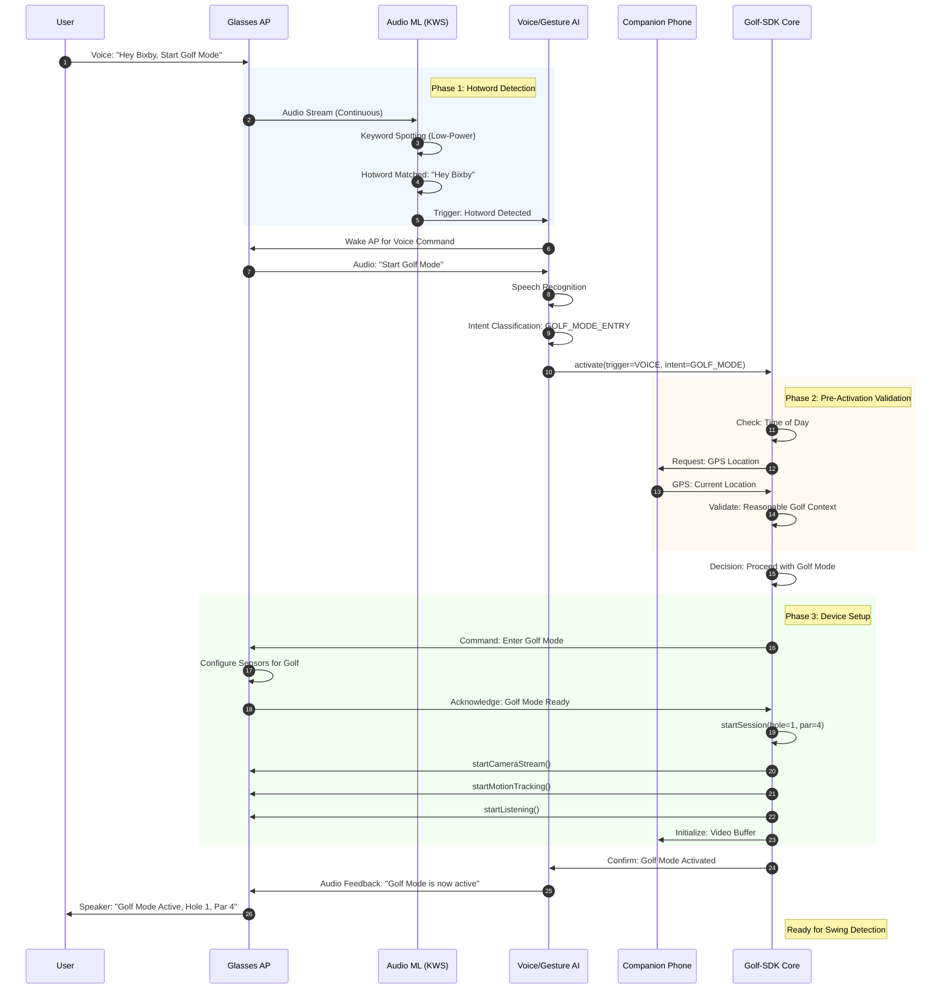
```mermaid
sequenceDiagram
    autonumber
    participant User
    participant Glasses as Jinju Glasses
    participant AudioML as Audio ML (KWS)
    participant VoiceAI as Voice/Gesture AI
    participant Phone as Companion Phone
    participant GolfSDK as Golf-SDK Core
    participant Glasses as Glasses AP
    
    User->>Glasses: Voice: "Hey Bixby, Start Golf Mode"
    
    rect rgb(240, 248, 255)
        note right of AudioML: Phase 1: Hotword Detection
        Glasses->>AudioML: Audio Stream (Continuous)
        AudioML->>AudioML: Keyword Spotting (Low-Power)
        AudioML->>AudioML: Hotword Matched: "Hey Bixby"
        AudioML->>VoiceAI: Trigger: Hotword Detected
    end
    
    VoiceAI->>Glasses: Wake AP for Voice Command
    Glasses->>VoiceAI: Audio: "Start Golf Mode"
    VoiceAI->>VoiceAI: Speech Recognition
    VoiceAI->>VoiceAI: Intent Classification: GOLF_MODE_ENTRY
    VoiceAI->>GolfSDK: activate(trigger=VOICE, intent=GOLF_MODE)
    
    rect rgb(255, 250, 240)
        note right of GolfSDK: Phase 2: Pre-Activation Validation
        GolfSDK->>GolfSDK: Check: Time of Day
        GolfSDK->>Phone: Request: GPS Location
        Phone->>GolfSDK: GPS: Current Location
        GolfSDK->>GolfSDK: Validate: Reasonable Golf Context
    end
    
    GolfSDK->>GolfSDK: Decision: Proceed with Golf Mode
    
    rect rgb(240, 255, 240)
        note right of GolfSDK: Phase 3: Device Setup
        GolfSDK->>Glasses: Command: Enter Golf Mode
        Glasses->>Glasses: Configure Sensors for Golf
        Glasses->>GolfSDK: Acknowledge: Golf Mode Ready
        
        GolfSDK->>GolfSDK: startSession(hole=1, par=4)
        GolfSDK->>Glasses: startCameraStream()
        GolfSDK->>Glasses: startMotionTracking()
        GolfSDK->>Glasses: startListening()
        GolfSDK->>Phone: Initialize: Video Buffer
    end
    
    GolfSDK->>VoiceAI: Confirm: Golf Mode Activated
    VoiceAI->>Glasses: Audio Feedback: "Golf Mode is now active"
    Glasses->>User: Speaker: "Golf Mode Active, Hole 1, Par 4"
    
    note right of GolfSDK: Ready for Swing Detection
```

---

### 7.3 Golf Mode Entry - Gesture (PUI)

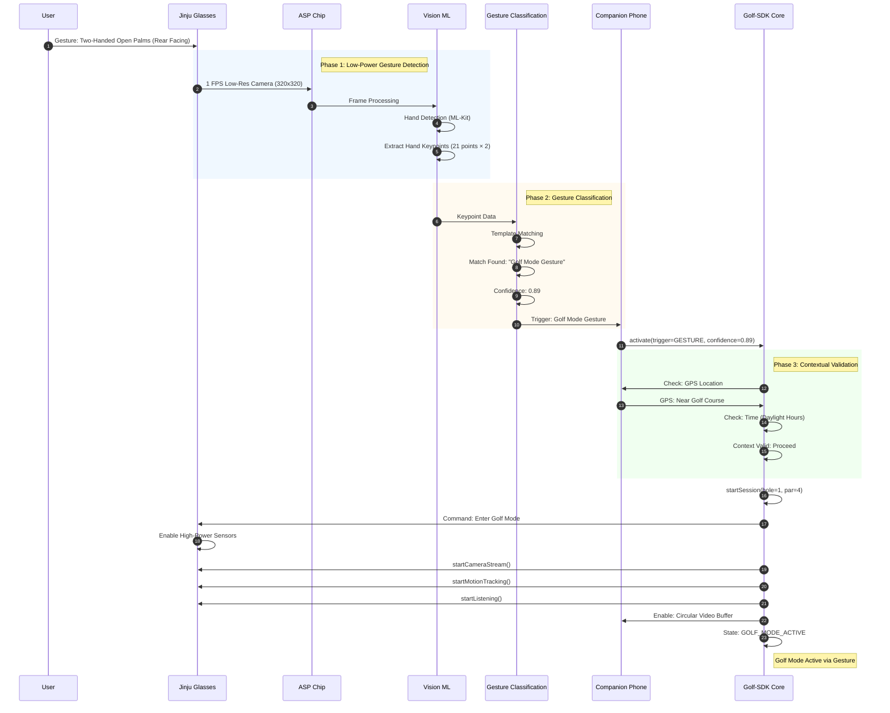
```mermaid
sequenceDiagram
    autonumber
    participant User
    participant Glasses as Jinju Glasses
    participant ASP as ASP Chip
    participant VisionML as Vision ML
    participant GestureML as Gesture Classification
    participant Phone as Companion Phone
    participant GolfSDK as Golf-SDK Core
    
    User->>Glasses: Gesture: Two-Handed Open Palms (Rear Facing)
    
    rect rgb(240, 248, 255)
        note right of ASP: Phase 1: Low-Power Gesture Detection
        Glasses->>ASP: 1 FPS Low-Res Camera (320x320)
        ASP->>VisionML: Frame Processing
        VisionML->>VisionML: Hand Detection (ML-Kit)
        VisionML->>VisionML: Extract Hand Keypoints (21 points × 2)
    end
    
    rect rgb(255, 250, 240)
        note right of GestureML: Phase 2: Gesture Classification
        VisionML->>GestureML: Keypoint Data
        GestureML->>GestureML: Template Matching
        GestureML->>GestureML: Match Found: "Golf Mode Gesture"
        GestureML->>GestureML: Confidence: 0.89
        GestureML->>Phone: Trigger: Golf Mode Gesture
    end
    
    Phone->>GolfSDK: activate(trigger=GESTURE, confidence=0.89)
    
    rect rgb(240, 255, 240)
        note right of GolfSDK: Phase 3: Contextual Validation
        GolfSDK->>Phone: Check: GPS Location
        Phone->>GolfSDK: GPS: Near Golf Course
        GolfSDK->>GolfSDK: Check: Time (Daylight Hours)
        GolfSDK->>GolfSDK: Context Valid: Proceed
    end
    
    GolfSDK->>GolfSDK: startSession(hole=1, par=4)
    GolfSDK->>Glasses: Command: Enter Golf Mode
    Glasses->>Glasses: Enable High-Power Sensors
    GolfSDK->>Glasses: startCameraStream()
    GolfSDK->>Glasses: startMotionTracking()
    GolfSDK->>Glasses: startListening()
    GolfSDK->>Phone: Enable: Circular Video Buffer
    
    GolfSDK->>GolfSDK: State: GOLF_MODE_ACTIVE
    
    note right of GolfSDK: Golf Mode Active via Gesture
```

---

### 7.4 Hit Detection & Auto Video Recording (Complete Flow)

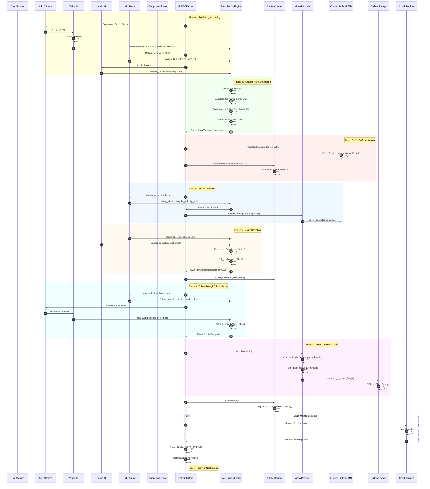
```mermaid
sequenceDiagram
    autonumber
    participant Glasses as Jinju Glasses
    participant AR1Cam as AR1 Camera
    participant VisionAI as Vision AI
    participant AudioAI as Audio AI
    participant IMU as IMU Sensor
    participant Phone as Companion Phone
    participant GolfSDK as Golf-SDK Core
    participant Fusion as Event Fusion Engine
    participant StrokeCounter as Stroke Counter
    participant VideoRec as Video Recorder
    participant CircularBuf as Circular Buffer (RAM)
    participant Gallery as Gallery Storage
    participant Cloud as Cloud Services
    
    rect rgb(255, 255, 224)
        note right of GolfSDK: Phase 1: Pre-Swing Monitoring
        GolfSDK->>AR1Cam: Continuous Frame Stream
        AR1Cam->>VisionAI: Frame @ 30fps
        VisionAI->>VisionAI: Object Detection
        VisionAI->>Fusion: stanceReady(club✓, ball✓, about_to_swing✓)
        
        GolfSDK->>IMU: Motion Tracking @ 200Hz
        IMU->>Fusion: motion=IDLE(address_posture)
        
        GolfSDK->>AudioAI: Audio Stream
        AudioAI->>Fusion: pre-shot_sounds(breathing, rustle)
    end
    
    rect rgb(240, 255, 240)
        note right of Fusion: Phase 2: "About to Hit" Confirmation
        Fusion->>Fusion: Multi-Modal Fusion
        Fusion->>Fusion: Calculate: Combined Confidence
        Fusion->>Fusion: Confidence = 0.91 > Threshold(0.85)
        Fusion->>Fusion: "about_to_hit" CONFIRMED
        Fusion->>GolfSDK: Event: AboutToHit(confidence=0.91)
    end
    
    rect rgb(255, 240, 240)
        note right of CircularBuf: Phase 3: Pre-Buffer Activation
        GolfSDK->>CircularBuf: Allocate: 5-second Rolling Buffer
        CircularBuf->>CircularBuf: Start: Continuous Low-Bitrate Encode
        GolfSDK->>StrokeCounter: beginStroke(hole=1, stroke=N+1)
        StrokeCounter->>StrokeCounter: Increment: stroke_count++
    end
    
    rect rgb(240, 248, 255)
        note right of GolfSDK: Phase 4: Swing Detection
        GolfSDK->>IMU: Monitor: Angular Velocity
        IMU->>Fusion: swing_initiated(angular_velocity_spike)
        Fusion->>GolfSDK: Event: SwingInitiated
        
        GolfSDK->>VideoRec: startRecording(source=glasses)
        VideoRec->>CircularBuf: Lock: Pre-Buffer Contents
    end
    
    rect rgb(255, 250, 240)
        note right of Fusion: Phase 5: Impact Detection
        IMU->>Fusion: deceleration_spike(micro-jolt)
        AudioAI->>Fusion: impact_sound(spectral_crack)
        Fusion->>Fusion: Timestamp Correlation: Δt < 10ms
        Fusion->>Fusion: "hit_confirmed" = TRUE
        Fusion->>GolfSDK: Event: HitDetected(confidence=0.95)
    end
    
    GolfSDK->>StrokeCounter: logHit(timestamp, confidence)
    
    rect rgb(240, 255, 255)
        note right of GolfSDK: Phase 6: Follow-through & Post-Swing
        GolfSDK->>IMU: Monitor: Follow-through Motion
        IMU->>Fusion: follow_through_complete(motion_decay)
        
        GolfSDK->>AR1Cam: Continue Frame Stream
        AR1Cam->>VisionAI: Post-Swing Frames
        VisionAI->>Fusion: post_swing_posture(confirmed)
        
        Fusion->>Fusion: "stroke_ended" CONFIRMED
        Fusion->>GolfSDK: Event: StrokeComplete
    end
    
    rect rgb(255, 240, 255)
        note right of VideoRec: Phase 7: Video Commit & Save
        GolfSDK->>VideoRec: stopRecording()
        VideoRec->>VideoRec: Commit: Pre-buffer + Impact + Post(6s)
        VideoRec->>VideoRec: Encode: H.265 @ 1080p/30fps
        VideoRec->>Gallery: save(hole_1_stroke_5.mp4)
        Gallery->>Gallery: Write to Flash Storage
    end
    
    GolfSDK->>StrokeCounter: completeStroke()
    StrokeCounter->>StrokeCounter: log(info: hit_confidence, trajectory)
    
    opt Cloud Upload Enabled
        GolfSDK->>Cloud: Upload: Session Data
        Cloud->>Cloud: Heavy AI Analysis
        Cloud->>GolfSDK: Return: Coaching Notes
    end
    
    GolfSDK->>GolfSDK: State: READY_NEXT_STROKE
    GolfSDK->>GolfSDK: Reset: Detection Pipeline
    
    note right of GolfSDK: Loop: Ready for Next Stroke
```

---

### 7.5 Club Detection (Gemma4 ML Triggering)

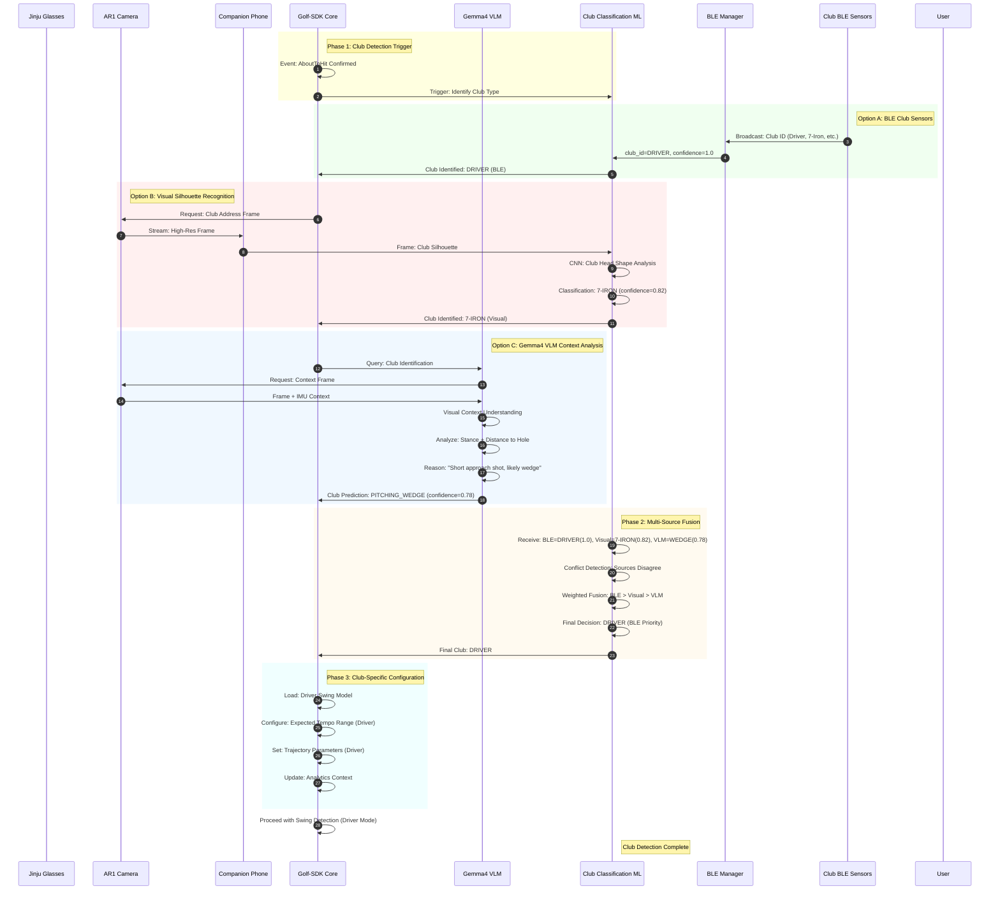
```mermaid
sequenceDiagram
    autonumber
    participant Glasses as Jinju Glasses
    participant AR1Cam as AR1 Camera
    participant Phone as Companion Phone
    participant GolfSDK as Golf-SDK Core
    participant Gemma4 as Gemma4 VLM
    participant ClubML as Club Classification ML
    participant BLE as BLE Manager
    participant ClubSensors as Club BLE Sensors
    participant User as User
    
    rect rgb(255, 255, 224)
        note right of GolfSDK: Phase 1: Club Detection Trigger
        GolfSDK->>GolfSDK: Event: AboutToHit Confirmed
        GolfSDK->>ClubML: Trigger: Identify Club Type
    end
    
    rect rgb(240, 255, 240)
        note right of ClubSensors: Option A: BLE Club Sensors
        ClubSensors->>BLE: Broadcast: Club ID (Driver, 7-Iron, etc.)
        BLE->>ClubML: club_id=DRIVER, confidence=1.0
        ClubML->>GolfSDK: Club Identified: DRIVER (BLE)
    end
    
    rect rgb(255, 240, 240)
        note right of AR1Cam: Option B: Visual Silhouette Recognition
        GolfSDK->>AR1Cam: Request: Club Address Frame
        AR1Cam->>Phone: Stream: High-Res Frame
        Phone->>ClubML: Frame: Club Silhouette
        ClubML->>ClubML: CNN: Club Head Shape Analysis
        ClubML->>ClubML: Classification: 7-IRON (confidence=0.82)
        ClubML->>GolfSDK: Club Identified: 7-IRON (Visual)
    end
    
    rect rgb(240, 248, 255)
        note right of Gemma4: Option C: Gemma4 VLM Context Analysis
        GolfSDK->>Gemma4: Query: Club Identification
        Gemma4->>AR1Cam: Request: Context Frame
        AR1Cam->>Gemma4: Frame + IMU Context
        Gemma4->>Gemma4: Visual Context Understanding
        Gemma4->>Gemma4: Analyze: Stance + Distance to Hole
        Gemma4->>Gemma4: Reason: "Short approach shot, likely wedge"
        Gemma4->>GolfSDK: Club Prediction: PITCHING_WEDGE (confidence=0.78)
    end
    
    rect rgb(255, 250, 240)
        note right of ClubML: Phase 2: Multi-Source Fusion
        ClubML->>ClubML: Receive: BLE=DRIVER(1.0), Visual=7-IRON(0.82), VLM=WEDGE(0.78)
        ClubML->>ClubML: Conflict Detection: Sources Disagree
        ClubML->>ClubML: Weighted Fusion: BLE > Visual > VLM
        ClubML->>ClubML: Final Decision: DRIVER (BLE Priority)
        ClubML->>GolfSDK: Final Club: DRIVER
    end
    
    rect rgb(240, 255, 255)
        note right of GolfSDK: Phase 3: Club-Specific Configuration
        GolfSDK->>GolfSDK: Load: Driver Swing Model
        GolfSDK->>GolfSDK: Configure: Expected Tempo Range (Driver)
        GolfSDK->>GolfSDK: Set: Trajectory Parameters (Driver)
        GolfSDK->>GolfSDK: Update: Analytics Context
    end
    
    GolfSDK->>GolfSDK: Proceed with Swing Detection (Driver Mode)
    
    note right of ClubML: Club Detection Complete
```

---

### 7.6 Occlusion Detection (Erase Hat - P0)

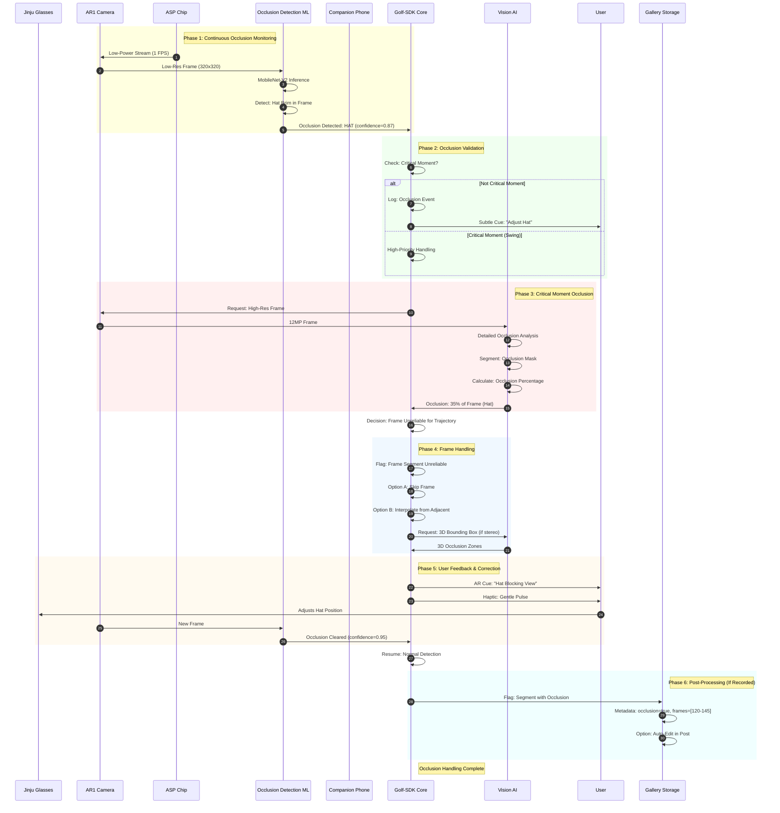
```mermaid
sequenceDiagram
    autonumber
    participant Glasses as Jinju Glasses
    participant AR1Cam as AR1 Camera
    participant ASP as ASP Chip
    participant OcclusionML as Occlusion Detection ML
    participant Phone as Companion Phone
    participant GolfSDK as Golf-SDK Core
    participant VisionAI as Vision AI
    participant User as User
    participant Gallery as Gallery Storage
    
    rect rgb(255, 255, 224)
        note right of ASP: Phase 1: Continuous Occlusion Monitoring
        ASP->>AR1Cam: Low-Power Stream (1 FPS)
        AR1Cam->>OcclusionML: Low-Res Frame (320x320)
        OcclusionML->>OcclusionML: MobileNet-V2 Inference
        OcclusionML->>OcclusionML: Detect: Hat Brim in Frame
        OcclusionML->>GolfSDK: Occlusion Detected: HAT (confidence=0.87)
    end
    
    rect rgb(240, 255, 240)
        note right of GolfSDK: Phase 2: Occlusion Validation
        GolfSDK->>GolfSDK: Check: Critical Moment?
        alt Not Critical Moment
            GolfSDK->>GolfSDK: Log: Occlusion Event
            GolfSDK->>User: Subtle Cue: "Adjust Hat"
        else Critical Moment (Swing)
            GolfSDK->>GolfSDK: High-Priority Handling
        end
    end
    
    rect rgb(255, 240, 240)
        note right of VisionAI: Phase 3: Critical Moment Occlusion
        GolfSDK->>AR1Cam: Request: High-Res Frame
        AR1Cam->>VisionAI: 12MP Frame
        VisionAI->>VisionAI: Detailed Occlusion Analysis
        VisionAI->>VisionAI: Segment: Occlusion Mask
        VisionAI->>VisionAI: Calculate: Occlusion Percentage
        VisionAI->>GolfSDK: Occlusion: 35% of Frame (Hat)
    end
    
    GolfSDK->>GolfSDK: Decision: Frame Unreliable for Trajectory
    
    rect rgb(240, 248, 255)
        note right of GolfSDK: Phase 4: Frame Handling
        GolfSDK->>GolfSDK: Flag: Frame Segment Unreliable
        GolfSDK->>GolfSDK: Option A: Skip Frame
        GolfSDK->>GolfSDK: Option B: Interpolate from Adjacent
        GolfSDK->>VisionAI: Request: 3D Bounding Box (if stereo)
        VisionAI->>GolfSDK: 3D Occlusion Zones
    end
    
    rect rgb(255, 250, 240)
        note right of GolfSDK: Phase 5: User Feedback & Correction
        GolfSDK->>User: AR Cue: "Hat Blocking View"
        GolfSDK->>User: Haptic: Gentle Pulse
        User->>Glasses: Adjusts Hat Position
        AR1Cam->>OcclusionML: New Frame
        OcclusionML->>GolfSDK: Occlusion Cleared (confidence=0.95)
    end
    
    GolfSDK->>GolfSDK: Resume: Normal Detection
    
    rect rgb(240, 255, 255)
        note right of Gallery: Phase 6: Post-Processing (If Recorded)
        GolfSDK->>Gallery: Flag: Segment with Occlusion
        Gallery->>Gallery: Metadata: occlusion=true, frames=[120-145]
        Gallery->>Gallery: Option: Auto-Edit in Post
    end
    
    note right of GolfSDK: Occlusion Handling Complete
```

---

### 7.7 Audio Trigger (Voice Command During Golf Mode)

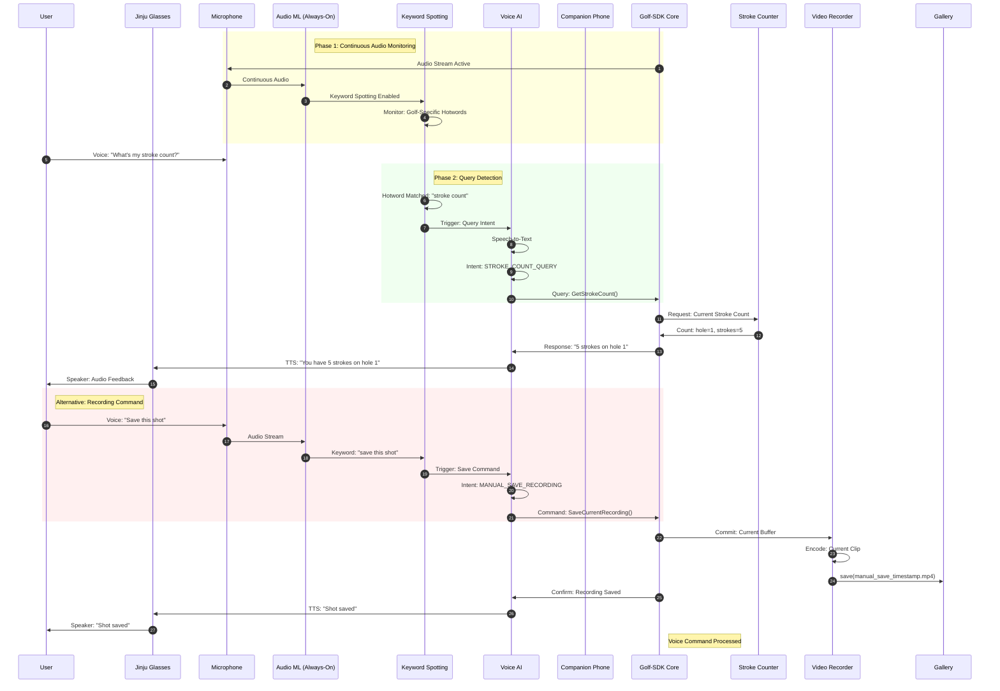
```mermaid
sequenceDiagram
    autonumber
    participant User
    participant Glasses as Jinju Glasses
    participant MIC as Microphone
    participant AudioML as Audio ML (Always-On)
    participant KWS as Keyword Spotting
    participant VoiceAI as Voice AI
    participant Phone as Companion Phone
    participant GolfSDK as Golf-SDK Core
    participant StrokeCounter as Stroke Counter
    participant VideoRec as Video Recorder
    
    rect rgb(255, 255, 224)
        note right of AudioML: Phase 1: Continuous Audio Monitoring
        GolfSDK->>MIC: Audio Stream Active
        MIC->>AudioML: Continuous Audio
        AudioML->>KWS: Keyword Spotting Enabled
        KWS->>KWS: Monitor: Golf-Specific Hotwords
    end
    
    User->>MIC: Voice: "What's my stroke count?"
    
    rect rgb(240, 255, 240)
        note right of KWS: Phase 2: Query Detection
        KWS->>KWS: Hotword Matched: "stroke count"
        KWS->>VoiceAI: Trigger: Query Intent
        VoiceAI->>VoiceAI: Speech-to-Text
        VoiceAI->>VoiceAI: Intent: STROKE_COUNT_QUERY
        VoiceAI->>GolfSDK: Query: GetStrokeCount()
    end
    
    GolfSDK->>StrokeCounter: Request: Current Stroke Count
    StrokeCounter->>GolfSDK: Count: hole=1, strokes=5
    GolfSDK->>VoiceAI: Response: "5 strokes on hole 1"
    VoiceAI->>Glasses: TTS: "You have 5 strokes on hole 1"
    Glasses->>User: Speaker: Audio Feedback
    
    rect rgb(255, 240, 240)
        note right of User: Alternative: Recording Command
        User->>MIC: Voice: "Save this shot"
        MIC->>AudioML: Audio Stream
        AudioML->>KWS: Keyword: "save this shot"
        KWS->>VoiceAI: Trigger: Save Command
        VoiceAI->>VoiceAI: Intent: MANUAL_SAVE_RECORDING
        VoiceAI->>GolfSDK: Command: SaveCurrentRecording()
    end
    
    GolfSDK->>VideoRec: Commit: Current Buffer
    VideoRec->>VideoRec: Encode: Current Clip
    VideoRec->>Gallery: save(manual_save_timestamp.mp4)
    GolfSDK->>VoiceAI: Confirm: Recording Saved
    VoiceAI->>Glasses: TTS: "Shot saved"
    Glasses->>User: Speaker: "Shot saved"
    
    note right of GolfSDK: Voice Command Processed
```

---

### 7.8 Sensor Fusion Architecture (Glasses + Watch + Phone)

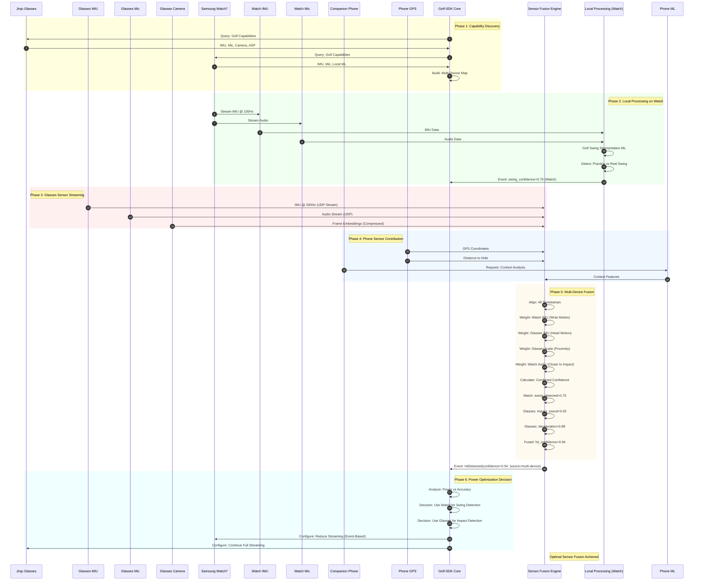
```mermaid
sequenceDiagram
    autonumber
    participant Glasses as Jinju Glasses
    participant G_IMU as Glasses IMU
    participant G_MIC as Glasses Mic
    participant G_CAM as Glasses Camera
    participant Watch as Samsung Watch7
    participant W_IMU as Watch IMU
    participant W_MIC as Watch Mic
    participant Phone as Companion Phone
    participant P_GPS as Phone GPS
    participant GolfSDK as Golf-SDK Core
    participant FusionEngine as Sensor Fusion Engine
    participant LocalML as Local Processing (Watch)
    participant PhoneML as Phone ML
    
    rect rgb(255, 255, 224)
        note right of GolfSDK: Phase 1: Capability Discovery
        GolfSDK->>Glasses: Query: Golf Capabilities
        Glasses->>GolfSDK: IMU, Mic, Camera, ASP
        GolfSDK->>Watch: Query: Golf Capabilities
        Watch->>GolfSDK: IMU, Mic, Local ML
        GolfSDK->>GolfSDK: Build: Multi-Device Map
    end
    
    rect rgb(240, 255, 240)
        note right of LocalML: Phase 2: Local Processing on Watch
        Watch->>W_IMU: Stream IMU @ 100Hz
        Watch->>W_MIC: Stream Audio
        W_IMU->>LocalML: IMU Data
        W_MIC->>LocalML: Audio Data
        LocalML->>LocalML: Golf Swing Segmentation ML
        LocalML->>LocalML: Detect: Practice vs Real Swing
        LocalML->>GolfSDK: Event: swing_confidence=0.75 (Watch)
    end
    
    rect rgb(255, 240, 240)
        note right of Glasses: Phase 3: Glasses Sensor Streaming
        G_IMU->>FusionEngine: IMU @ 200Hz (UDP Stream)
        G_MIC->>FusionEngine: Audio Stream (UDP)
        G_CAM->>FusionEngine: Frame Embeddings (Compressed)
    end
    
    rect rgb(240, 248, 255)
        note right of Phone: Phase 4: Phone Sensor Contribution
        P_GPS->>FusionEngine: GPS Coordinates
        P_GPS->>FusionEngine: Distance to Hole
        Phone->>PhoneML: Request: Context Analysis
        PhoneML->>FusionEngine: Context Features
    end
    
    rect rgb(255, 250, 240)
        note right of FusionEngine: Phase 5: Multi-Device Fusion
        FusionEngine->>FusionEngine: Align: All Timestamps
        FusionEngine->>FusionEngine: Weight: Watch IMU (Wrist Motion)
        FusionEngine->>FusionEngine: Weight: Glasses IMU (Head Motion)
        FusionEngine->>FusionEngine: Weight: Glasses Audio (Proximity)
        FusionEngine->>FusionEngine: Weight: Watch Audio (Closer to Impact)
        
        FusionEngine->>FusionEngine: Calculate: Combined Confidence
        FusionEngine->>FusionEngine: Watch: swing_detected=0.75
        FusionEngine->>FusionEngine: Glasses: impact_sound=0.92
        FusionEngine->>FusionEngine: Glasses: deceleration=0.88
        FusionEngine->>FusionEngine: Fused: hit_confidence=0.94
    end
    
    FusionEngine->>GolfSDK: Event: HitDetected(confidence=0.94, source=multi-device)
    
    rect rgb(240, 255, 255)
        note right of GolfSDK: Phase 6: Power Optimization Decision
        GolfSDK->>GolfSDK: Analyze: Power vs Accuracy
        GolfSDK->>GolfSDK: Decision: Use Watch for Swing Detection
        GolfSDK->>GolfSDK: Decision: Use Glasses for Impact Detection
        GolfSDK->>Watch: Configure: Reduce Streaming (Event-Based)
        GolfSDK->>Glasses: Configure: Continue Full Streaming
    end
    
    note right of FusionEngine: Optimal Sensor Fusion Achieved
```

---

### 7.9 Video Recording Flow (Event-Triggered with Pre-Buffer)

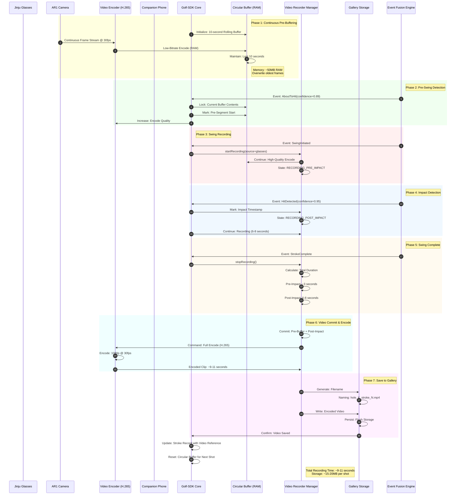
```mermaid
sequenceDiagram
    autonumber
    participant Glasses as Jinju Glasses
    participant AR1Cam as AR1 Camera
    participant VideoEnc as Video Encoder (H.265)
    participant Phone as Companion Phone
    participant GolfSDK as Golf-SDK Core
    participant CircularBuf as Circular Buffer (RAM)
    participant VideoRec as Video Recorder Manager
    participant Gallery as Gallery Storage
    participant FusionEngine as Event Fusion Engine
    
    rect rgb(255, 255, 224)
        note right of CircularBuf: Phase 1: Continuous Pre-Buffering
        GolfSDK->>CircularBuf: Initialize: 10-second Rolling Buffer
        AR1Cam->>VideoEnc: Continuous Frame Stream @ 30fps
        VideoEnc->>CircularBuf: Low-Bitrate Encode (RAM)
        CircularBuf->>CircularBuf: Maintain: Last 10 seconds
        note right of CircularBuf: Memory: ~50MB RAM<br/>Overwrite oldest frames
    end
    
    rect rgb(240, 255, 240)
        note right of FusionEngine: Phase 2: Pre-Swing Detection
        FusionEngine->>GolfSDK: Event: AboutToHit(confidence=0.89)
        GolfSDK->>CircularBuf: Lock: Current Buffer Contents
        GolfSDK->>CircularBuf: Mark: Pre-Segment Start
        GolfSDK->>VideoEnc: Increase: Encode Quality
    end
    
    rect rgb(255, 240, 240)
        note right of GolfSDK: Phase 3: Swing Recording
        FusionEngine->>GolfSDK: Event: SwingInitiated
        GolfSDK->>VideoRec: startRecording(source=glasses)
        VideoRec->>CircularBuf: Continue: High-Quality Encode
        VideoRec->>VideoRec: State: RECORDING_PRE_IMPACT
    end
    
    rect rgb(240, 248, 255)
        note right of FusionEngine: Phase 4: Impact Detection
        FusionEngine->>GolfSDK: Event: HitDetected(confidence=0.95)
        GolfSDK->>VideoRec: Mark: Impact Timestamp
        VideoRec->>VideoRec: State: RECORDING_POST_IMPACT
        GolfSDK->>VideoRec: Continue: Recording (6-8 seconds)
    end
    
    rect rgb(255, 250, 240)
        note right of FusionEngine: Phase 5: Swing Complete
        FusionEngine->>GolfSDK: Event: StrokeComplete
        GolfSDK->>VideoRec: stopRecording()
        VideoRec->>VideoRec: Calculate: Total Duration
        VideoRec->>VideoRec: Pre-Impact: ~3 seconds
        VideoRec->>VideoRec: Post-Impact: 6-8 seconds
    end
    
    rect rgb(240, 255, 255)
        note right of VideoRec: Phase 6: Video Commit & Encode
        VideoRec->>VideoRec: Commit: Pre-Buffer + Post-Impact
        VideoRec->>VideoEnc: Command: Full Encode (H.265)
        VideoEnc->>VideoEnc: Encode: 1080p @ 30fps
        VideoEnc->>VideoRec: Encoded Clip: ~9-11 seconds
    end
    
    rect rgb(255, 240, 255)
        note right of Gallery: Phase 7: Save to Gallery
        VideoRec->>Gallery: Generate: Filename
        Gallery->>Gallery: Naming: hole_X_stroke_N.mp4
        VideoRec->>Gallery: Write: Encoded Video
        Gallery->>Gallery: Persist: Flash Storage
        Gallery->>GolfSDK: Confirm: Video Saved
    end
    
    GolfSDK->>GolfSDK: Update: Stroke Record with Video Reference
    GolfSDK->>GolfSDK: Reset: Circular Buffer for Next Shot
    
    note right of VideoRec: Total Recording Time: ~9-11 seconds<br/>Storage: ~15-20MB per shot
```

---

## 8. Power Management Architecture

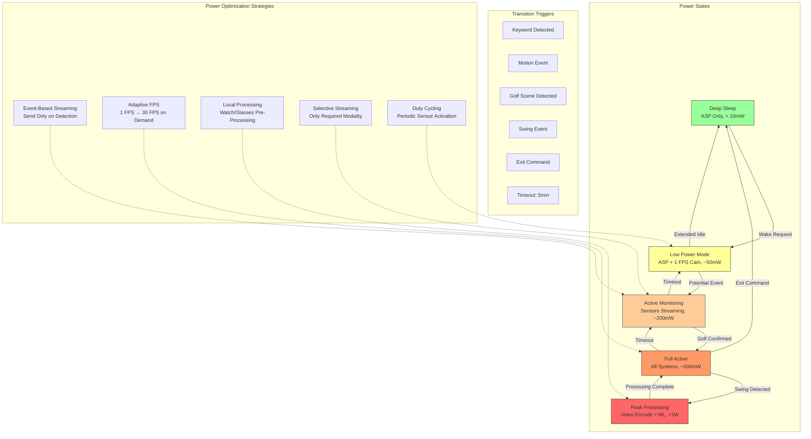
```mermaid
flowchart TB
    subgraph "Power States"
        DEEP_SLEEP[Deep Sleep<br/>ASP Only, < 10mW]
        LOW_POWER[Low Power Mode<br/>ASP + 1 FPS Cam, ~50mW]
        ACTIVE_MONITORING[Active Monitoring<br/>Sensors Streaming, ~200mW]
        FULL_ACTIVE[Full Active<br/>All Systems, ~500mW]
        PEAK_PROCESSING[Peak Processing<br/>Video Encode + ML, >1W]
    end
    
    subgraph "Transition Triggers"
        KEYWORD[Keyword Detected]
        MOTION[Motion Event]
        GOLF_SCENE[Golf Scene Detected]
        SWING_EVENT[Swing Event]
        EXIT_CMD[Exit Command]
        TIMEOUT[Timeout: 5min]
    end
    
    DEEP_SLEEP -->|Wake Request | LOW_POWER
    LOW_POWER -->|Potential Event | ACTIVE_MONITORING
    ACTIVE_MONITORING -->|Golf Confirmed | FULL_ACTIVE
    FULL_ACTIVE -->|Swing Detected | PEAK_PROCESSING
    PEAK_PROCESSING -->|Processing Complete | FULL_ACTIVE
    FULL_ACTIVE -->|Timeout | ACTIVE_MONITORING
    ACTIVE_MONITORING -->|Timeout | LOW_POWER
    LOW_POWER -->|Extended Idle | DEEP_SLEEP
    FULL_ACTIVE -->|Exit Command | DEEP_SLEEP
    
    subgraph "Power Optimization Strategies"
        EVENT_BASED[Event-Based Streaming<br/>Send Only on Detection]
        ADAPTIVE_FPS[Adaptive FPS<br/>1 FPS → 30 FPS on Demand]
        LOCAL_PROCESSING[Local Processing<br/>Watch/Glasses Pre-Processing]
        SELECTIVE_STREAMING[Selective Streaming<br/>Only Required Modality]
        DUTY_CYCLING[Duty Cycling<br/>Periodic Sensor Activation]
    end
    
    EVENT_BASED -.-> ACTIVE_MONITORING
    ADAPTIVE_FPS -.-> FULL_ACTIVE
    LOCAL_PROCESSING -.-> PEAK_PROCESSING
    SELECTIVE_STREAMING -.-> ACTIVE_MONITORING
    DUTY_CYCLING -.-> LOW_POWER
    
    style DEEP_SLEEP fill:#9f9,stroke:#333
    style LOW_POWER fill:#ff9,stroke:#333
    style ACTIVE_MONITORING fill:#fc9,stroke:#333
    style FULL_ACTIVE fill:#f96,stroke:#333
    style PEAK_PROCESSING fill:#f66,stroke:#333
```

---

## 9. API Interface Architecture

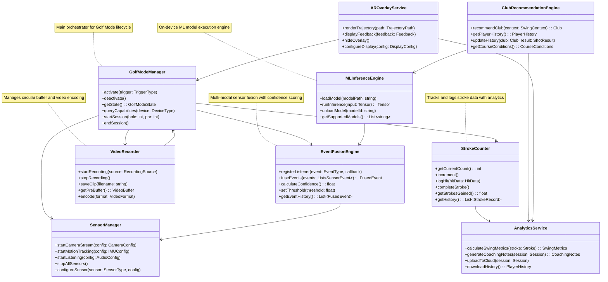
```mermaid
classDiagram
    class GolfModeManager {
        +activate(trigger: TriggerType)
        +deactivate()
        +getState(): GolfModeState
        +queryCapabilities(device: DeviceType)
        +startSession(hole: int, par: int)
        +endSession()
    }
    
    class StrokeCounter {
        +getCurrentCount(): int
        +increment()
        +logHit(hitData: HitData)
        +completeStroke()
        +getStrokesGained(): float
        +getHistory(): List~StrokeRecord~
    }
    
    class VideoRecorder {
        +startRecording(source: RecordingSource)
        +stopRecording()
        +saveClip(filename: string)
        +getPreBuffer(): VideoBuffer
        +encode(format: VideoFormat)
    }
    
    class EventFusionEngine {
        +registerListener(event: EventType, callback)
        +fuseEvents(events: List~SensorEvent~): FusedEvent
        +calculateConfidence(): float
        +setThreshold(threshold: float)
        +getEventHistory(): List~FusedEvent~
    }
    
    class SensorManager {
        +startCameraStream(config: CameraConfig)
        +startMotionTracking(config: IMUConfig)
        +startListening(config: AudioConfig)
        +stopAllSensors()
        +configureSensor(sensor: SensorType, config)
    }
    
    class MLInferenceEngine {
        +loadModel(modelPath: string)
        +runInference(input: Tensor): Tensor
        +unloadModel(modelId: string)
        +getSupportedModels(): List~string~
    }
    
    class ClubRecommendationEngine {
        +recommendClub(context: SwingContext): Club
        +getPlayerHistory(): PlayerHistory
        +updateHistory(club: Club, result: ShotResult)
        +getCourseConditions(): CourseConditions
    }
    
    class AnalyticsService {
        +calculateSwingMetrics(stroke: Stroke): SwingMetrics
        +generateCoachingNotes(session: Session): CoachingNotes
        +uploadToCloud(session: Session)
        +downloadHistory(): PlayerHistory
    }
    
    class AROverlayService {
        +renderTrajectory(path: TrajectoryPath)
        +displayFeedback(feedback: Feedback)
        +hideOverlay()
        +configureDisplay(config: DisplayConfig)
    }
    
    GolfModeManager --> EventFusionEngine
    GolfModeManager --> SensorManager
    GolfModeManager --> StrokeCounter
    GolfModeManager --> VideoRecorder
    EventFusionEngine --> SensorManager
    StrokeCounter --> AnalyticsService
    VideoRecorder --> GolfModeManager
    MLInferenceEngine --> EventFusionEngine
    ClubRecommendationEngine --> MLInferenceEngine
    ClubRecommendationEngine --> AnalyticsService
    AROverlayService --> AnalyticsService
    AROverlayService --> GolfModeManager
    
    note for GolfModeManager "Main orchestrator for Golf Mode lifecycle"
    note for EventFusionEngine "Multi-modal sensor fusion with confidence scoring"
    note for StrokeCounter "Tracks and logs stroke data with analytics"
    note for VideoRecorder "Manages circular buffer and video encoding"
    note for MLInferenceEngine "On-device ML model execution engine"
```

---

## 10. Deployment Architecture

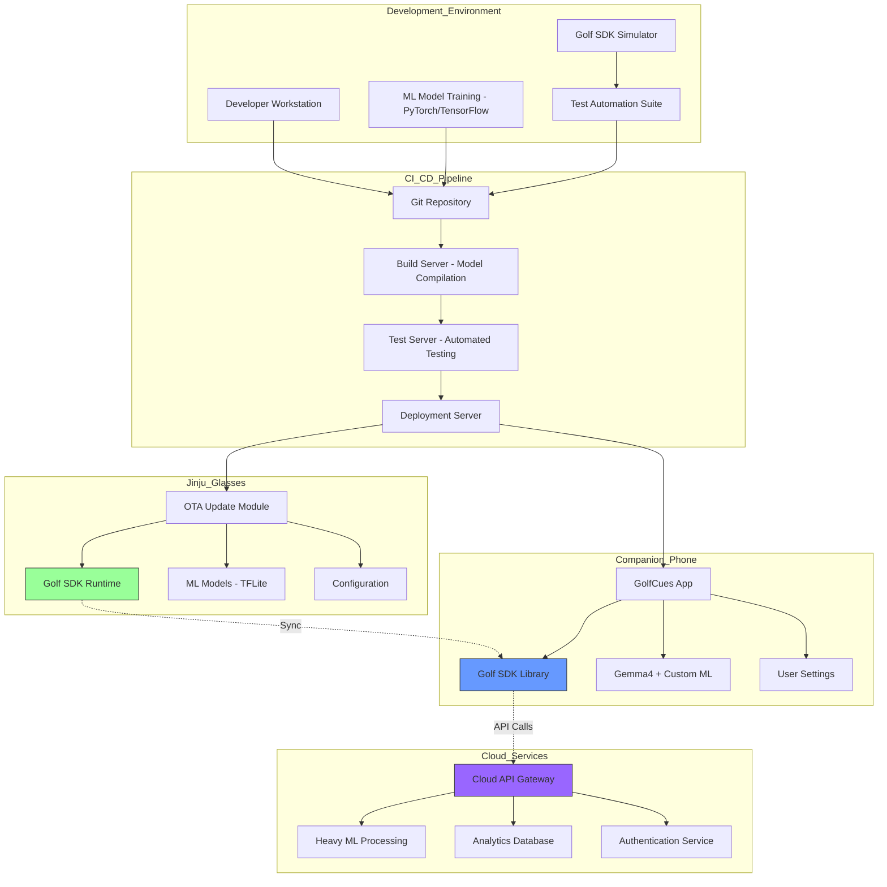
```mermaid
flowchart TB
    subgraph Development_Environment
        DEV[Developer Workstation]
        MODEL_TRAIN[ML Model Training - PyTorch/TensorFlow]
        SIMULATOR[Golf SDK Simulator]
        TEST_SUITE[Test Automation Suite]
    end
    
    subgraph CI_CD_Pipeline
        GIT[Git Repository]
        BUILD[Build Server - Model Compilation]
        TEST[Test Server - Automated Testing]
        DEPLOY[Deployment Server]
    end
    
    subgraph Jinju_Glasses
        GLASSES_OTA[OTA Update Module]
        GLASSES_SDK[Golf SDK Runtime]
        GLASSES_ML[ML Models - TFLite]
        GLASSES_CONFIG[Configuration]
    end
    
    subgraph Companion_Phone
        PHONE_APP[GolfCues App]
        PHONE_SDK[Golf SDK Library]
        PHONE_ML[Gemma4 + Custom ML]
        PHONE_CONFIG[User Settings]
    end
    
    subgraph Cloud_Services
        CLOUD_API[Cloud API Gateway]
        CLOUD_ML[Heavy ML Processing]
        CLOUD_DB[Analytics Database]
        CLOUD_AUTH[Authentication Service]
    end
    
    DEV --> GIT
    MODEL_TRAIN --> GIT
    SIMULATOR --> TEST_SUITE
    TEST_SUITE --> GIT
    
    GIT --> BUILD
    BUILD --> TEST
    TEST --> DEPLOY
    
    DEPLOY --> GLASSES_OTA
    DEPLOY --> PHONE_APP
    
    GLASSES_OTA --> GLASSES_SDK
    GLASSES_OTA --> GLASSES_ML
    GLASSES_OTA --> GLASSES_CONFIG
    
    PHONE_APP --> PHONE_SDK
    PHONE_APP --> PHONE_ML
    PHONE_APP --> PHONE_CONFIG
    
    PHONE_SDK -.API Calls.-> CLOUD_API
    CLOUD_API --> CLOUD_ML
    CLOUD_API --> CLOUD_DB
    CLOUD_API --> CLOUD_AUTH
    
    GLASSES_SDK -.Sync.-> PHONE_SDK
    
    style GLASSES_SDK fill:#9f9,stroke:#333
    style PHONE_SDK fill:#69f,stroke:#333
    style CLOUD_API fill:#96f,stroke:#333
```

---

## 11. Network & Communication Architecture

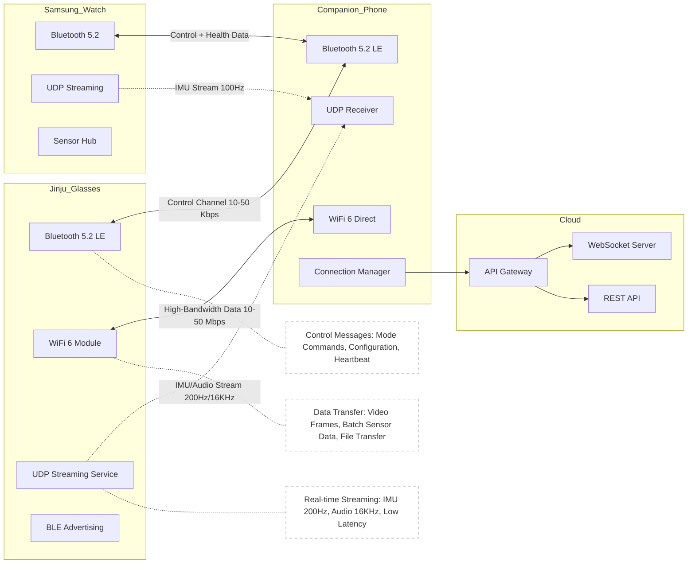
```mermaid
flowchart LR
    subgraph Jinju_Glasses
        GLASSES_BT[Bluetooth 5.2 LE]
        GLASSES_WIFI[WiFi 6 Module]
        GLASSES_UDP[UDP Streaming Service]
        GLASSES_BLE_ADV[BLE Advertising]
    end
    
    subgraph Companion_Phone
        PHONE_BT[Bluetooth 5.2 LE]
        PHONE_WIFI[WiFi 6 Direct]
        PHONE_UDP[UDP Receiver]
        PHONE_CONN_MGR[Connection Manager]
    end
    
    subgraph Samsung_Watch
        WATCH_BT[Bluetooth 5.2]
        WATCH_UDP[UDP Streaming]
        WATCH_SENSOR_HUB[Sensor Hub]
    end
    
    subgraph Cloud
        CLOUD_GATEWAY[API Gateway]
        CLOUD_WS[WebSocket Server]
        CLOUD_REST[REST API]
    end
    
    GLASSES_BT <-->|Control Channel 10-50 Kbps| PHONE_BT
    GLASSES_WIFI <-->|High-Bandwidth Data 10-50 Mbps| PHONE_WIFI
    GLASSES_UDP -.->|IMU/Audio Stream 200Hz/16KHz| PHONE_UDP
    WATCH_BT <-->|Control + Health Data| PHONE_BT
    WATCH_UDP -.->|IMU Stream 100Hz| PHONE_UDP
    PHONE_CONN_MGR --> CLOUD_GATEWAY
    CLOUD_GATEWAY --> CLOUD_WS
    CLOUD_GATEWAY --> CLOUD_REST
    
    GLASSES_NOTES[Control Messages: Mode Commands, Configuration, Heartbeat]
    WIFI_NOTES[Data Transfer: Video Frames, Batch Sensor Data, File Transfer]
    UDP_NOTES[Real-time Streaming: IMU 200Hz, Audio 16KHz, Low Latency]
    
    GLASSES_BT -.- GLASSES_NOTES
    GLASSES_WIFI -.- WIFI_NOTES
    GLASSES_UDP -.- UDP_NOTES
    
    style GLASSES_NOTES fill:#fff,stroke:#999,stroke-dasharray:5
    style WIFI_NOTES fill:#fff,stroke:#999,stroke-dasharray:5
    style UDP_NOTES fill:#fff,stroke:#999,stroke-dasharray:5
```

---

## 12. Security Architecture

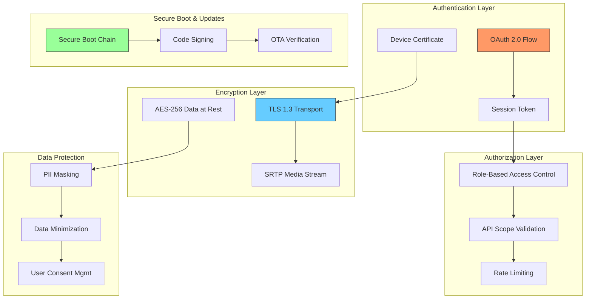
```mermaid
flowchart TB
    subgraph "Authentication Layer"
        OAUTH[OAuth 2.0 Flow]
        DEVICE_CERT[Device Certificate]
        SESSION_TOKEN[Session Token]
    end
    
    subgraph "Encryption Layer"
        TLS13[TLS 1.3 Transport]
        AES256[AES-256 Data at Rest]
        SRTP[SRTP Media Stream]
    end
    
    subgraph "Authorization Layer"
        RBAC[Role-Based Access Control]
        SCOPE[API Scope Validation]
        RATE_LIMIT[Rate Limiting]
    end
    
    subgraph "Data Protection"
        PII_MASK[PII Masking]
        DATA_MIN[Data Minimization]
        CONSENT[User Consent Mgmt]
    end
    
    subgraph "Secure Boot & Updates"
        SECURE_BOOT[Secure Boot Chain]
        CODE_SIGN[Code Signing]
        OTA_VERIFY[OTA Verification]
    end
    
    OAUTH --> SESSION_TOKEN
    DEVICE_CERT --> TLS13
    SESSION_TOKEN --> RBAC
    RBAC --> SCOPE
    SCOPE --> RATE_LIMIT
    TLS13 --> SRTP
    AES256 --> PII_MASK
    PII_MASK --> DATA_MIN
    DATA_MIN --> CONSENT
    SECURE_BOOT --> CODE_SIGN
    CODE_SIGN --> OTA_VERIFY
    
    style OAUTH fill:#f96,stroke:#333
    style TLS13 fill:#6cf,stroke:#333
    style SECURE_BOOT fill:#9f9,stroke:#333
```

---

## 13. Error Handling & Recovery Architecture

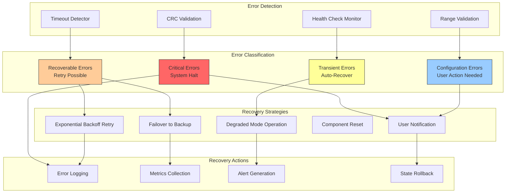
```mermaid
flowchart TB
    subgraph "Error Detection"
        HEALTH_CHECK[Health Check Monitor]
        TIMEOUT_DETECTOR[Timeout Detector]
        CRC_CHECK[CRC Validation]
        RANGE_CHECK[Range Validation]
    end
    
    subgraph "Error Classification"
        ERR_CRITICAL[Critical Errors<br/>System Halt]
        ERR_RECOVERABLE[Recoverable Errors<br/>Retry Possible]
        ERR_TRANSIENT[Transient Errors<br/>Auto-Recover]
        ERR_CONFIG[Configuration Errors<br/>User Action Needed]
    end
    
    subgraph "Recovery Strategies"
        RETRY[Exponential Backoff Retry]
        FAILOVER[Failover to Backup]
        DEGRADED[Degraded Mode Operation]
        RESET[Component Reset]
        USER_NOTIFY[User Notification]
    end
    
    subgraph "Recovery Actions"
        LOG_ERROR[Error Logging]
        METRICS[Metrics Collection]
        ALERT[Alert Generation]
        ROLLBACK[State Rollback]
    end
    
    HEALTH_CHECK --> ERR_TRANSIENT
    TIMEOUT_DETECTOR --> ERR_RECOVERABLE
    CRC_CHECK --> ERR_CRITICAL
    RANGE_CHECK --> ERR_CONFIG
    
    ERR_CRITICAL --> USER_NOTIFY
    ERR_CRITICAL --> LOG_ERROR
    ERR_RECOVERABLE --> RETRY
    ERR_RECOVERABLE --> FAILOVER
    ERR_TRANSIENT --> DEGRADED
    ERR_CONFIG --> USER_NOTIFY
    
    RETRY --> LOG_ERROR
    FAILOVER --> METRICS
    DEGRADED --> ALERT
    USER_NOTIFY --> ROLLBACK
    
    style ERR_CRITICAL fill:#f66,stroke:#333
    style ERR_RECOVERABLE fill:#fc9,stroke:#333
    style ERR_TRANSIENT fill:#ff9,stroke:#333
    style ERR_CONFIG fill:#9cf,stroke:#333
```

---

## 14. CUJ Coverage Matrix

```mermaid
flowchart LR
    subgraph "P0 CUJs (Critical)"
        CUJ1[Live Count Shots]
        CUJ2[Auto Start/End Recording]
        CUJ3[Erase Hat Occlusion]
    end
    
    subgraph "P1 CUJs (High Priority)"
        CUJ4[Ball Direction/Find Ball]
        CUJ5[Club Selection Advice]
        CUJ6[Head-Up Detection]
    end
    
    subgraph "P2 CUJs (Medium Priority)"
        CUJ7[Shot Trajectory Analysis]
        CUJ8[Strokes Gained Analytics]
        CUJ9[Cloud Coaching]
    end
    
    subgraph "Implementation Status"
        IMPL_DONE[Implemented ✓]
        IMPL_PROGRESS[In Progress ⚡]
        IMPL_PLANNED[Planned ◐]
        IMPL_FUTURE[Future ○]
    end
    
    CUJ1 --> IMPL_DONE
    CUJ2 --> IMPL_DONE
    CUJ3 --> IMPL_PROGRESS
    CUJ4 --> IMPL_PROGRESS
    CUJ5 --> IMPL_PLANNED
    CUJ6 --> IMPL_PLANNED
    CUJ7 --> IMPL_FUTURE
    CUJ8 --> IMPL_FUTURE
    CUJ9 --> IMPL_FUTURE
    
    style IMPL_DONE fill:#9f9,stroke:#333
    style IMPL_PROGRESS fill:#ff9,stroke:#333
    style IMPL_PLANNED fill:#fc9,stroke:#333
    style IMPL_FUTURE fill:#ccc,stroke:#333
```

---

## 15. Performance Timeline - Single Swing Detection

```mermaid
gantt
    title Swing Detection and Recording Timeline
    dateFormat  X
    axisFormat %Lms
    
    section Sensing
    IMU Streaming      :0, 500
    Audio Streaming    :0, 500
    Vision Analysis    :0, 500
    
    section Detection
    About-to-Hit       :100, 150
    Impact Detection   :250, 50
    Swing Complete     :400, 100
    
    section Recording
    Pre-Buffer Active  :0, 500
    Lock Buffer        :250, 10
    Post-Impact Rec    :300, 200
    
    section Processing
    Video Encode       :500, 2000
    Analytics          :600, 500
    Save to Gallery    :2500, 500
    
    section Feedback
    AR Overlay         :500, 1000
    Haptic Feedback    :300, 100
```

---

## 16. Entity Relationship Diagram

```mermaid
erDiagram
    USER ||--o{ SESSION : participates_in
    SESSION ||--o{ STROKE : contains
    SESSION ||--o{ VIDEO_CLIP : contains
    STROKE ||--o{ VIDEO_CLIP : has
    STROKE ||--o{ SWING_METRICS : has
    SESSION ||--o{ HOLE : contains
    HOLE ||--o{ STROKE : contains
    CLUB ||--o{ STROKE : used_in
    COURSE ||--o{ HOLE : contains
    USER ||--o{ PLAYER_PROFILE : has
    PLAYER_PROFILE ||--o{ SWING_METRICS : accumulates
    VIDEO_CLIP ||--o{ ANALYTICS : generates
    SESSION ||--o{ ANALYTICS : generates
    
    USER {
        string user_id PK
        string name
        string handicap
        datetime created_at
    }
    
    SESSION {
        string session_id PK
        string user_id FK
        string course_id FK
        datetime start_time
        datetime end_time
        int total_strokes
    }
    
    STROKE {
        string stroke_id PK
        string session_id FK
        int hole_number
        int stroke_number
        datetime timestamp
        string club_used
        float confidence_score
    }
    
    VIDEO_CLIP {
        string clip_id PK
        string stroke_id FK
        string filepath
        int duration_ms
        int file_size_bytes
        datetime created_at
    }
    
    SWING_METRICS {
        string metric_id PK
        string stroke_id FK
        float tempo_ratio
        float swing_plane_deg
        float club_speed_mph
        float launch_angle_deg
        float carry_distance_yds
    }
    
    HOLE {
        int hole_id PK
        string course_id FK
        int hole_number
        int par
        int yardage
        string handicap_index
    }
    
    CLUB {
        string club_id PK
        string club_type
        string club_name
        float loft_deg
        float shaft_flex
    }
    
    COURSE {
        string course_id PK
        string name
        string location
        float latitude
        float longitude
        int total_holes
    }
```

---

## 17. Service Discovery Architecture

```mermaid
flowchart TB
    subgraph Discovery_Phase
        BROADCAST[Device Broadcast]
        SCAN[Active Scanning]
        PAIRING[Pairing Request]
    end
    
    subgraph Capability_Exchange
        CAP_REQ[Capability Request]
        CAP_RESP[Capability Response]
        CAP_VALIDATE[Capability Validation]
    end
    
    subgraph Service_Registration
        GLASSES_SVC[Glasses Services - Camera, IMU, Audio, ASP Events]
        WATCH_SVC[Watch Services - IMU, Audio, Heart Rate, Local ML]
        PHONE_SVC[Phone Services - GPS, Golf Mode Mgr, Video, Analytics]
    end
    
    subgraph Service_Registry
        REGISTRY[Service Registry]
        HEALTH[Health Monitor]
        LOAD_BAL[Load Balancer]
    end
    
    BROADCAST --> SCAN
    SCAN --> PAIRING
    PAIRING --> CAP_REQ
    CAP_REQ --> CAP_RESP
    CAP_RESP --> CAP_VALIDATE
    
    CAP_VALIDATE --> GLASSES_SVC
    CAP_VALIDATE --> WATCH_SVC
    CAP_VALIDATE --> PHONE_SVC
    
    GLASSES_SVC --> REGISTRY
    WATCH_SVC --> REGISTRY
    PHONE_SVC --> REGISTRY
    
    REGISTRY --> HEALTH
    HEALTH --> LOAD_BAL
```

---

## 18. Buffer Management Architecture

```mermaid
flowchart TB
    subgraph Circular_Buffer_Structure
        BUFFER_HEAD[Buffer Head Pointer]
        BUFFER_TAIL[Buffer Tail Pointer]
        BUFFER_SIZE[Buffer Size 50MB]
        FRAME_SLOTS[Frame Slots 150 frames at 1080p30]
    end
    
    subgraph Buffer_Operations
        WRITE_OP[Write Operation]
        READ_OP[Read Operation]
        LOCK_OP[Lock Operation]
        COMMIT_OP[Commit Operation]
    end
    
    subgraph Buffer_States
        STATE_EMPTY[Empty]
        STATE_FILLING[Filling]
        STATE_LOCKED[Locked]
        STATE_COMMITTING[Committing]
    end
    
    subgraph Memory_Management
        MALLOC[Pre-allocate RAM]
        POOL[Memory Pool]
        GC[Garbage Collection]
        FRAG[Fragmentation Control]
    end
    
    BUFFER_HEAD --> WRITE_OP
    BUFFER_TAIL --> READ_OP
    BUFFER_SIZE --> MALLOC
    FRAME_SLOTS --> POOL
    
    WRITE_OP --> STATE_FILLING
    READ_OP --> STATE_FILLING
    LOCK_OP --> STATE_LOCKED
    COMMIT_OP --> STATE_COMMITTING
    
    STATE_LOCKED --> COMMIT_OP
    STATE_COMMITTING --> STATE_EMPTY
    
    MALLOC --> POOL
    POOL --> GC
    GC --> FRAG
    
    WRITE_OP_DESC[WRITE_OP: Continuous write, Overwrite oldest, Atomic operations]
    LOCK_OP_DESC[LOCK_OP: On About-to-Hit, Freeze head/tail, Mark segment]
    COMMIT_OP_DESC[COMMIT_OP: Transfer to encoder, Release memory, Reset pointers]
    
    WRITE_OP -.- WRITE_OP_DESC
    LOCK_OP -.- LOCK_OP_DESC
    COMMIT_OP -.- COMMIT_OP_DESC
    
    style WRITE_OP_DESC fill:#fff,stroke:#999,stroke-dasharray:5
    style LOCK_OP_DESC fill:#fff,stroke:#999,stroke-dasharray:5
    style COMMIT_OP_DESC fill:#fff,stroke:#999,stroke-dasharray:5
```

---

## 19. ML Model Versioning & Update Flow

```mermaid
flowchart TB
    subgraph "Model Development"
        DEV_TRAIN[Model Training]
        DEV_EVAL[Evaluation]
        DEV_VERSION[Version Tagging]
    end
    
    subgraph "Model Registry"
        REG_STORE[Model Store]
        REG_META[Metadata]
        REG_DEPS[Dependencies]
    end
    
    subgraph "Distribution"
        CDN[CDN Distribution]
        OTA_PKG[OTA Package]
        DELTA_UPDATE[Delta Updates]
    end
    
    subgraph "Device Update"
        DOWNLOAD[Download]
        VERIFY[Signature Verify]
        STAGING[Staging Area]
        ACTIVATE[Activate]
    end
    
    subgraph "Rollback"
        HEALTH_MON[Health Monitor]
        ROLLBACK_CMD[Rollback Command]
        PREV_VERSION[Previous Version]
    end
    
    DEV_TRAIN --> DEV_EVAL
    DEV_EVAL --> DEV_VERSION
    DEV_VERSION --> REG_STORE
    DEV_VERSION --> REG_META
    DEV_VERSION --> REG_DEPS
    
    REG_STORE --> CDN
    CDN --> OTA_PKG
    OTA_PKG --> DELTA_UPDATE
    
    DELTA_UPDATE --> DOWNLOAD
    DOWNLOAD --> VERIFY
    VERIFY --> STAGING
    STAGING --> ACTIVATE
    
    ACTIVATE --> HEALTH_MON
    HEALTH_MON -->|On Failure| ROLLBACK_CMD
    ROLLBACK_CMD --> PREV_VERSION
    
    style DEV_TRAIN fill:#9f9,stroke:#333
    style VERIFY fill:#6cf,stroke:#333
    style ACTIVATE fill:#f96,stroke:#333
    style ROLLBACK_CMD fill:#f66,stroke:#333
```

---

## 20. User Journey - Complete Golf Round

```mermaid
journey
    title User Journey: Golf Round with Golf-SDK
    section Pre-Round
      Arrive at Course: 5: User
      Auto Golf Mode Entry: 5: System
      Device Connection Check: 4: System
      Initialize Hole 1: 5: System
    
    section During Play
      Address Ball: 5: User
      About-to-Hit Detection: 5: System
      Auto Recording Start: 5: System
      Swing & Impact: 5: User
      Hit Detection: 5: System
      Stroke Counter Increment: 5: System
      Auto Recording Stop: 5: System
      Video Save to Gallery: 5: System
      AR Feedback Display: 4: System
      Walk to Next Shot: 3: User
    
    section Between Holes
      Hole Summary Display: 4: System
      Club Recommendation: 4: System
      Move to Next Tee: 3: User
    
    section Post-Round
      Exit Golf Mode: 5: User
      Session Summary: 5: System
      Analytics Generation: 5: System
      Optional Cloud Upload: 4: User
      Review Video Highlights: 5: User
```

---

## 21. Fault Tolerance Architecture

```mermaid
flowchart TB
    subgraph "Redundancy Layer"
        SENSOR_REDUNDANCY[Sensor Redundancy<br/>Glasses + Watch IMU]
        MODEL_REDUNDANCY[Model Redundancy<br/>Multiple Detection Paths]
        COMM_REDUNDANCY[Communication Redundancy<br/>BT + WiFi]
    end
    
    subgraph "Degraded Modes"
        MODE_FULL[Full Mode<br/>All Sensors Active]
        MODE_REDUCED[Reduced Mode<br/>Essential Sensors Only]
        MODE_MINIMAL[Minimal Mode<br/>Audio + IMU Only]
        MODE_OFFLINE[Offline Mode<br/>Phone-Only Processing]
    end
    
    subgraph "Failure Detection"
        HEARTBEAT[Heartbeat Monitor]
        DATA_QUALITY[Data Quality Check]
        LATENCY_MON[Latency Monitor]
    end
    
    subgraph "Recovery Actions"
        SENSOR_SWITCH[Switch to Backup Sensor]
        MODEL_FALLBACK[Fallback Model]
        COMM_SWITCH[Switch Communication Path]
        LOCAL_PROCESS[Local Processing]
    end
    
    HEARTBEAT --> MODE_REDUCED
    DATA_QUALITY --> MODE_MINIMAL
    LATENCY_MON --> MODE_OFFLINE
    
    SENSOR_REDUNDANCY --> SENSOR_SWITCH
    MODEL_REDUNDANCY --> MODEL_FALLBACK
    COMM_REDUNDANCY --> COMM_SWITCH
    
    MODE_FULL --> MODE_REDUCED
    MODE_REDUCED --> MODE_MINIMAL
    MODE_MINIMAL --> MODE_OFFLINE
    
    SENSOR_SWITCH --> MODE_REDUCED
    MODEL_FALLBACK --> MODE_MINIMAL
    COMM_SWITCH --> MODE_REDUCED
    LOCAL_PROCESS --> MODE_OFFLINE
    
    style MODE_FULL fill:#9f9,stroke:#333
    style MODE_REDUCED fill:#ff9,stroke:#333
    style MODE_MINIMAL fill:#fc9,stroke:#333
    style MODE_OFFLINE fill:#f66,stroke:#333
```

---

## 22. Scalability Architecture

```mermaid
flowchart LR
    subgraph "Horizontal Scaling"
        MULTI_GLASSES[Multiple Glasses<br/>Load Distribution]
        MULTI_PHONES[Multiple Phones<br/>Edge Computing]
        MULTI_USERS[Multi-User Sessions<br/>Group Play]
    end
    
    subgraph "Vertical Scaling"
        EDGE_COMPUTE[Edge Processing<br/>On-Device ML]
        FOG_COMPUTE[Fog Computing<br/>Local Server]
        CLOUD_COMPUTE[Cloud Processing<br/>Heavy Analytics]
    end
    
    subgraph "Data Scaling"
        STREAM_PROC[Stream Processing<br/>Real-time Events]
        BATCH_PROC[Batch Processing<br/>Session Analytics]
        ARCHIVE[Archive Storage<br/>Historical Data]
    end
    
    subgraph "Geographic Scaling"
        REGION_US[US Region]
        REGION_EU[EU Region]
        REGION_ASIA[Asia Region]
        CDN_EDGE[CDN Edge Nodes]
    end
    
    MULTI_GLASSES --> STREAM_PROC
    MULTI_PHONES --> EDGE_COMPUTE
    MULTI_USERS --> BATCH_PROC
    
    EDGE_COMPUTE --> FOG_COMPUTE
    FOG_COMPUTE --> CLOUD_COMPUTE
    
    STREAM_PROC --> ARCHIVE
    BATCH_PROC --> ARCHIVE
    
    REGION_US --> CDN_EDGE
    REGION_EU --> CDN_EDGE
    REGION_ASIA --> CDN_EDGE
    
    style EDGE_COMPUTE fill:#9f9,stroke:#333
    style FOG_COMPUTE fill:#ff9,stroke:#333
    style CLOUD_COMPUTE fill:#6cf,stroke:#333
```

---

## 23. Testing Architecture

```mermaid
flowchart TB
    subgraph "Test Levels"
        UNIT[Unit Tests<br/>ML Models, Services]
        INTEGRATION[Integration Tests<br/>Multi-Device]
        SYSTEM[System Tests<br/>End-to-End]
        ACCEPTANCE[Acceptance Tests<br/>CUJ Validation]
    end
    
    subgraph "Test Environments"
        SIM_ENVV[Simulation Environment<br/>Virtual Sensors]
        LAB_ENVV[Lab Environment<br/>Physical Devices]
        FIELD_ENVV[Field Environment<br/>Real Golf Course]
    end
    
    subgraph "Test Automation"
        CI_PIPELINE[CI Pipeline]
        AUTO_TEST[Automated Tests]
        REPORT[Test Reports]
    end
    
    subgraph "Test Data"
        SYNTHETIC[Synthetic Data<br/>Generated Swings]
        RECORDED[Recorded Data<br/>Real Sessions]
        EDGE_CASES[Edge Cases<br/>Corner Scenarios]
    end
    
    UNIT --> SIM_ENVV
    INTEGRATION --> LAB_ENVV
    SYSTEM --> LAB_ENVV
    ACCEPTANCE --> FIELD_ENVV
    
    SIM_ENVV --> SYNTHETIC
    LAB_ENVV --> RECORDED
    FIELD_ENVV --> EDGE_CASES
    
    CI_PIPELINE --> AUTO_TEST
    AUTO_TEST --> REPORT
    
    style UNIT fill:#9f9,stroke:#333
    style INTEGRATION fill:#ff9,stroke:#333
    style SYSTEM fill:#fc9,stroke:#333
    style ACCEPTANCE fill:#f96,stroke:#333
```

---

## 24. Monitoring & Observability Architecture

```mermaid
flowchart TB
    subgraph "Metrics Collection"
        SYS_METRICS[System Metrics<br/>CPU, Memory, Battery]
        APP_METRICS[App Metrics<br/>Latency, Throughput]
        ML_METRICS[ML Metrics<br/>Confidence, Accuracy]
        BUSINESS_METRICS[Business Metrics<br/>Sessions, Strokes]
    end
    
    subgraph "Logging"
        STRUCTURED_LOGS[Structured Logs]
        DISTRIBUTED_TRACING[Distributed Tracing]
        AUDIT_LOGS[Audit Logs]
    end
    
    subgraph "Alerting"
        THRESHOLD[Threshold Alerts]
        ANOMALY[Anomaly Detection]
        ESCALATION[Escalation Rules]
    end
    
    subgraph "Dashboards"
        REALTIME_DASH[Real-time Dashboard]
        ANALYTICS_DASH[Analytics Dashboard]
        HEALTH_DASH[Health Dashboard]
    end
    
    SYS_METRICS --> REALTIME_DASH
    APP_METRICS --> ANALYTICS_DASH
    ML_METRICS --> HEALTH_DASH
    BUSINESS_METRICS --> ANALYTICS_DASH
    
    STRUCTURED_LOGS --> REALTIME_DASH
    DISTRIBUTED_TRACING --> HEALTH_DASH
    AUDIT_LOGS --> ANALYTICS_DASH
    
    THRESHOLD --> ESCALATION
    ANOMALY --> ESCALATION
    
    style SYS_METRICS fill:#9f9,stroke:#333
    style ML_METRICS fill:#6cf,stroke:#333
    style REALTIME_DASH fill:#f96,stroke:#333
    style HEALTH_DASH fill:#f66,stroke:#333
```

---

## 25. Summary

This architecture documentation provides a comprehensive view of the Golf-SDK system, including:

1. **System Overview**: High-level component relationships between Jinju glasses, companion phone, and cloud services
2. **Component Architecture**: Detailed breakdown of HAL, ML services, and application layers
3. **ML Deployment Strategy**: Distribution of ML models across glasses (ASP/AP), phone (Gemma4 + custom), and cloud
4. **Data Flow**: End-to-end sensor data processing and fusion pipeline
5. **State Machine**: Complete state transitions for Golf Mode lifecycle
6. **Sequence Diagrams**: 9 detailed interaction flows for all major CUJs
7. **Power Management**: Strategies for optimizing battery life through adaptive sensor management
8. **API Architecture**: Interface definitions for SDK consumers
9. **Deployment Pipeline**: CI/CD flow for SDK and model updates

The architecture emphasizes:
- **Multi-modal sensor fusion** for accurate event detection
- **Power efficiency** through low-power ASP chip and selective streaming
- **Scalability** to support additional sports beyond golf
- **Flexibility** in ML model deployment (edge vs. cloud)
- **User experience** through AR feedback and voice interaction
