# 01 · Golf-SDK System Architecture

> Companion to [`README.md`](README.md). Diagrams are Mermaid. Component names in the on-phone view
> map 1:1 to the `GolfCues` POC source (`com.golfcues.app.*`) so the architecture is **buildable,
> not aspirational**. Tags: 🅡 = roadmap (not yet built) · 🅐 = assumption (not confirmed in source).

**Contents**
1. [Architectural drivers & constraints](#1-architectural-drivers--constraints)
2. [C4-L1 — System Context](#2-c4-l1--system-context)
3. [C4-L2 — Device / Container topology](#3-c4-l2--device--container-topology)
4. [C4-L3 — On-phone SDK component model](#4-c4-l3--on-phone-sdk-component-model)
5. [Glasses-side architecture (ASP / AP split)](#5-glasses-side-architecture-asp--ap-split)
6. [Sensor-fusion architecture](#6-sensor-fusion-architecture)
7. [Power & data tiering model](#7-power--data-tiering-model)
8. [Transport / protocol stack](#8-transport--protocol-stack)
9. [Capability negotiation](#9-capability-negotiation)
10. [Concurrency & threading model](#10-concurrency--threading-model)
11. [Failure modes & graceful degradation](#11-failure-modes--graceful-degradation)
12. [Deployment view](#12-deployment-view)

---

## 1. Architectural drivers & constraints

| # | Driver (source) | Architectural consequence |
|---|-----------------|---------------------------|
| D1 | Jinju is **display-less** + single camera | No on-glass UI; all feedback is **audio (speaker/TTS)** or rendered on the **phone**. Single camera ⇒ monocular vision (no stereo depth) ⇒ vision is a *gate/classifier*, not a metric trajectory engine. |
| D2 | Glasses are a **phone accessory** | Phone is the compute hub & UI surface; glasses are a **sensor + speaker peripheral**. SDK = phone-side library + glass transport. |
| D3 | **Streaming costs power** (Khani, Slack) | Stream Camera/IMU/MIC **on-demand only**, per-consumer, with the *minimum* modality. Prefer the **phone's own** IMU/MIC when equivalent. |
| D4 | **Heavy ML on phone, micro-ML on glass** (Penke, Slack) | Two-tier inference: ASP micro-classifiers (binary) on glass; VLM/detectors on phone NPU; cloud for session-level analysis. |
| D5 | **Low-power ambient sensing**, AP in deep sleep (Tech Overview) | Always-On sensing lives on the glass **ASP**; phone AP & glass AP stay asleep until an impact-class event escalates. |
| D6 | **Mode-first** UX (Penke, Slack) | A top-level *Golf-Mode* state machine with 4 entry paths gates every feature. |
| D7 | **Multi-device sensor fusion** (glasses + phone + watch) | A fusion bus that ingests heterogeneous, time-stamped events with confidence; late/absent devices degrade gracefully. |
| D8 | **On-device first, cloud opt-in** (slide 22) | Full session works offline on SQLite; cloud upload is an explicit, post-round/proactive opt-in. |
| D9 | SDK consumed by **3rd-party apps** | A stable public API surface (capabilities, mode control, event stream, clip store) separate from the internal engine. |
| D10 | **Glass firmware build fragility** (HaeAn/GG, Slack) | The Projected camera stream only works on *specific* glass builds; firmware build is a first-class deployment dependency, and the SDK must detect/handle a black/absent stream. |
| D11 | **3rd-party + multi-host** (Tech Overview goal) | Public surface must be host-agnostic; GolfCues is just the first consumer. |

---

## 2. C4-L1 — System Context

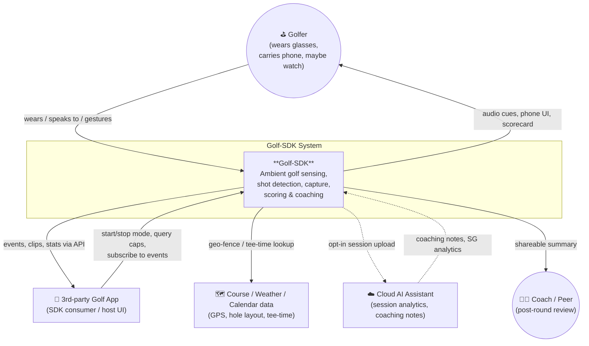

---

## 3. C4-L2 — Device / Container topology

Four physical nodes. The phone is the **only** node that does heavy compute, hosts the public SDK
API, and owns persistent state.

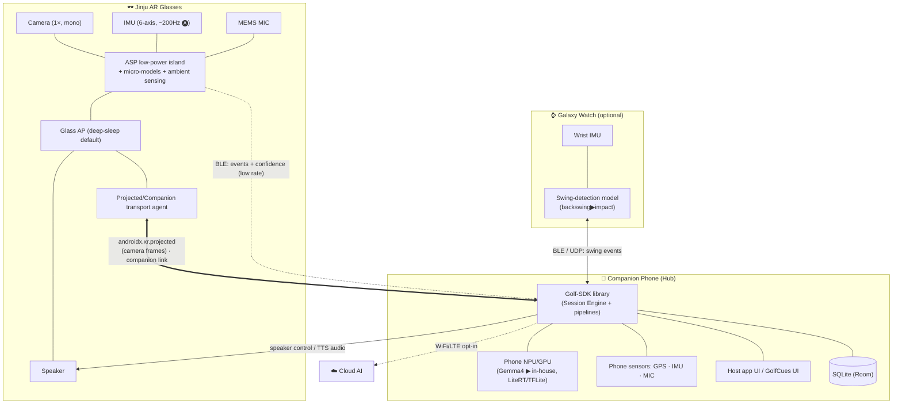

**Key topology facts**

- **Camera transport** is the Android **Projected API** (`androidx.xr.projected:1.0.0-alpha04`). The
  phone obtains the glasses camera as a *projected device context* — no glass firmware change needed
  for a paired AR glass (confirmed in the POC and by Luo/Khani on Slack).
- **Event transport** (ASP → phone) is a **low-rate BLE event channel** carrying
  `{event, confidence, timestamp}` — *not* raw sensor streams (D3).
- **Speaker** is phone-controlled TTS: *not* default-on, but the phone can push audio cues to the
  glass speaker (slide 22 "spoken cues").
- **Watch** joins the fusion bus opportunistically (only if worn), streaming IMU-derived **swing
  events** (the UX team's Watch7 PoC streams IMU+audio over UDP).

---

## 4. C4-L3 — On-phone SDK component model

The heart of the system. Names map to the POC: the **Session Engine** is
`GolfModeForegroundService`; it orchestrates three sensor pipelines whose outputs converge on the
**Shot Detection / Fusion** core.

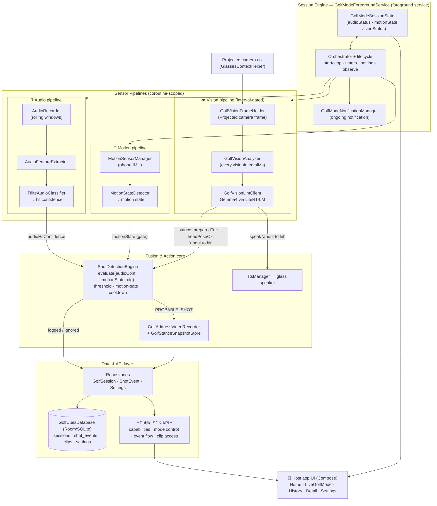

### 4.1 The fusion contract (code-accurate)

`ShotDetectionEngine.evaluate(...)` is the canonical fusion rule today. It is deliberately
**audio-primary, motion-gated, vision-priming**:

```
PROBABLE_SHOT  ⇐   audioHitConfidence ≥ sensitivity.threshold()
              AND  motionState ∈ {still / near-idle}          // motion gate (D7)
              AND  now − lastShot ≥ cooldownMillis (de-bounce) // ~seconds
```

- **Vision (Gemma4)** runs on an interval and produces the *prelude* — `preparedToHit`, `headPoseOk`,
  and the spoken **"about to hit"** cue — which primes the engine and the user *before* impact, rather
  than being in the hard hit-trigger path. This keeps the expensive VLM off the millisecond-critical path.
- **Why motion-gate on still/near-idle?** A real golf address is near-still; gating rejects "hit-like"
  audio transients while walking between shots (D7, false-positive suppression).
- **Roadmap hardening 🅡:** add glass-IMU **deceleration-spike** confirmation and watch
  **swing-segment** confirmation as additional fusion inputs (see §6 and doc #2).

> The exact enum names, thresholds, and cooldown values are documented in
> [`03_State_Machines.md`](03_State_Machines.md) §5 and [`05_Data_Model_and_API.md`](05_Data_Model_and_API.md).

### 4.2 Public SDK API surface (proposed)

| API group | Operations | Backed by |
|-----------|-----------|-----------|
| `Capabilities` | `queryDevices()`, `capabilitiesOf(device)` | §9 negotiation |
| `Mode` | `requestGolfMode(entry)`, `exitGolfMode()`, `observeMode()` | Session Engine FSM (doc #3) |
| `Events` | `observeShots()`, `observeCues()`, `observeScore()` | ShotDetectionEngine + repos |
| `Capture` | `triggerClip(durationSec)`, `listClips(session)`, `getClip(id)` | GolfAddressVideoRecorder + on-demand glass capture (doc #4) |
| `Coaching` | `speak(cue)`, `requestPostRound()` | TtsManager + cloud opt-in |
| `Session` | `startSession()`, `currentScore()`, `endSession()` | repositories / SQLite |

The full API contract is in [`05_Data_Model_and_API.md`](05_Data_Model_and_API.md) §3.

---

## 5. Glasses-side architecture (ASP / AP split)

The glasses are intentionally "dumb but always-on": the **ASP island** never sleeps and runs *micro*
binary classifiers; the glass **AP** is woken only to stream a modality or play audio.

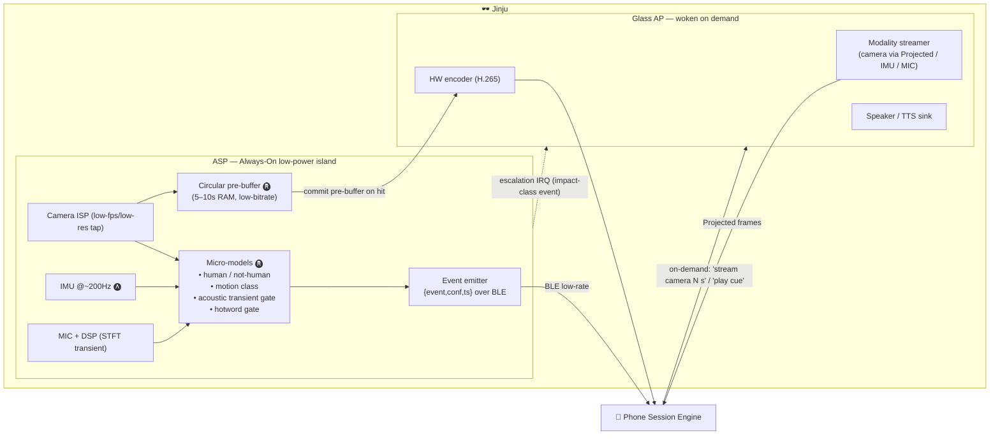

**Design notes**

- The **circular pre-buffer** (Tech Overview §4) lets the system capture the *pre-swing* once a hit
  fires — the phone says "commit", the glass backfills from RAM + post-rolls 6–8 s.
- Today's POC pulls camera frames over the **Projected API** with the glass acting as a projected
  device; the ASP micro-model tier is the *target* low-power path (D4/D5) that replaces "always
  stream + classify on phone" with "classify on glass, stream on demand".
- **Speaker** is a sink the phone drives — used for "about to hit", "stroke logged", earcons.

> The **division of labor** today vs. target: in the POC, motion/audio classification runs on the
> *phone* (`MotionStateDetector`, `TfliteAudioClassifier`) using the *phone's* sensors; the target
> pushes the always-on *gate* tier down to the glass ASP and reserves the phone for heavy
> understanding. See [`02_ML_Model_Placement.md`](02_ML_Model_Placement.md) §1.

---

## 6. Sensor-fusion architecture

Heterogeneous devices publish **time-stamped events with confidence** onto a fusion bus. Each
producer does *local* estimation; the phone fuses. Absent devices degrade gracefully.

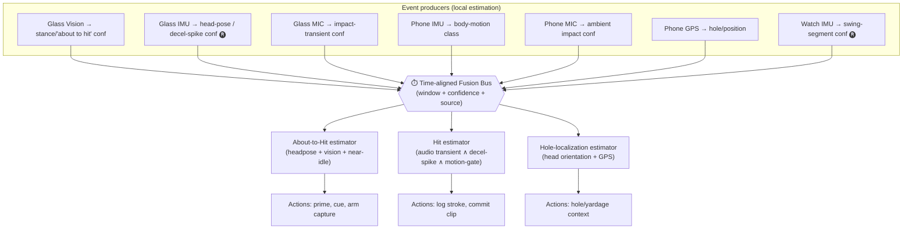

**Fusion policy**

| Estimate | Primary | Confirm | Veto / gate | Notes |
|----------|---------|---------|-------------|-------|
| About-to-Hit | Vision stance (Gemma4) | head-pose steady (IMU) | motion ≠ near-idle | drives the early TTS cue |
| **Hit confirmed** | Audio transient | glass-IMU decel spike 🅡, watch swing 🅡 | motion-gate (still/near-idle), cooldown | code-accurate today (audio+motion); IMU/watch are roadmap |
| Hole localization | Head-orientation (**glass IMU** — the one case it's truly needed, per Khani) | phone GPS | — | only modality where glass IMU > phone IMU |

**Graceful degradation:** no watch ⇒ drop watch confirm; no glass-IMU stream ⇒ fall back to
audio+phone-motion (today's POC path); vision disabled ⇒ no early cue but hit detection still works.
The full degradation matrix is in §11.

---

## 7. Power & data tiering model

The single most important non-functional property. Three escalating tiers; the system spends the
vast majority of time in **Tier 0** and only briefly visits Tier 2.

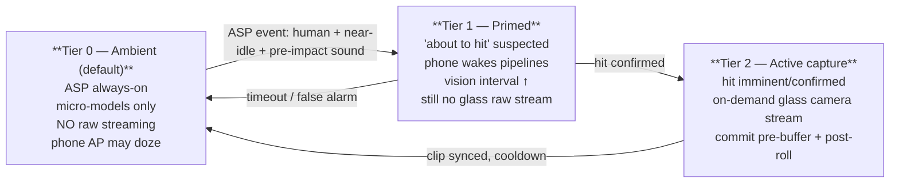

### 7.1 What streams, when (the D3 contract)

| Modality | Tier 0 | Tier 1 | Tier 2 | Rationale |
|----------|:------:|:------:|:------:|-----------|
| Glass camera frames | ❌ (ASP-local tap) | ⏳ low-rate sample | ✅ on-demand N s | Vision is most expensive; gate hard |
| Glass IMU | ❌ (ASP-local) | ❌ | ⚠️ only for head-pose/hole | "only place glass IMU truly needed" |
| Glass MIC | ❌ (ASP DSP-local) | ❌ | ✅ if confirming transient | Prefer ASP-local transient gate |
| **Phone IMU** | ✅ cheap | ✅ | ✅ | On-device, no link cost — preferred for motion |
| **Phone MIC** | ✅ cheap | ✅ | ✅ | Can substitute glass MIC for hit audio when adequate |
| Phone GPS | 🔁 coarse | 🔁 | ✅ fine | Hole/position context |
| Glass speaker | ❌ | ✅ cue | ✅ cue | Phone-driven TTS |

> **Engineering rule (Khani, Slack):** *"Only the specific data needed by the consuming ML model
> should be streamed."* Prefer the **phone's own** IMU/MIC over the glass radio link whenever accuracy
> allows; reserve the glass link for camera capture and head-orientation.

The tier FSM with full transition conditions is in [`03_State_Machines.md`](03_State_Machines.md) §2.

---

## 8. Transport / protocol stack

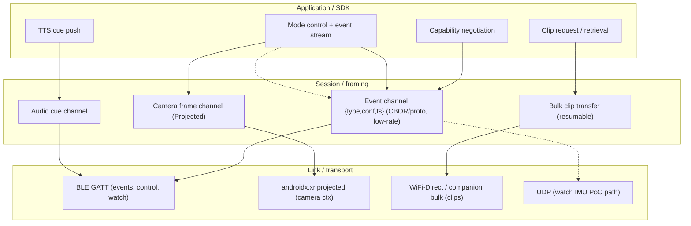

| Concern | Choice | Why |
|---------|--------|-----|
| Glass→phone **events** | BLE GATT, low duty cycle | cheap, always-on friendly (D3/D5) |
| Glass→phone **camera** | Projected API | already works in POC, no glass build change |
| Glass→phone **clips** | WiFi-Direct / companion bulk, resumable, **deferred** ("when golfer walks to next shot") | large payload, not latency-critical |
| Watch↔phone | BLE + UDP | matches UX Watch7 PoC |
| Phone→glass **audio** | BLE audio cue channel | low-rate TTS earcons |
| Time sync | shared monotonic clock + per-event ts | fusion needs alignment (§6) |

---

## 9. Capability negotiation

Per Penke's request: *"Mobile device queries the capabilities of Golf-supported features from
wearables."* On entering Golf Mode the phone discovers which producers exist and adapts the fusion
graph.

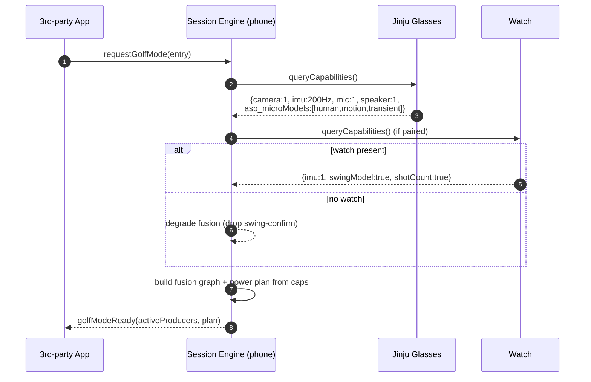

The negotiated capability set drives: which estimators in §6 are live, the power-tier policy (§7),
and which CUJs are offered (e.g. no watch ⇒ no redundant shot count).

---

## 10. Concurrency & threading model

Grounded in the POC: the Session Engine is an Android **foreground service** that owns a
`CoroutineScope`; each sensor pipeline is an independent coroutine producing into a `StateFlow`/
`SharedFlow`, and the fusion core consumes those flows. The UI observes engine state through the
repositories and `GolfModeSessionState`.

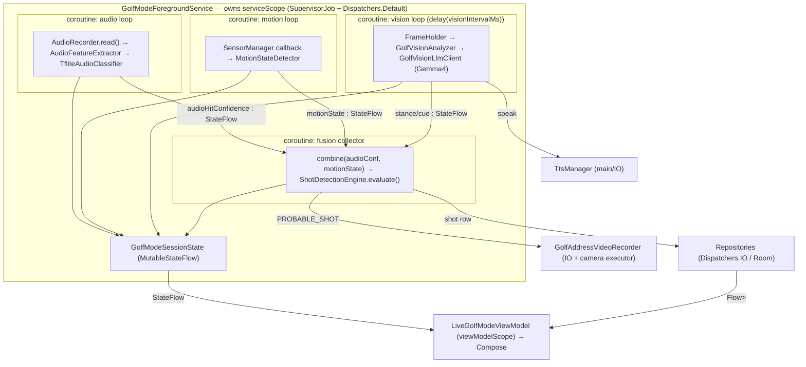

**Threading rules**

| Concern | Dispatcher / thread | Why |
|---------|---------------------|-----|
| Sensor callbacks (IMU) | `SensorManager` HAL thread → hop to service scope | avoid blocking the HAL |
| Audio capture | dedicated IO/Default coroutine, blocking `read()` | continuous PCM windows |
| Vision inference (Gemma4) | single-flight coroutine, `delay(visionIntervalMs)` between runs | one heavy inference at a time; never per-frame |
| Fusion `evaluate()` | cheap, runs on collector | pure function of latest values |
| Room writes / clip IO | `Dispatchers.IO` | disk |
| TTS / camera bind | main-thread affinity where the API requires | Android API constraints |
| UI | `viewModelScope` collecting `StateFlow` | lifecycle-safe |

**Back-pressure:** vision is **interval-gated** (sampled, single-flight) so a slow VLM inference
never queues; audio uses bounded rolling windows; the fusion collector always reads the *latest*
value (conflated flows), so a burst of sensor events cannot pile up.

---

## 11. Failure modes & graceful degradation

A field device on a golf course will lose the glass link, hit a bad firmware build, run low on
battery, and drop GPS. The architecture treats each as a *degrade*, not a *crash*.

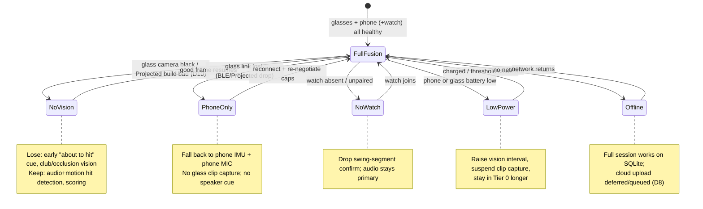

**Degradation matrix**

| Failure | Detection | Behaviour | CUJ impact |
|---------|-----------|-----------|-----------|
| Black/absent camera stream (bad HaeAn build) | frame staleness / decode fail | disable vision pipeline, surface "vision unavailable", keep audio+motion | lose early cue, club/occlusion; **hit detection survives** |
| Glass BLE/Projected drop | link callback / timeout | switch to phone IMU+MIC; no clip capture/speaker | scoring survives, capture paused |
| No watch | capability negotiation | drop watch confirm input | redundancy only — no functional loss |
| Low battery | phone battery API / glass status | back off to Tier 0, raise interval, pause capture | fewer clips, longer detection latency |
| No GPS lock | location API | skip hole/position context | lose hole localization & per-hole scoring auto-advance |
| Model load failure | `Engine.open` exception | fall back: vision off / `FakeAudioClassifier` (POC has one) | degraded, not crashed |
| Permission denied (cam/mic/loc) | runtime permission check | feature-gate the affected pipeline; explain in UI | only affected CUJs disabled |

> The POC ships a `FakeAudioClassifier` — a concrete signal that the audio path is designed to be
> *swappable/mockable*, which is also the seam for the in-house hit net (doc #2).

---

## 12. Deployment view

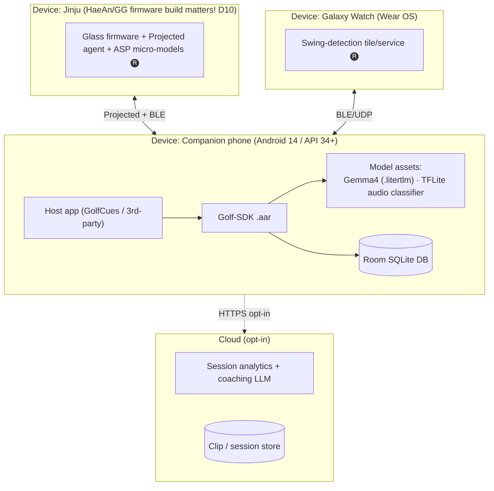

**Deployment gotchas captured from the thread**

- **Firmware build sensitivity (D10):** the glasses camera stream (Projected) only works on specific
  **HaeAn/GG** builds — too-new builds bricked devices; a ~1-month-old build fixed black-preview. Treat
  *glass firmware build* as a first-class deployment dependency and **pin a known-good build** (Khani's
  build summary: "1 month old — fixes the streaming problem (working)"). The connection/firmware FSM
  is in [`03_State_Machines.md`](03_State_Machines.md) §10.
- **Min platform:** the Projected camera context requires `Build.VERSION_CODES.UPSIDE_DOWN_CAKE`
  (Android 14 / API 34) — gate the vision pipeline on it (POC does exactly this).
- **Model assets ship with the SDK/app**, not the glasses (heavy ML on phone, D4).
- **Companion-app check:** if the companion app shows the device connected, the camera frames should
  flow; "device connected but black" ⇒ suspect firmware build (Penke/Luo guidance).
