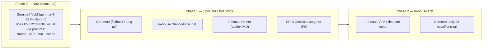
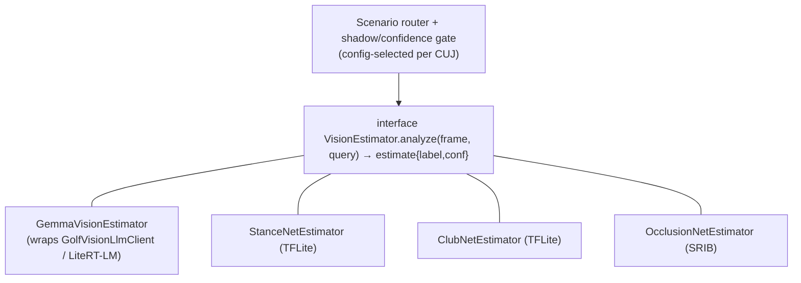
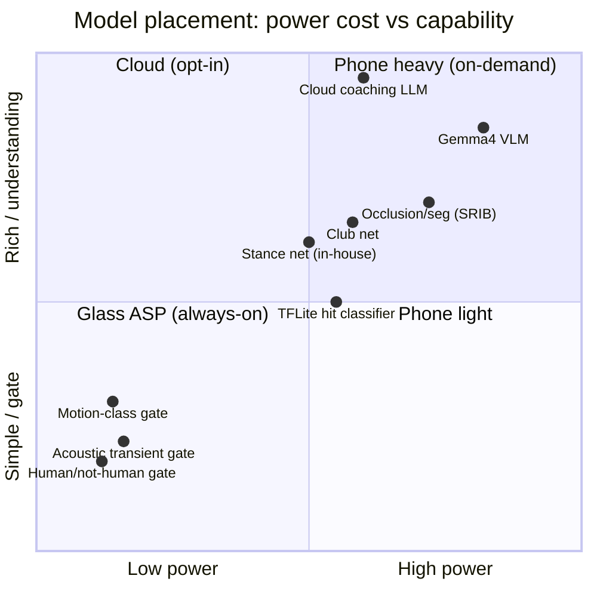
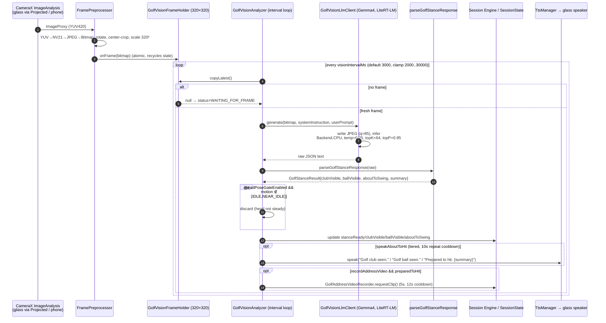
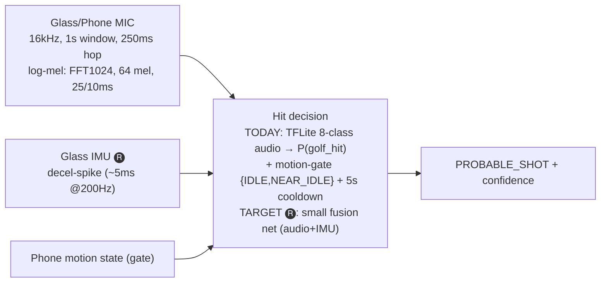
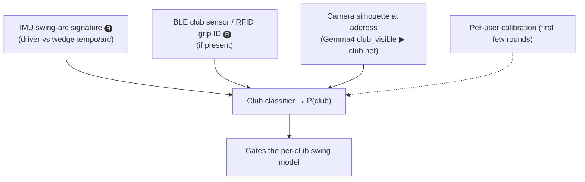
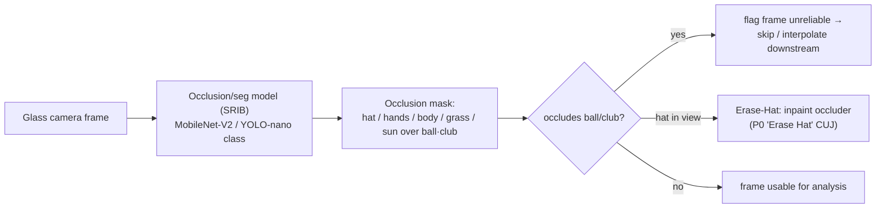
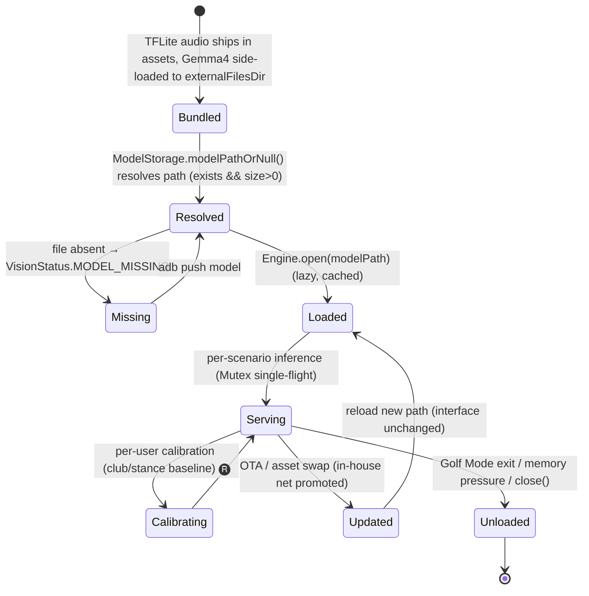

# 02 · ML Model Placement & Migration (ML-Team Focus)

> *"I am part of the ML Team and trying to understand what ML model will run where. Initially
> planning to use Gemma4 on the phone and planning to replace that with our own for handling
> various scenarios."* — **this document answers exactly that, end to end**, and is grounded in the
> real `GolfCues` POC pipelines (`com.golfcues.app.*`). Tags: 🅡 roadmap · 🅐 assumption.

**Contents**
1. [The three-tier inference model](#1-the-three-tier-inference-model)
2. [Per-CUJ model map (where each runs)](#2-per-cuj-model-map-where-each-runs)
3. [Gemma4 today → in-house tomorrow (migration)](#3-gemma4-today--in-house-tomorrow-migration)
4. [Power / accuracy / latency trade matrix](#4-power--accuracy--latency-trade-matrix)
5. [Vision pipeline internals (Gemma4 via LiteRT-LM) — code-accurate](#5-vision-pipeline-internals-gemma4-via-litert-lm--code-accurate)
6. [Hit / club / occlusion model design](#6-hit--club--occlusion-model-design)
7. [Model lifecycle (storage, update, calibration)](#7-model-lifecycle-storage-update-calibration)
8. [Model registry — what's in the POC today](#8-model-registry--whats-in-the-poc-today)

---

## 1. The three-tier inference model

The governing rule (Penke, Slack): **micro-models on glasses, heavy models on phone, session models
in cloud.** *"Micro models run on the glasses (limited to simple classification like human detected
or not); anything that requires heavy processing like object detection… scene classification etc.,
will have to run on the mobile."*

```mermaid
flowchart LR
    subgraph T_GLASS["TIER A · Glasses ASP (always-on, µW–mW) 🅡"]
        direction TB
        A1["Human / not-human (binary)"]
        A2["Motion-class gate (IMU)"]
        A3["Acoustic-transient gate (MIC/DSP)"]
        A4["Hotword gate (audio)"]
    end
    subgraph T_PHONE["TIER B · Phone (on-demand, heavy) — where it ALL runs today"]
        direction TB
        B1["Gemma4 VLM ▶ in-house VLM<br/>(stance, scene, club, occlusion)"]
        B2["TFLite audio hit classifier (8-class)"]
        B3["MotionStateDetector (phone IMU)"]
        B4["Fusion / scoring logic"]
    end
    subgraph T_CLOUD["TIER C · Cloud (opt-in, session-level) 🅡"]
        direction TB
        C1["Strokes-Gained analytics"]
        C2["Coaching LLM / pattern analysis"]
        C3["Heavy trajectory refinement"]
    end
    T_GLASS -->|"escalate events {type,conf,ts}"| T_PHONE
    T_PHONE -.->|"opt-in upload"| T_CLOUD
    classDef a fill:#e8f5e9,stroke:#2e7d32;
    classDef b fill:#e3f2fd,stroke:#1565c0;
    classDef c fill:#f3e5f5,stroke:#6a1b9a;
    class T_GLASS a; class T_PHONE b; class T_CLOUD c;
```



| Tier | Runs on | Model class | Job | Budget |
|------|---------|-------------|-----|--------|
| **A** 🅡 | Glass ASP / TFLite-Micro | tiny binary classifiers | *gate* — decide whether to wake Tier B | always-on, ~mW |
| **B** ✅ today | Phone NPU/GPU/CPU (LiteRT / TFLite) | VLM (Gemma4→in-house), CNN/audio classifiers | *understand* — stance, club, occlusion, hit | on-demand, seconds-scale |
| **C** 🅡 | Cloud | LLM + analytics | *coach* — session patterns, SG, notes | opt-in, post-round |

> **Today's reality check.** In the POC, **everything heavy runs on the phone (Tier B)** —
> including motion classification (`MotionStateDetector` on the *phone* IMU) and audio
> classification (`TfliteAudioClassifier` on the *phone* MIC). The **Tier A glass-ASP micro-model
> layer is the target architecture** that moves the always-on *gate* down to the glasses to honour
> the power rule (D3/D5). Document this gap honestly: *we have the understanding tier; we are
> building the gate tier.*

---

## 2. Per-CUJ model map (where each runs)

| CUJ / Use-case | Prio | Tier A (glass) 🅡 | Tier B (phone) ✅ | Tier C (cloud) 🅡 | Today's POC | In-house target |
|----------------|:----:|----------------|----------------|----------------|-------------|-----------------|
| **Golf-Mode entry (scene detect)** | P0 | human-present gate | **Gemma4** scene/stance | — | Gemma4 stance JSON | small scene classifier (replaces VLM for entry) |
| **Hit detection** | P0 | acoustic-transient + motion gate | **TFLite 8-class audio** + motion gate + cooldown | — | `TfliteAudioClassifier` + `ShotDetectionEngine` | in-house multi-modal hit net (audio+IMU) |
| **Auto video record + count shots** | **P0** | pre-buffer + transient gate | fusion → record trigger | — | `GolfAddressVideoRecorder` (5 s) | + watch/IMU confirm, glass pre-buffer |
| **Erase Hat / Occlusion** | **P0** | (none) | occlusion/seg model (**SRIB-built**) | — | — (roadmap) | MobileNet-V2 / YOLO-nano seg → inpaint |
| **Club detection** | P1 | (none) | **Gemma4** `club_visible` ▶ classifier | — | Gemma4 prompt | in-house IMU-arc + vision club classifier |
| **About-to-hit / posture** | P1 | head-pose-steady gate | **Gemma4** stance (`about_to_swing`) | — | Gemma4 stance JSON | small pose/stance net |
| **Hole / pin localization** | P1 | head-orientation (glass IMU) | GPS+orientation fuse, pin detect (vision) | — | — | geo + vision pin detector |
| **Live coaching (real-time cues)** | P1 | — | stance net → TTS cue | — | TTS "Prepared to hit" tiers | low-latency coaching policy |
| **Post-round analysis / SG** | P1/P2 | — | aggregate features | **coaching LLM + SG** | — | cloud + on-device summary |
| **Voice command / hotword entry** | P1 | hotword gate (audio) | keyword/intent (ASR) | optional NLU | — | on-device hotword + intent |

> **P0 P0 P0:** the spreadsheet pins **Erase Hat (occlusion)** and **Start/End Recording + Count
> Shots/Score** as the two P0s. Occlusion model is being built by **SRIB**; the recording+count loop
> is already partly implemented in the GolfCues POC.

---

## 3. Gemma4 today → in-house tomorrow (migration)

Gemma4 (`gemma-4-E2B-it.litertlm`, a general instruction-tuned VLM) is the **bootstrap brain**: one
model answers many visual questions via prompting, so the team can build the *system* before owning
the *models*. The migration replaces Gemma4 piecewise with small, cheap, specialized nets —
**scenario by scenario** — without changing the SDK contract.



**Migration strategy (why this order):**

1. **Replace the *frequent + simple* first.** Stance (`about_to_swing`) and hit detection fire
   constantly → biggest power/latency win from small nets. Occlusion (P0, SRIB) is already a
   dedicated net.
2. **Keep Gemma4 as the long-tail fallback.** Rare/ambiguous visual questions still route to the VLM;
   the SDK's vision interface stays identical, so swapping the backing model is an internal change.
3. **Shadow-mode rollout.** Run the in-house net *alongside* Gemma4, log agreement/confidence, promote
   when it matches or beats Gemma4 on the labeled set — then drop Gemma4 from that path.
4. **The abstraction that makes it safe:** `GolfVisionLlmClient` is already an isolation seam — it
   wraps the LiteRT-LM `Engine` and exposes `generate(bitmap, systemInstruction, userPrompt)`. Define
   a `VisionEstimator` interface (`analyze(frame, query) → {label, conf}`); Gemma4 and in-house nets
   become interchangeable implementations selected per-scenario by config.



> **Seam already exists in code.** `GolfStancePrompts.parseGolfStanceResponse()` turns Gemma's free
> text into a typed `GolfStanceResult{clubVisible, ballVisible, aboutToSwing, summary}`. That typed
> result — not the raw VLM — is what the rest of the system consumes. So *any* estimator that can
> produce that struct can replace Gemma4 with **zero downstream change**.

---

## 4. Power / accuracy / latency trade matrix



| Decision | Guidance |
|----------|----------|
| Put it on **glass ASP** if… | it's a binary gate, must be always-on, and ≤ few mW (human/motion/transient/hotword). |
| Put it on **phone** if… | it needs real understanding (VLM, club, occlusion, hit fusion) and can be on-demand. |
| Put it in **cloud** if… | it's session-level, not latency-critical, and the user opted in (SG analytics, coaching notes). |
| Prefer **phone IMU/MIC over glass** if… | accuracy is adequate — saves the radio link power (D3). The POC already does this: motion+audio use the *phone's* sensors. |

---

## 5. Vision pipeline internals (Gemma4 via LiteRT-LM) — code-accurate

Grounded in `vision/GolfVisionAnalyzer.kt`, `vision/GolfVisionLlmClient.kt`,
`vision/GolfStancePrompts.kt`, `model/ModelStorage.kt`, `camera/FramePreprocessor.kt`.



**Key facts from code**

- **Model:** `gemma-4-E2B-it.litertlm` (Gemma 4 E2B instruction-tuned), resolved by `ModelStorage`
  from `{externalFilesDir}/GolfCues/gemma-4-E2B-it.litertlm`; **must be side-loaded** (adb push) —
  if absent the vision status is `MODEL_MISSING`.
- **Runtime:** `com.google.ai.edge.litertlm:litertlm-android:0.10.0`, `Engine` + `Conversation`,
  **`Backend.CPU()` today** for both model and vision (🅡 NPU/GPU is the target backend once
  validated). Decode params: `temperature=0.25`, `topK=64`, `topP=0.95`.
- **Frame path:** CameraX `ImageAnalysis` with `STRATEGY_KEEP_ONLY_LATEST` → `FramePreprocessor`
  produces a **320×320** bitmap → `GolfVisionFrameHolder` (single-slot atomic buffer, recycles stale).
  The VLM frame is written to a scratch JPEG (`golfcues_vision_frame.jpg`, q=85) per inference.
- **Interval-gated & single-flight:** `visionIntervalMs` default **3000 ms**, clamped **2000–30000 ms**;
  a `Mutex` guards the engine so only one inference runs at a time; `requestImmediateRun()` lets a
  confirmed shot trigger an off-cadence run. Vision is the **prelude/priming** path, *never* the
  millisecond hit trigger.
- **Prompt seam:** `GolfStancePrompts.kt` holds the system + user prompt asking for a single JSON
  object with snake_case keys `club_visible`, `ball_visible`, `about_to_swing`, `summary`. This is the
  exact seam where "ask Gemma4" becomes "call a specialized net" during migration.

### 5.1 The prompt contract (verbatim shape)

```text
SYSTEM: "You analyze a single forward-facing camera frame from a golfer wearing smart glasses.
         Reply with ONE JSON object only … keys: club_visible, ball_visible, about_to_swing, summary.
         Set about_to_swing true when club and ball are both visible and the golfer looks ready to strike."
USER:   "Is a golf club visible? Is a golf ball visible? Is the golfer set up to hit? Return JSON."
→ {club_visible:bool, ball_visible:bool, about_to_swing:bool, summary:str}
   derived:  preparedToHit = club_visible && ball_visible
             addressPosition = preparedToHit && about_to_swing
```

> **Why this matters for migration:** the in-house stance net only has to output these 3 booleans +
> a summary to be a drop-in. That's a *tiny* classification target — ideal first replacement.

---

## 6. Hit / club / occlusion model design

### 6.1 Hit detection (multi-modal fusion target)



- **Today (`TfliteAudioClassifier` → `ShotDetectionEngine`):** the audio model is an **8-class
  softmax** over `golf_hit, non_hit, speech, club_rattle, wind, cart_noise, footsteps, background`;
  `P(golf_hit)` is the hit confidence. Input features are **log-mel spectrograms** (FFT 1024, 64 mel
  bins, 25 ms window / 10 ms hop, Hann window, in-house Cooley-Tukey FFT). Decision = `P(golf_hit) ≥
  sensitivity.threshold()` (LOW 0.90 / NORMAL 0.80 / HIGH 0.70) **AND** motion ∈ {IDLE, NEAR_IDLE}
  **AND** outside the 5 s cooldown. (A `FakeAudioClassifier` exists for model-less dev: spike if
  `peak>12000 && rms>2000`.)
- **Target in-house net (🅡):** fuse the acoustic transient with the **IMU deceleration spike** (Tech
  Overview: the "crack" sits in a club-dependent frequency band; the IMU sees a micro-jolt within
  ~5 ms at 200 Hz) → higher precision, and the *same* features feed club-type inference.

> The 8-class taxonomy is itself a design asset: `club_rattle/wind/cart_noise/footsteps` are exactly
> the **false-positive sources** on a course — the classifier is built to *reject* them, not just
> detect the hit.

### 6.2 Club detection (probability-weighted ID)



Single-camera limitation (CUJ xlsx): with one mono camera, club/ball detection is constrained — hence
**fusion** (IMU arc + optional BLE club tag) rather than vision-only.

### 6.3 Occlusion / Erase-Hat (P0, SRIB)



- **Two jobs from one model:** (a) *reliability gating* — mark frames where ball/club-head/hands are
  occluded as unreliable for trajectory; (b) *Erase Hat* — the P0 CUJ where the player's own hat
  enters the frame and is inpainted out.
- **Built by SRIB** (CUJ xlsx note). Runs Tier B (phone). Future stereo/depth glasses can add a 3D
  bounding box to predict occlusion zones dynamically (Tech Overview).
- Pipeline: `frame capture → seg inference → occlusion mask → flag/erase → downstream`.

---

## 7. Model lifecycle (storage, update, calibration)



- `ModelStorage` resolves model assets; the LiteRT-LM `Engine` load is **lazy + cached** by path —
  so swapping models = changing a path / config, not rewiring the app.
- **Audio model** (`golf_audio_classifier.tflite`) ships in app assets; **Gemma4** is large and is
  **side-loaded** to `externalFilesDir` (status `MODEL_MISSING` until present).
- **Calibration (🅡, Tech Overview):** club classifier calibrates per-user over the first few rounds;
  stance baseline personalizes the "about to hit" trigger and post-shot comparison.
- **Promotion path (§3):** in-house nets ship as new assets, run in shadow, then flip the router
  config — no SDK API change, no host-app change.

---

## 8. Model registry — what's in the POC today

| Model | File / id | Runtime | Tier | Input | Output | Status |
|-------|-----------|---------|:----:|-------|--------|--------|
| **Gemma 4 E2B (VLM)** | `gemma-4-E2B-it.litertlm` | LiteRT-LM 0.10.0, `Backend.CPU()` | B (phone) | 320×320 JPEG + prompt | JSON stance `{club,ball,about_to_swing,summary}` | ✅ (side-loaded) |
| **Audio hit classifier** | `golf_audio_classifier.tflite` | TF-Lite 2.16.1 | B (phone) | log-mel (FFT1024/64-mel/25-10ms) of 1 s @16 kHz | 8-class softmax incl. `golf_hit` | ✅ (asset) |
| **Fake audio classifier** | `FakeAudioClassifier` | pure Kotlin | B (phone) | PCM window | spike heuristic | ✅ dev-only |
| **Motion classifier** | `MotionSensorManager.classify()` | rule-based (variance + steps) | B (phone, but ASP-class job) | accel/gyro/step | `MotionState` enum | ✅ |
| **Occlusion / Erase-Hat** | SRIB seg net | TFLite (MobileNet-V2/YOLO-nano class) | B (phone) | frame | mask / inpaint | 🅡 (SRIB building) |
| **In-house stance net** | — | TFLite | B (phone) | 320² frame | 3 booleans + summary | 🅡 |
| **In-house hit fusion net** | — | TFLite | A→B | audio + IMU | hit conf | 🅡 |
| **Club net** | — | TFLite | B | IMU arc + silhouette (+BLE) | P(club) | 🅡 |
| **Glass ASP micro-gates** | human / motion / transient / hotword | TFLite-Micro | A (glass) | raw sensors on-glass | binary event | 🅡 |
| **Cloud coaching / SG** | LLM + analytics | cloud | C | session aggregate | notes, SG | 🅡 |

> **Bottom line for the ML team:** *today* one VLM (Gemma 4 E2B on CPU) + one TFLite audio net carry
> the vision and hit CUJs on the **phone**; the migration is to (1) push always-on **gates** to the
> glass ASP, and (2) replace Gemma4 **scenario-by-scenario** with small specialized nets behind the
> typed `GolfStanceResult`/`VisionEstimator` seam — with SRIB's occlusion net as the first dedicated
> P0 model.
