# 03 · State & Transition Machines

> Every FSM here is grounded in the `GolfCues` POC source (`com.golfcues.app.*`). Enum names,
> thresholds, timers, and transition conditions are **verbatim from code** unless tagged 🅡 (roadmap)
> or 🅐 (assumption). Diagrams are Mermaid `stateDiagram-v2`.

**Contents**
1. [Golf-Mode lifecycle (top level)](#1-golf-mode-lifecycle-top-level)
2. [Ambient power-tier FSM](#2-ambient-power-tier-fsm)
3. [Mode-entry FSM (4 entry paths)](#3-mode-entry-fsm-4-entry-paths)
4. [Foreground-service lifecycle](#4-foreground-service-lifecycle)
5. [Shot-detection FSM (code-accurate)](#5-shot-detection-fsm-code-accurate)
6. [Motion-state FSM](#6-motion-state-fsm)
7. [Audio-status FSM](#7-audio-status-fsm)
8. [Vision-status FSM](#8-vision-status-fsm)
9. [Recording / pre-buffer FSM](#9-recording--pre-buffer-fsm)
10. [Glasses camera connection & firmware FSM](#10-glasses-camera-connection--firmware-fsm)
11. [On-demand glass-streaming FSM](#11-on-demand-glass-streaming-fsm)
12. [Session & shot-feedback lifecycle](#12-session--shot-feedback-lifecycle)

---

## 1. Golf-Mode lifecycle (top level)

The mode-first principle (Penke): *"for any feature, the very first step is to get to the right
mode."* Everything else is a sub-state of `GolfModeActive`.

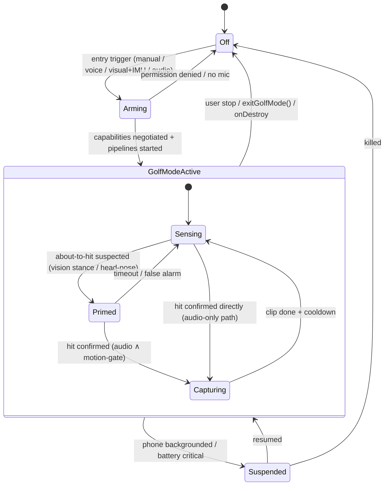

| From | Event | To | Source |
|------|-------|----|--------|
| Off | entry trigger | Arming | mode-entry FSM §3 |
| Arming | caps OK + pipelines up | GolfModeActive | `startGolfMode()` |
| Arming | mic permission missing | Off | `onStartCommand()` stops service |
| Sensing | stance/head-pose says "about to hit" | Primed | vision pipeline |
| Primed | hit confirmed | Capturing | `ShotDetectionEngine.Logged` |
| Capturing | clip finalized + cooldown | Sensing | recorder finalize §9 |
| GolfModeActive | user stop | Off | `GolfModeForegroundService.stop()` |

---

## 2. Ambient power-tier FSM

The power model from [`01 §7`](01_System_Architecture.md#7-power--data-tiering-model). Default is
Tier 0; the system briefly escalates and falls back.

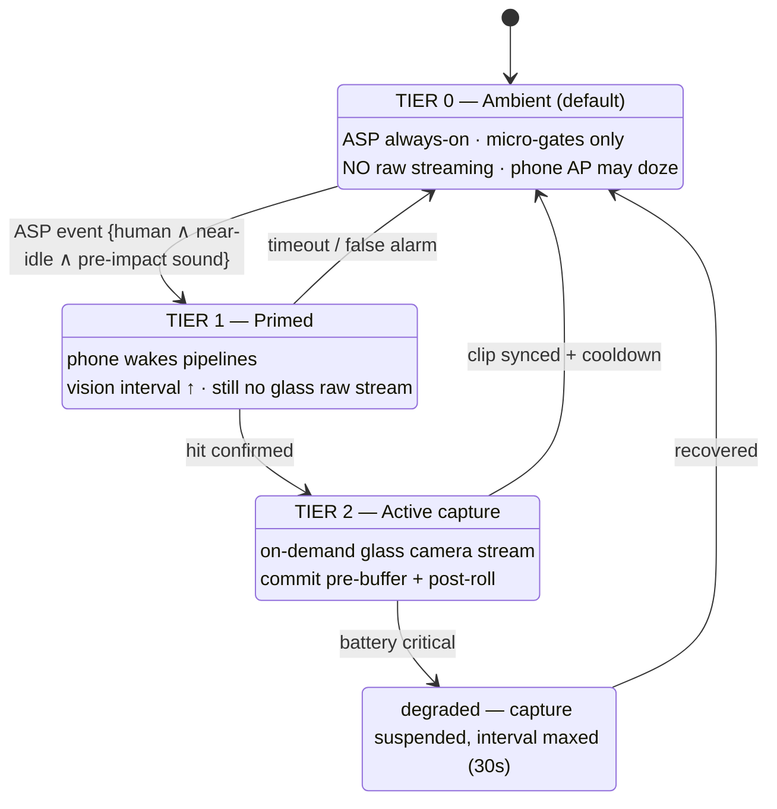

> 🅡 The Tier-0 ASP gating is the **target**. In today's POC the phone always runs the audio + motion
> pipelines while in Golf Mode; "Tier 0" maps to *idle listening* with vision at the 3 s interval.

---

## 3. Mode-entry FSM (4 entry paths)

Penke's four entry options. All converge on `GolfModeActive`.

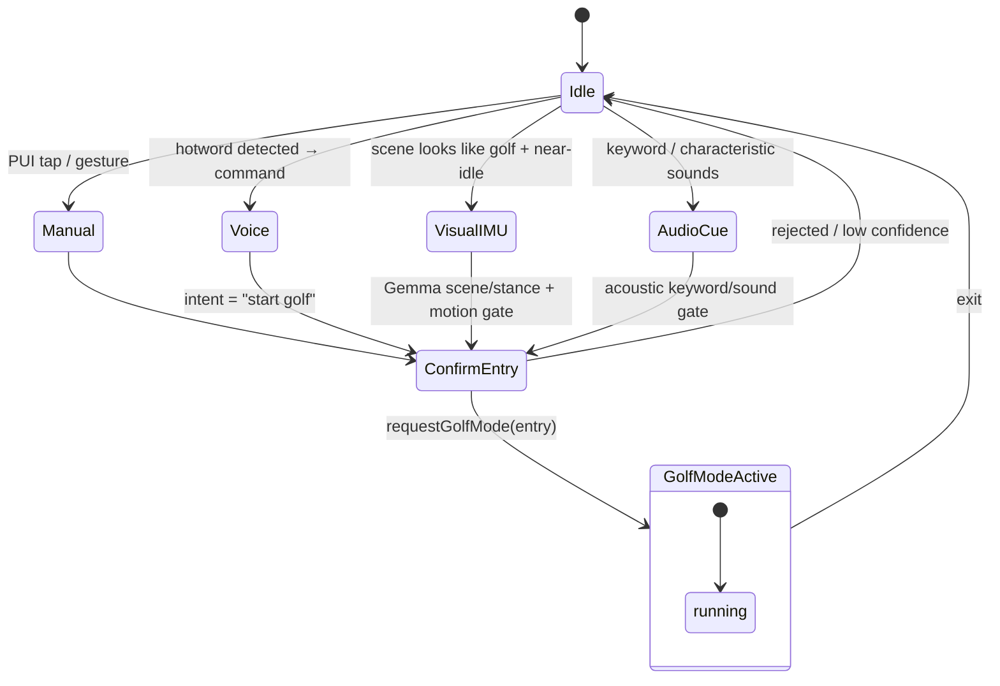

| Entry path | Trigger source | Confidence gate | Today |
|-----------|----------------|-----------------|-------|
| **Manual** | PUI / gesture | n/a (explicit) | ✅ (Home → Start Golf Mode) |
| **Voice** | hotword → ASR intent | intent conf | 🅡 |
| **Visual + IMU** | Gemma scene/stance + `MotionState` gate | stance + near-idle | partial (vision exists; auto-entry 🅡) |
| **Audio** | keyword / sound classifier | acoustic gate | 🅡 |

---

## 4. Foreground-service lifecycle

`GolfModeForegroundService` — the orchestrator. Code-accurate from `onCreate`/`onStartCommand`/
`startGolfMode`/`onDestroy`.

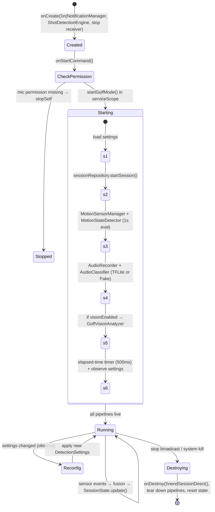

**Service facts:** `serviceScope = CoroutineScope(SupervisorJob() + Dispatchers.Default)`; ongoing
notification via `GolfModeNotificationManager`; elapsed-time tick every **500 ms**; event buffer in
`SessionState` capped at **50** events.

---

## 5. Shot-detection FSM (code-accurate)

The heart of the P0 "count shots" CUJ — `ShotDetectionEngine.evaluate(audioHitConfidence,
motionState, config)`. The engine itself is nearly stateless: its only state is
`lastLoggedShotTimestamp`. The FSM below makes the decision flow explicit.

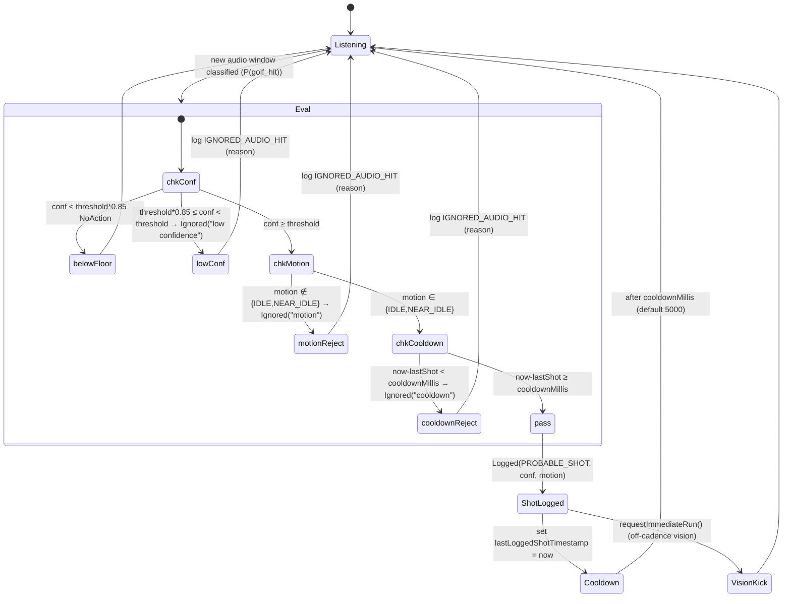

**Thresholds (verbatim)**

| Gate | Rule | Constant |
|------|------|----------|
| Audio threshold | `P(golf_hit) ≥ sensitivity.threshold()` | LOW `0.90` · NORMAL `0.80` (default) · HIGH `0.70` |
| Low-confidence band | `threshold*0.85 ≤ conf < threshold` ⇒ `Ignored("low confidence")` | `0.85` factor |
| Below floor | `conf < threshold*0.85` ⇒ `NoAction` (not even logged) | — |
| Motion gate | must be `IDLE` or `NEAR_IDLE` (if `motionGateEnabled`, default true) | — |
| Cooldown | `now - lastLoggedShotTimestamp ≥ cooldownMillis` | default `5000 ms` |
| Success | emit `Logged(EventType.PROBABLE_SHOT, conf, motionState)` | — |

**Result types:** `NoAction` · `Ignored(reason)` (persists `IGNORED_AUDIO_HIT` with the reason
string) · `Logged(...)` (persists `PROBABLE_SHOT`, increments shot count, kicks vision).

---

## 6. Motion-state FSM

`MotionSensorManager.classify(accelVar, gyroVar, recentSteps, msSinceLastStep)` — phone IMU
(accelerometer + gyroscope + step detector), evaluated every **1 s** by `MotionStateDetector`. This
is the **gate** that suppresses false hits while the golfer walks.

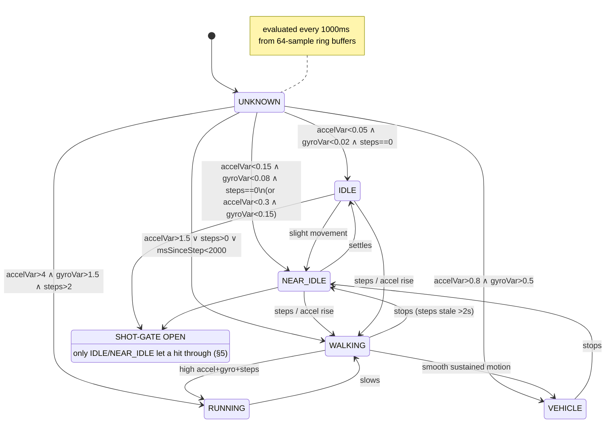

**Classification thresholds (verbatim, evaluation order = RUNNING → WALKING → VEHICLE → IDLE →
NEAR_IDLE → UNKNOWN)**

| State | Condition |
|-------|-----------|
| `RUNNING` | `accelVar > 4 ∧ gyroVar > 1.5 ∧ recentSteps > 2` |
| `WALKING` | `accelVar > 1.5 ∨ recentSteps > 0 ∨ msSinceLastStep < 2000` |
| `VEHICLE` | `accelVar > 0.8 ∧ gyroVar > 0.5` |
| `IDLE` | `accelVar < 0.05 ∧ gyroVar < 0.02 ∧ recentSteps == 0` |
| `NEAR_IDLE` | `accelVar < 0.15 ∧ gyroVar < 0.08 ∧ recentSteps == 0` **or** `accelVar < 0.3 ∧ gyroVar < 0.15` |
| `UNKNOWN` | otherwise |

Windows: steps "recent" if `< 3000 ms` old; step counter reset if `> 60000 ms` since last step.
Ring-buffer capacity 64 samples per axis.

---

## 7. Audio-status FSM

`AudioStatus` drives the live UI badge. Derived from classifier confidence vs. the active threshold.

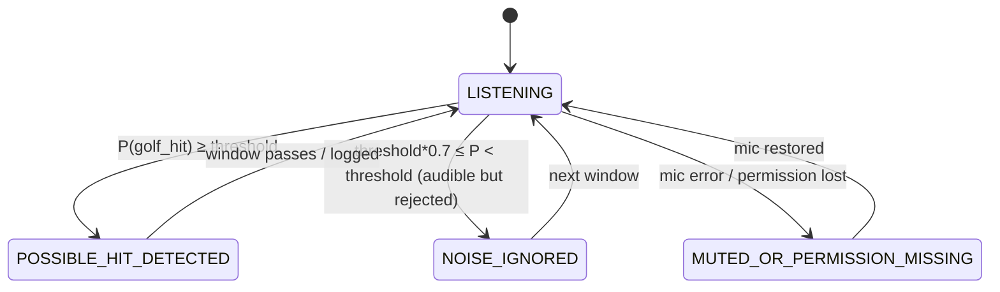

| State | Meaning |
|-------|---------|
| `LISTENING` | baseline, capturing 1 s windows @16 kHz (250 ms hop) |
| `POSSIBLE_HIT_DETECTED` | confidence cleared threshold (may still be gated by motion/cooldown) |
| `NOISE_IGNORED` | loud but sub-threshold |
| `MUTED_OR_PERMISSION_MISSING` | AudioRecord error / permission revoked |

---

## 8. Vision-status FSM

`VisionStatus` — lifecycle of the Gemma4 pipeline (`GolfVisionAnalyzer`).

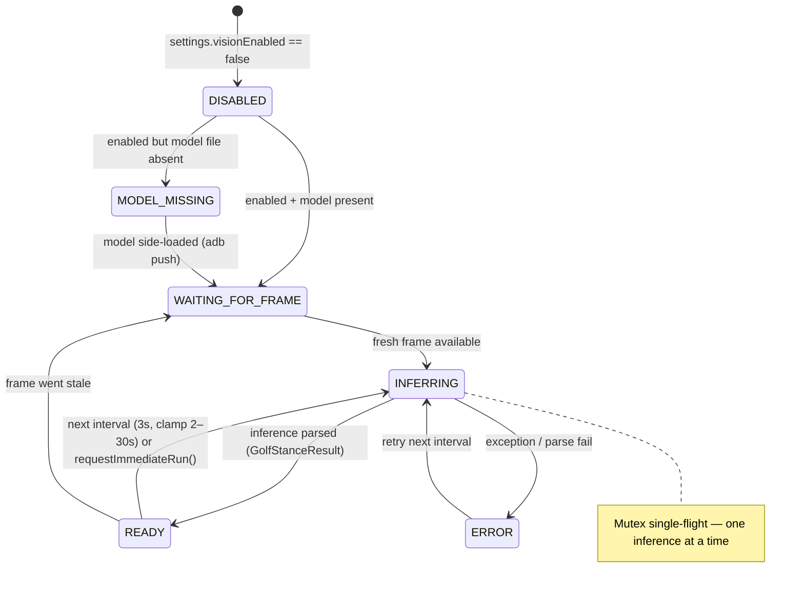

---

## 9. Recording / pre-buffer FSM

Two layers: **today's** on-phone CameraX clip recorder (`GolfAddressVideoRecorder`, 5 s), and the
**target** glass-side circular pre-buffer (commit-on-hit).

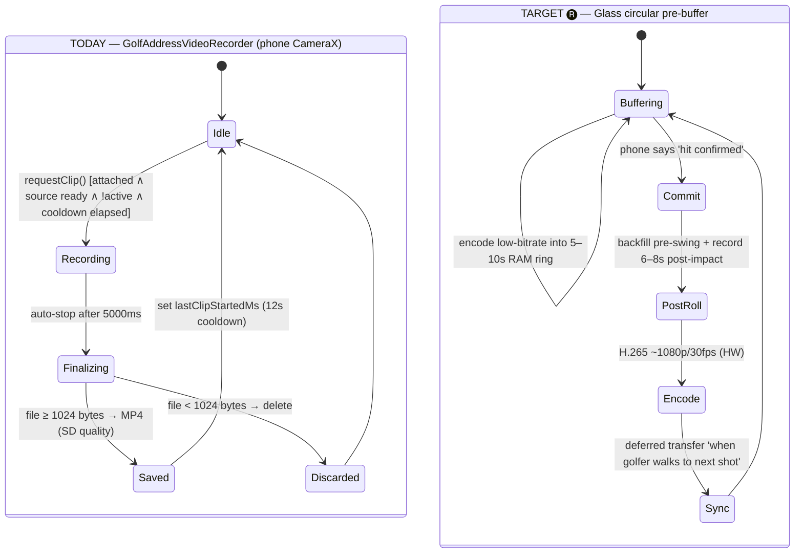

**Today's constants:** clip `5000 ms`, cooldown `12000 ms`, min size `1024 B`, quality `SD` with
fallback; precondition `isVideoSourceReady` (first frame received or preview streaming). Stance JPEG
snapshots use a separate `12000 ms` cooldown, quality 88, min 512 B.

---

## 10. Glasses camera connection & firmware FSM

Captures the **HaeAn/GG firmware fragility** (D10) and the Projected-API bind path
(`GolfCameraBindState`, `GlassesContextHelper`, `GolfCameraPreview`).

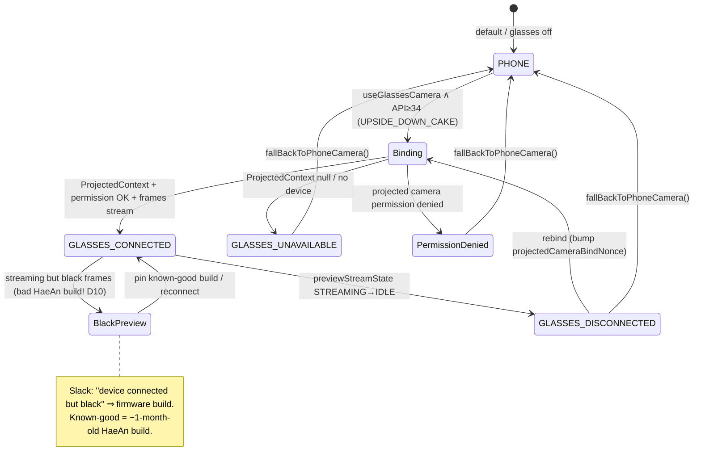

| State | Meaning |
|-------|---------|
| `PHONE` | using the phone camera (default / fallback) |
| `GLASSES_CONNECTED` | Projected device bound, frames streaming |
| `GLASSES_UNAVAILABLE` | no projected context / device not present |
| `GLASSES_DISCONNECTED` | was streaming, link dropped (STREAMING→IDLE) → dialog + rebind |
| *BlackPreview* (🅐 op-state) | "connected" but black frames ⇒ suspect firmware build |

`isVideoSourceReady` flips true only after the first frame (or preview streaming) — it gates clip
recording (§9).

---

## 11. On-demand glass-streaming FSM

The **D3 power contract** as a state machine: the glass radio link is dark by default and opens only
for a specific consumer, minimal modality, for a bounded time. This is the engine behind the critical
"phone triggers N-sec capture" flow ([`04 §7`](04_Sequence_Diagrams.md)).

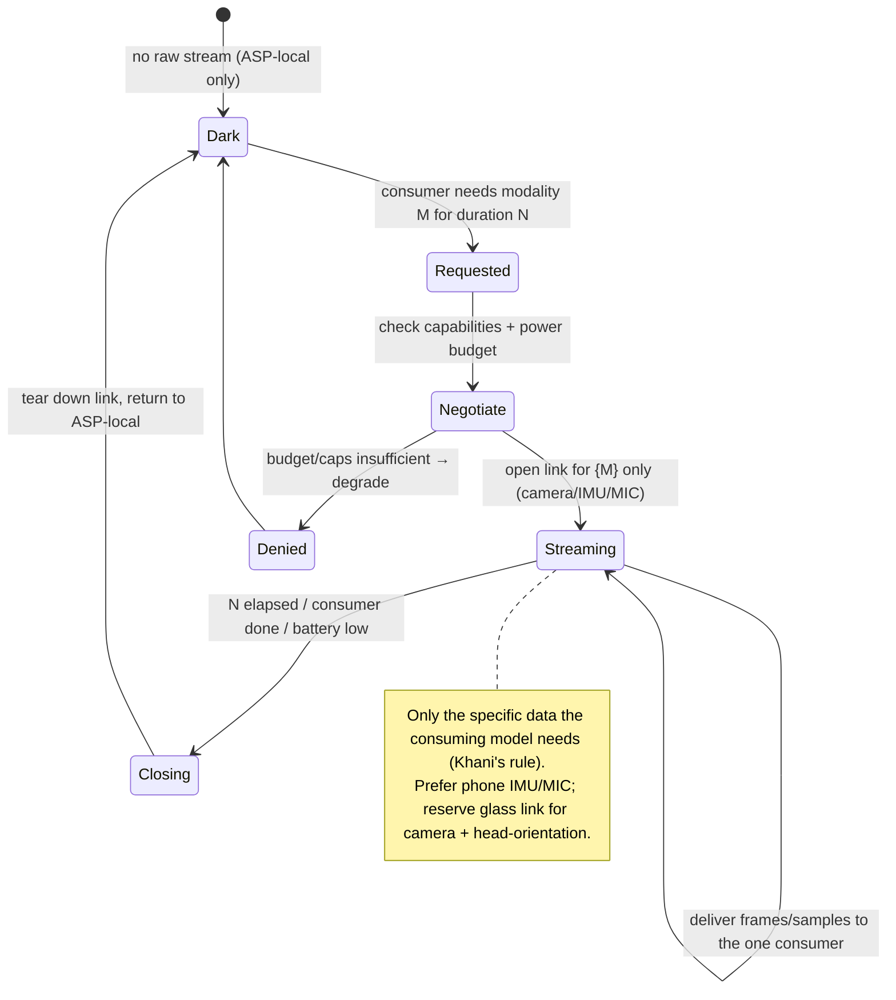

---

## 12. Session & shot-feedback lifecycle

The data lifecycle of a round and the human-in-the-loop correction of detected shots
(`GolfSession`, `ShotEvent`, `FeedbackType`).

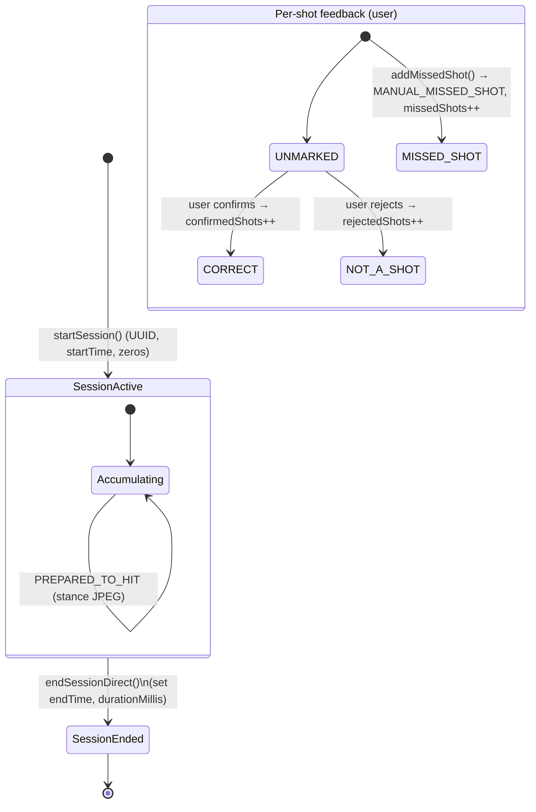

**Event types:** `PROBABLE_SHOT` · `POSSIBLE_SHOT` (reserved) · `IGNORED_AUDIO_HIT` ·
`MANUAL_MISSED_SHOT` · `PREPARED_TO_HIT`.
**Feedback types:** `UNMARKED` · `CORRECT` · `NOT_A_SHOT` · `MISSED_SHOT`.
Session counters: `totalProbableShots`, `confirmedShots`, `rejectedShots`, `missedShots`.

> 🅡 **Score** (vs. raw shot count) and **per-hole** segmentation are the natural extensions: bind
> shot events to a hole via GPS (`04 §11`) to turn the shot log into a scorecard.
