# 04 · Sequence Diagrams (Complete Catalog)

> **This chapter completes the incomplete v1 diagram.** The original `GolfCues-Sequence-Diagram-v1.png`
> (Luo) covered CUJ #10/#11 — *Live count shots / record* — **partially**, in one pass. This catalog
> re-derives that flow end-to-end **and** adds every other entry path and P0/P1 CUJ, the critical
> *phone-triggers-N-sec-glass-capture-and-retrieves-it* flow Penke flagged, capability negotiation,
> watch fusion, occlusion/erase-hat, post-round cloud analysis, and the error/recovery paths.
> Participant names map to POC classes. Tags: 🅡 roadmap · 🅐 assumption.

**Index**

| # | Sequence | CUJ | Status |
|---|----------|-----|:------:|
| 1 | [Pairing & capability negotiation](#1-pairing--capability-negotiation) | setup | 🅡 |
| 2 | [Golf-Mode entry — Manual (PUI/gesture)](#2-golf-mode-entry--manual-puigesture) | entry P0 | ✅ |
| 3 | [Golf-Mode entry — Voice / hotword](#3-golf-mode-entry--voice--hotword) | entry P1 | 🅡 |
| 4 | [Golf-Mode entry — Auto (Visual + IMU)](#4-golf-mode-entry--auto-visual--imu) | entry P0 | partial |
| 5 | [Service startup — pipeline bring-up](#5-service-startup--pipeline-bring-up) | infra | ✅ |
| 6 | [About-to-Hit prelude (vision priming + cue)](#6-about-to-hit-prelude-vision-priming--cue) | live coaching P1 | ✅ |
| 7 | [Hit detection → auto-record → count shot (completes v1)](#7-hit-detection--auto-record--count-shot-completes-v1) | **P0 #10/#11** | ✅ |
| 8 | [⭐ Phone-triggered N-sec glass capture → retrieve](#8--phone-triggered-n-sec-glass-capture--retrieve) | **critical** | 🅡 |
| 9 | [False-positive rejection paths](#9-false-positive-rejection-paths) | P0 robustness | ✅ |
| 10 | [Club detection](#10-club-detection) | P1 | partial |
| 11 | [Occlusion detection / Erase Hat](#11-occlusion-detection--erase-hat) | **P0** | 🅡 |
| 12 | [Hole / pin localization](#12-hole--pin-localization) | P1 | 🅡 |
| 13 | [Watch sensor-fusion confirm](#13-watch-sensor-fusion-confirm) | P1 | 🅡 |
| 14 | [User feedback & manual missed shot](#14-user-feedback--manual-missed-shot) | scoring | ✅ |
| 15 | [Glasses camera fault & fallback](#15-glasses-camera-fault--fallback) | robustness | ✅ |
| 16 | [End of round → post-round cloud analysis](#16-end-of-round--post-round-cloud-analysis) | P1/P2 | 🅡 |

---

## 1. Pairing & capability negotiation

Per Penke: *"Mobile device queries the capabilities of Golf-supported features from wearables."*

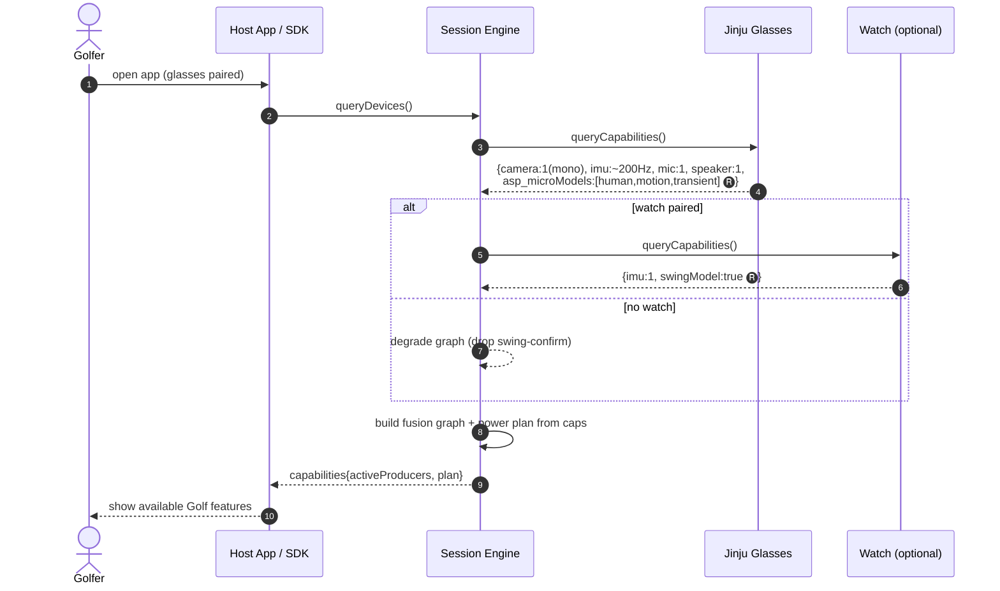

---

## 2. Golf-Mode entry — Manual (PUI/gesture)

The path that **works today** in the POC (Home → "Start Golf Mode").

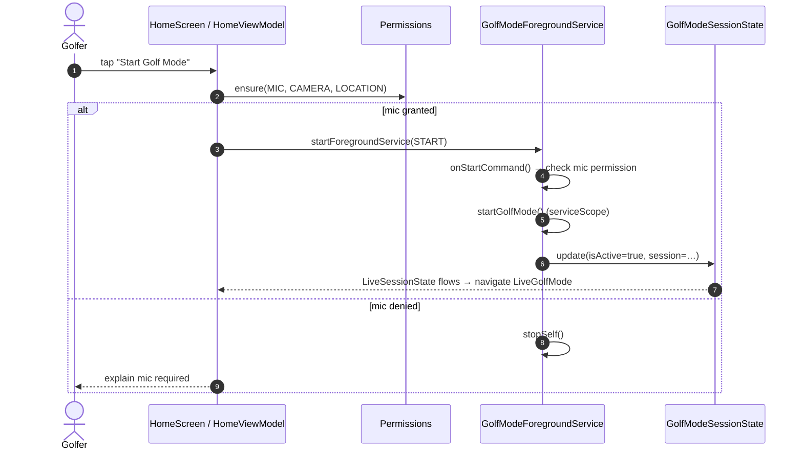

---

## 3. Golf-Mode entry — Voice / hotword

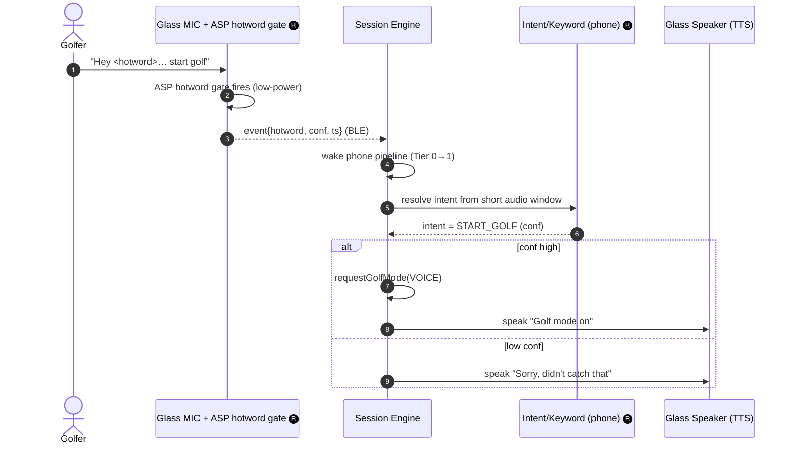

---

## 4. Golf-Mode entry — Auto (Visual + IMU)

Scene + sensor fusion. Vision exists today; **auto-entry** is roadmap. Maps to SCENARIO 1 of the
Cline-generated deck.

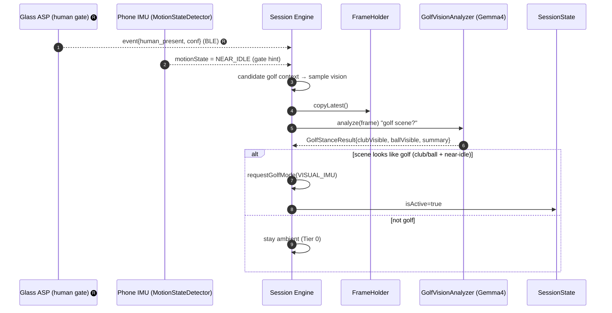

---

## 5. Service startup — pipeline bring-up

Code-accurate `startGolfMode()` fan-out (see [`03 §4`](03_State_Machines.md)).

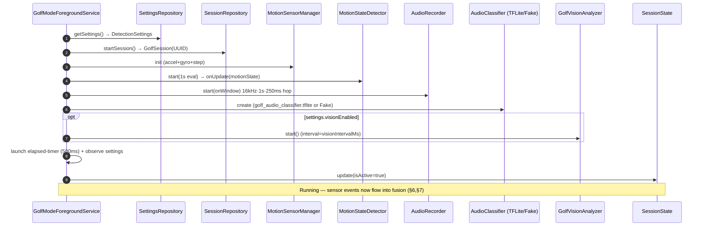

---

## 6. About-to-Hit prelude (vision priming + cue)

The **live-coaching** path: Gemma4 detects the golfer is set up and speaks an early cue. This *primes*
the engine (Tier 0→1) but is **not** the hard hit trigger.

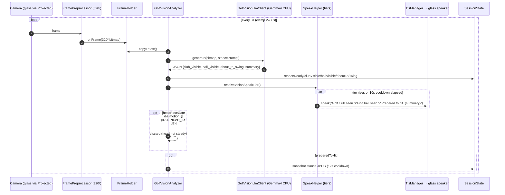

---

## 7. Hit detection → auto-record → count shot (completes v1)

**This is the v1 diagram, completed and made code-accurate.** It is the P0 #10/#11 loop:
*sense → detect hit → record clip → count shot → ready for next.*

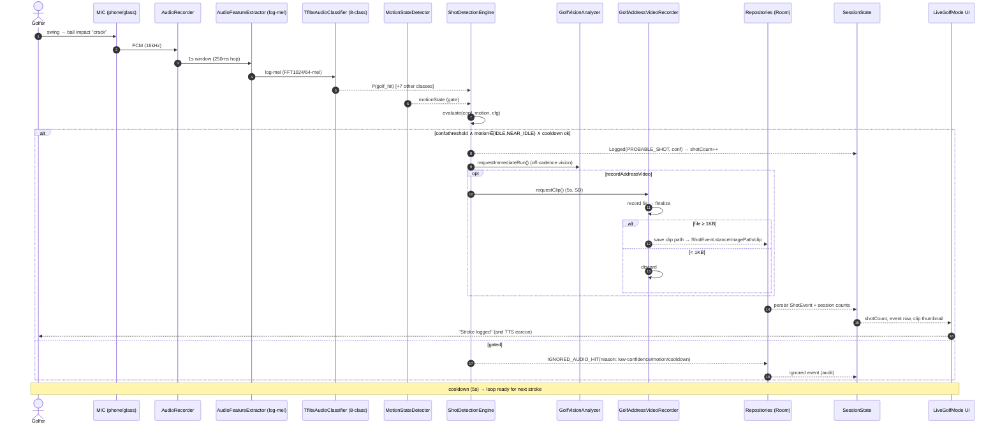

> **What v1 was missing and this adds:** the audio feature path (log-mel), the **8-class** classifier
> (not just "hit/no-hit"), the explicit **motion gate** and **cooldown**, the **ignored-event audit
> trail**, the **vision off-cadence kick**, the clip **finalize/discard** branch, and the persistence
> + UI propagation.

---

## 8. ⭐ Phone-triggered N-sec glass capture → retrieve

The flow Penke flagged: *"event from mobile → triggers a video capture on Glasses (N secs) → and
retrieve it onto the Phone. This is very important and we need to nail asap."* This is the **D3
on-demand streaming contract** (see [`03 §11`](03_State_Machines.md)) in action.

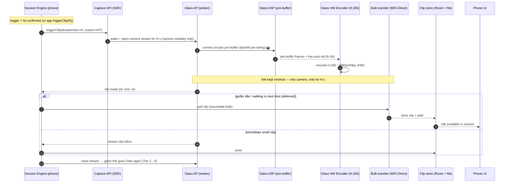

**Design contract:** open the link for **only the camera modality**, for **only N seconds**, to
**one consumer**; backfill from the ASP **pre-buffer** so the *pre-swing* is captured; **defer** the
bulk transfer to when the golfer walks ("not latency-critical"); then return the glass to the dark,
ASP-local ambient state.

---

## 9. False-positive rejection paths

P0 robustness — the course is noisy (carts, wind, footsteps, chatter). Shows all three rejection
branches and the audit trail.

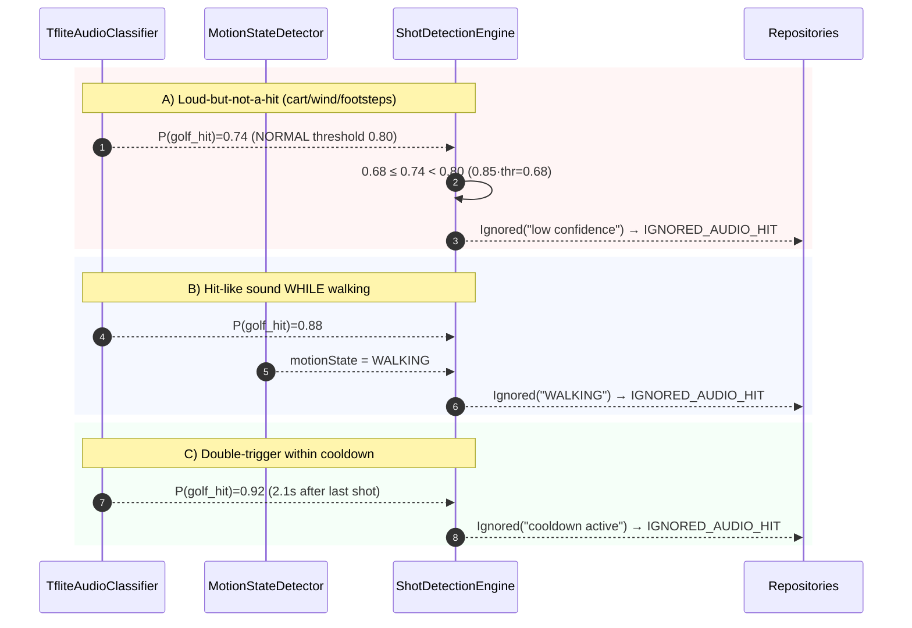

> The ignored events are **persisted with reasons** so the team can tune `sensitivity`,
> `motionGateEnabled`, and `cooldownMillis` from real-course data — and so a future fusion net has
> labeled negatives.

---

## 10. Club detection

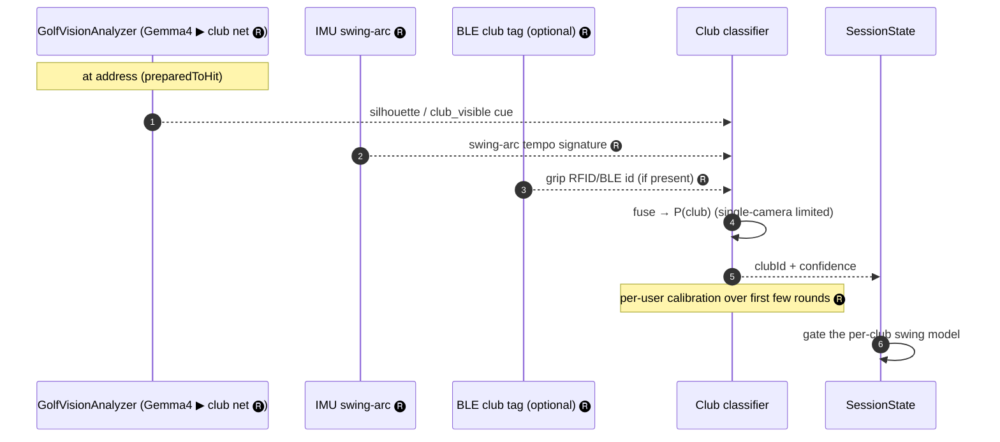

---

## 11. Occlusion detection / Erase Hat (P0)

Built by **SRIB**. Two outcomes: gate unreliable frames, or inpaint the hat.

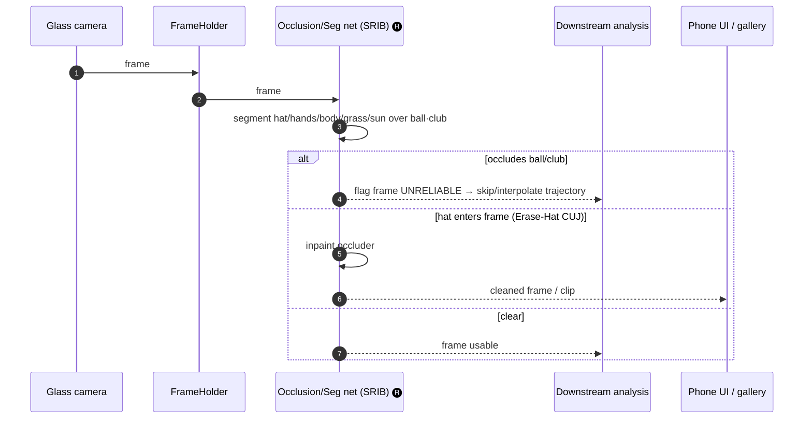

---

## 12. Hole / pin localization

The one case where the **glass IMU** is genuinely needed (Khani): head orientation + GPS.

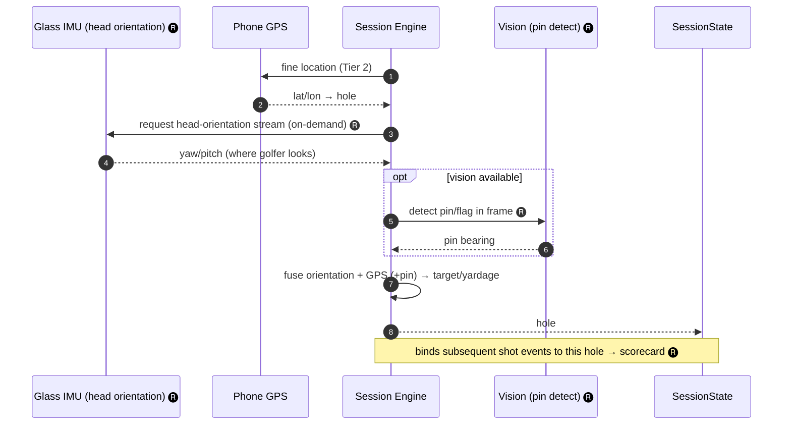

---

## 13. Watch sensor-fusion confirm

The UX team's Watch7 PoC streams IMU/audio over UDP; here it acts as an extra **hit confirm**.

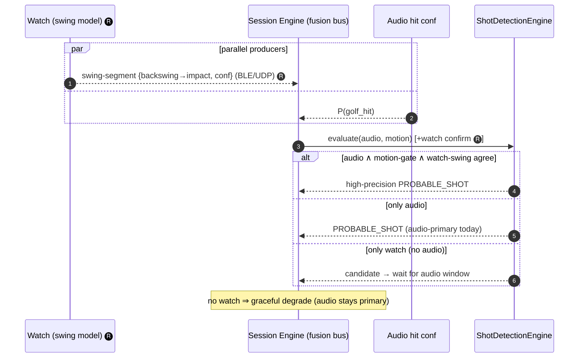

---

## 14. User feedback & manual missed shot

Human-in-the-loop scoring correction (`LiveGolfModeViewModel`).

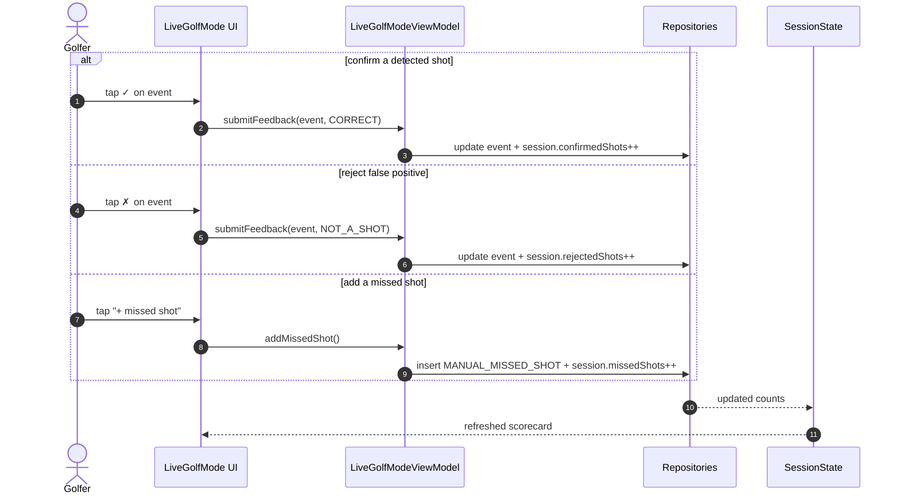

---

## 15. Glasses camera fault & fallback

The HaeAn/GG firmware reality (D10) — graceful fallback to the phone camera.

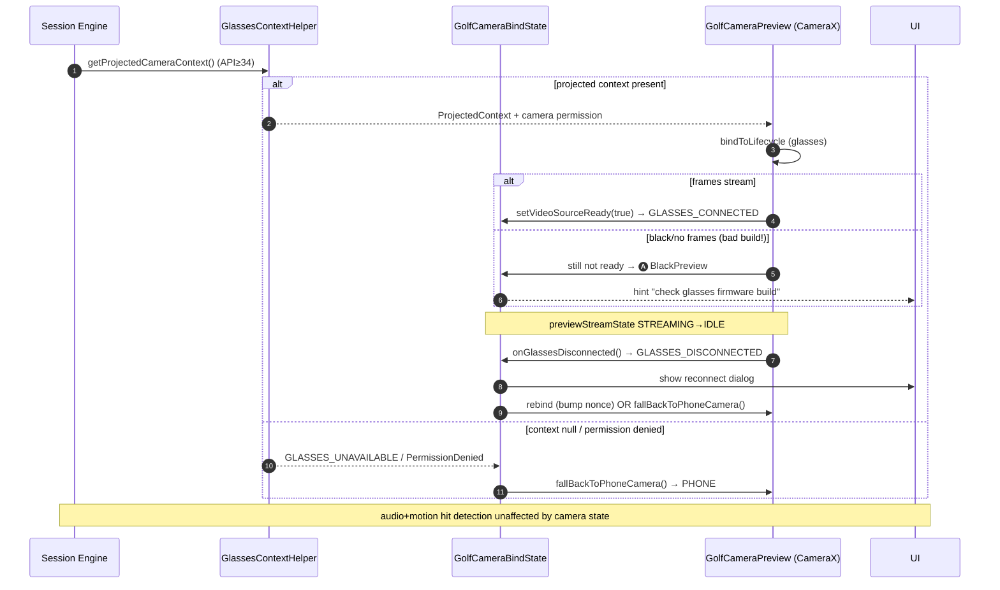

---

## 16. End of round → post-round cloud analysis

On-device first (D8); cloud is opt-in (slide 22). Closes Penke's "full gaming experience" loop.

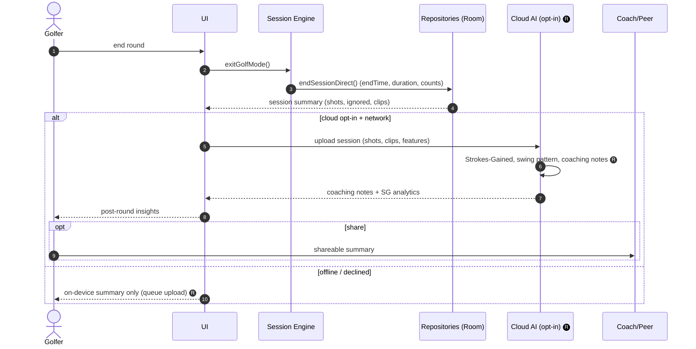

---

## Appendix · Cross-cutting legend

| Symbol | Meaning |
|--------|---------|
| solid arrow `->>` | synchronous call / event |
| dashed arrow `-->>` | return / async event |
| `par` / `alt` / `opt` | parallel / branch / optional Mermaid blocks |
| 🅡 | roadmap (not in POC yet) |
| 🅐 | assumption / operational state (not a code enum) |
| ⭐ | the critical "phone-triggers-glass-capture" flow |

> **Traceability:** every participant maps to a class in `com.golfcues.app.*` (see
> [`06_Glossary_and_Traceability.md`](06_Glossary_and_Traceability.md)); every 🅡 maps to a Slack
> decision or Tech-Overview statement, not to shipped code.
