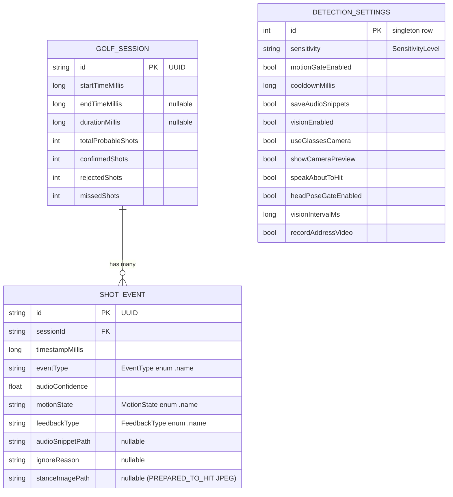
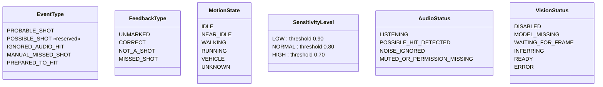
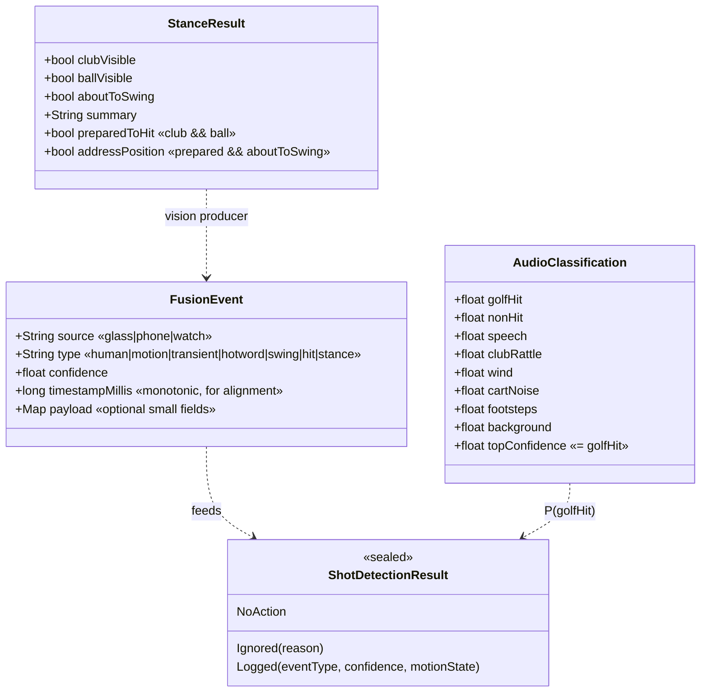
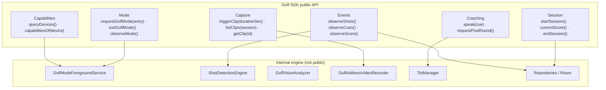
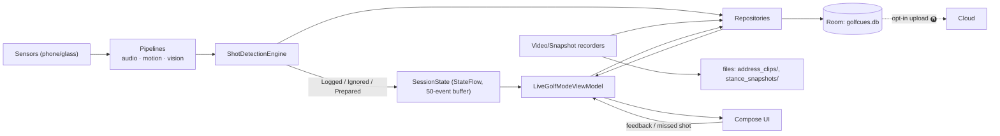

# 05 · Data Model & Public SDK API

> The persistence model is **verbatim from the POC** (`com.golfcues.app.data.*`,
> `domain.model.Models.kt`); the public SDK API is the **proposed** surface that wraps the engine
> for 3rd-party hosts (D9/D11). Tags: 🅡 roadmap · 🅐 assumption.

**Contents**
1. [Entity-relationship model (Room/SQLite)](#1-entity-relationship-model-roomsqlite)
2. [Domain enums (the vocabulary)](#2-domain-enums-the-vocabulary)
3. [Event & cue schemas (fusion bus)](#3-event--cue-schemas-fusion-bus)
4. [Public SDK API surface](#4-public-sdk-api-surface)
5. [Settings model](#5-settings-model)
6. [Data-flow & persistence lifecycle](#6-data-flow--persistence-lifecycle)

---

## 1. Entity-relationship model (Room/SQLite)

`GolfCuesDatabase` (`@Database version=4`, `golfcues.db`, `fallbackToDestructiveMigration()`),
three tables: `golf_sessions`, `shot_events`, `detection_settings`.

**Notes**

- Enums persist as `.name` strings (see `data/Mappers.kt`). Entity↔domain conversion is via extension
  functions (`toDomain()`/`toEntity()`).
- Repositories expose **`Flow`** reads (`observeSessions`, `observeEvents(sessionId)`,
  `observeSettings`) and suspend writes (`startSession`, `endSessionDirect`, `insertEvent`,
  `updateEvent`, `saveSettings`, `clearAllData`).
- 🅡 **Clip** rows (MP4 path, duration, hole #) and a **Hole/Scorecard** table are the natural
  additions to turn the shot log into a scorecard (`04 §12`). Today, clip/stance paths are columns on
  `SHOT_EVENT` + on-disk files under `externalFilesDir/GolfCues/{address_clips,stance_snapshots}`.

---

## 2. Domain enums (the vocabulary)

These are the **shared vocabulary** across the FSMs (doc 03), sequences (doc 04), and storage.

| Enum | Used by | Role |
|------|---------|------|
| `EventType` | `ShotEvent`, ShotDetectionEngine | what kind of event was logged |
| `FeedbackType` | `ShotEvent`, ViewModel | human correction of a shot |
| `MotionState` | MotionStateDetector → ShotDetectionEngine gate | the false-positive gate |
| `SensitivityLevel` | DetectionSettings → threshold | precision/recall knob |
| `AudioStatus` | SessionState → UI | live mic badge |
| `VisionStatus` | SessionState → UI | live vision badge |

---

## 3. Event & cue schemas (fusion bus)

The glass→phone and producer→fusion messages (D7). Kept tiny to honour the power rule (D3).

- **`AudioClassification`** is the real 8-class output of `TfliteAudioClassifier`; `topConfidence`
  (=`golfHit`) is what `ShotDetectionEngine` consumes.
- **`StanceResult`** is the parsed Gemma4 output (`GolfStanceResult`); `preparedToHit`/`addressPosition`
  are derived.
- **`FusionEvent`** 🅡 is the proposed normalized wire format for glass/watch producers — *small*
  `{source,type,conf,ts}` over BLE, not raw streams.

---

## 4. Public SDK API surface

The host-facing contract (D9, D11). It wraps the internal engine so GolfCues and 3rd-party apps share
one surface; the backing models (Gemma4 ▶ in-house) can change without breaking it.

| API group | Operation | Returns | Backed by | Status |
|-----------|-----------|---------|-----------|:------:|
| `Capabilities` | `queryDevices()` | `List<Device>` | negotiation (`01 §9`) | 🅡 |
| | `capabilitiesOf(device)` | `Capabilities` | " | 🅡 |
| `Mode` | `requestGolfMode(entry: EntryPath)` | `ModeResult` | Session Engine FSM (`03 §1,§3`) | ✅ manual |
| | `exitGolfMode()` | `Unit` | service stop | ✅ |
| | `observeMode()` | `Flow<ModeState>` | SessionState | ✅ |
| `Events` | `observeShots()` | `Flow<ShotEvent>` | engine + repo | ✅ |
| | `observeCues()` | `Flow<Cue>` | vision/TTS | ✅ |
| | `observeScore()` | `Flow<Score>` | repo counters | ✅ counts (🅡 score) |
| `Capture` | `triggerClip(durationSec)` | `ClipHandle` | recorder + glass capture (`04 §8`) | ✅ phone (🅡 glass) |
| | `listClips(session)` / `getClip(id)` | clips | repo + files | ✅ |
| `Coaching` | `speak(cue)` | `Unit` | TtsManager → glass speaker | ✅ |
| | `requestPostRound()` | `Flow<Insight>` | cloud opt-in (`04 §16`) | 🅡 |
| `Session` | `startSession()` / `endSession()` | `GolfSession` | repos | ✅ |
| | `currentScore()` | `Score` | counters | ✅ counts |

**Design rule:** the API speaks in **domain types** (`ShotEvent`, `MotionState`, `EntryPath`) and
**`Flow`** streams — never in model/runtime types (no `Interpreter`, no `litertlm.Engine` leaks). That
isolation is what lets the ML team swap Gemma4 for in-house nets (doc 02 §3) invisibly.

---

## 5. Settings model

`DetectionSettings` is the single tuning surface — observed live by the service (`03 §4` Reconfig).

| Field | Default | Controls | FSM/doc |
|-------|---------|----------|---------|
| `sensitivity` | `NORMAL` (0.80) | audio threshold | `03 §5` |
| `motionGateEnabled` | `true` | require IDLE/NEAR_IDLE for a hit | `03 §5,§6` |
| `cooldownMillis` | `5000` | min gap between shots | `03 §5` |
| `saveAudioSnippets` | `false` | persist audio clips for events | data |
| `visionEnabled` | `true` | run Gemma4 pipeline | `03 §8` |
| `useGlassesCamera` | `true` | glass vs phone camera | `03 §10` |
| `showCameraPreview` | `true` | bind a preview surface | `03 §10` |
| `speakAboutToHit` | `true` | TTS cues over glass speaker | `04 §6` |
| `headPoseGateEnabled` | `false` | discard stance unless head steady | `04 §6` |
| `visionIntervalMs` | `3000` (clamp 2000–30000) | vision cadence | `03 §8` |
| `recordAddressVideo` | `false` | auto-record 5 s address clip | `03 §9`, `04 §7` |

---

## 6. Data-flow & persistence lifecycle

**Two propagation channels:** the **hot path** (`SessionState` StateFlow → ViewModel → UI) for live
badges/counts, and the **durable path** (Repositories → Room → Flow reads) for history/detail. Files
(clips, JPEGs) live on disk with paths stored on the `SHOT_EVENT` row.
