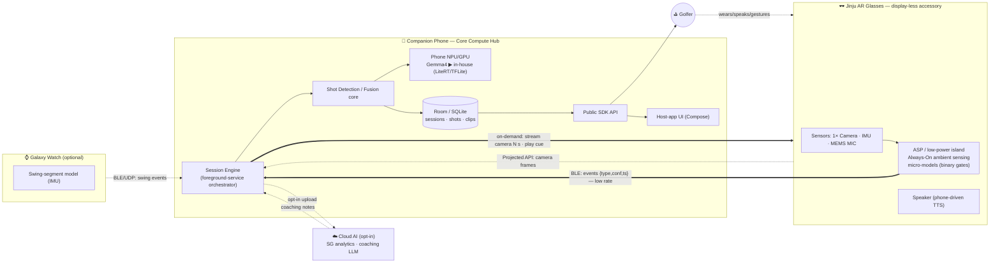

# Golf-SDK — Architecture & Design Documentation (V4)

**Project:** Golf-SDK — codename for the XR Solutions multi-device golf-sensing SDK
**Target device:** *Jinju* — **display-less** AR glasses (single camera · IMU · MIC · speaker), worn as a **phone accessory**
**Owning org:** XR Solutions Tech · contributions from XR UX Lab, Vision/Audio ML, and Sensor-Fusion
**Reference app:** `GolfCues` (POC) — `github.sec.samsung.net/RAM8-sra-mps-lab/ARG-MSV-Apps/tree/feat/golfcues/GolfCues`
**Document owner:** ML / Architecture working group
**Status:** **Draft v4** — complete, consolidated architecture (supersedes the partial v1 sequence diagram and the v3 set that left the state/sequence chapters unwritten)
**Last updated:** 2026-06-25

---

## 0. What this document set is — and what changed in V4

The Golf-SDK is **not an app**. It is an SDK that XR Solutions exposes to third-party golf apps
(and, internally, to the `GolfCues` reference app). It turns a phone + a pair of **display-less
AR glasses** (+ optionally a Galaxy Watch) into a **passive ambient golf-sensing system** that:

1. **Detects the golf context** and auto-enters *Golf Mode* (scene + sensor fusion).
2. **Senses the game** with low-power on-glass sensing (Camera / IMU / MIC), **gated to save power**.
3. **Detects shots** (hit detection) by fusing audio + IMU + vision.
4. **Auto-captures** short shot videos and **counts strokes / score**.
5. **Coaches** the player with real-time cues (audio over the glasses speaker) and post-round analysis.

> **What V4 adds over V3.** V3 delivered the system-architecture and ML-placement chapters but
> left the state machines, sequence diagrams, data model, and glossary as *promised-but-unwritten*
> stubs. **V4 completes the entire set**, deepens every chapter, grounds the state machines and
> sequences in the actual `GolfCues` POC source (`com.golfcues.app.*`), and **completes the
> incomplete v1 sequence diagram** (which covered only CUJ #10/#11 partially) across **all P0/P1
> CUJs** — including the "phone triggers an *N*-second glass capture and retrieves it" flow that
> Penke flagged as *"very important… we need to nail asap."*

---

## 1. Reading order

| # | Document | What it covers | Primary audience |
|---|----------|----------------|------------------|
| 0 | [`README.md`](README.md) | This index, the 60-second architecture, what's new in v4, the traceability spine | Everyone |
| 1 | [`01_System_Architecture.md`](01_System_Architecture.md) | C4 L1→L3, the on-phone SDK component model (grounded in POC code), glasses ASP/AP split, sensor-fusion bus, **power & data tiering**, transport stack, capability negotiation, concurrency model, failure & degradation, deployment | Architects, platform eng |
| 2 | [`02_ML_Model_Placement.md`](02_ML_Model_Placement.md) | **(ML-team focus)** which model runs where (glass ASP vs phone AP vs cloud), the *now* (Gemma4) → *future* (in-house) migration, per-CUJ model map, power/accuracy/latency trade matrix, hit/club/occlusion model design | **ML team** |
| 3 | [`03_State_Machines.md`](03_State_Machines.md) | Golf-Mode lifecycle, ambient power-tier FSM, 4-way mode-entry FSM, **shot-detection FSM (code-accurate)**, motion-state FSM, recording/pre-buffer FSM, on-demand glass-streaming FSM, session lifecycle, model lifecycle, connection/firmware FSM — with explicit transition tables | Eng, QA |
| 4 | [`04_Sequence_Diagrams.md`](04_Sequence_Diagrams.md) | 16 end-to-end sequence diagrams covering every entry path + every P0/P1 CUJ, the critical **phone→glass N-sec capture→retrieve** flow, capability negotiation, watch fusion, occlusion/erase-hat, post-round cloud analysis, error/recovery paths | Eng, QA, integrators |
| 5 | [`05_Data_Model_and_API.md`](05_Data_Model_and_API.md) | Room/SQLite ER model, event & cue schemas, the **public SDK API surface** (capabilities, mode, events, capture, coaching, session) | Integrators, eng |
| 6 | [`06_Glossary_and_Traceability.md`](06_Glossary_and_Traceability.md) | Glossary (SG, tempo, ASP, Projected API, HaeAn…) and a traceability map from every diagram back to its source doc / Slack message / code file | Everyone |

> **All diagrams are authored in [Mermaid](https://mermaid.js.org/)** so they render natively in
> Confluence, GitHub, and most Markdown viewers, and stay **diff-able and editable** (unlike the
> exported PNGs the team has been trading on Slack).

---

## 2. The 60-second architecture

**Five ideas that explain everything else**

1. **Phone is the brain, glasses are the senses.** Display-less + single camera ⇒ all feedback is
   *audio (glass speaker)* or the *phone UI*; all heavy compute is on the phone.
2. **Streaming costs power — so we don't stream by default.** The glass ASP runs always-on
   *micro-models* and emits only tiny `{event, confidence, timestamp}` messages. Raw Camera/IMU/MIC
   stream **on-demand, per-consumer, minimal-modality** (Khani's power rule).
3. **Mode-first.** A top-level *Golf-Mode* state machine with **4 entry paths** (manual / voice /
   visual+IMU / audio) gates every feature.
4. **Fusion, gracefully degrading.** Glasses + phone + watch publish time-stamped events with
   confidence onto a fusion bus; missing devices degrade the graph, they don't break it.
5. **Gemma4 now, in-house next.** A general VLM bootstraps every visual question via prompting;
   specialized nets replace it *scenario-by-scenario* behind a stable interface.

---

## 3. The CUJ → architecture spine

The whole design exists to serve the UX team's **Critical User Journeys** (CUJs). This table is
the spine that the rest of the docs hang off of.

| CUJ (UX) | Prio | Entry/trigger | Sensors | Where the ML runs | Docs |
|----------|:----:|---------------|---------|-------------------|------|
| **Enter Golf Mode** (scene detect) | P0 | visual+IMU / voice / manual / audio | glass cam, IMU, MIC | glass micro-gate → phone Gemma4 | [03 §3](03_State_Machines.md) · [04 §1–4](04_Sequence_Diagrams.md) |
| **Start/End Video Recording + Count Shots/Score** | **P0** | hit detection (audio∧motion-gate) | MIC + IMU (+vision prime) | phone TFLite audio + fusion | [03 §5–6](03_State_Machines.md) · [04 §5–7](04_Sequence_Diagrams.md) |
| **Erase Hat / Occlusion** | **P0** | in-frame occluder | glass cam | phone occlusion/seg net (**SRIB**) | [02 §6.3](02_ML_Model_Placement.md) · [04 §9](04_Sequence_Diagrams.md) |
| **Club Detection** | P1 | at address | IMU arc + vision (+BLE tag) | phone Gemma4 ▶ club net | [02 §6.2](02_ML_Model_Placement.md) · [04 §8](04_Sequence_Diagrams.md) |
| **About-to-Hit / posture (Live coaching)** | P1 | vision stance + head-pose | cam + IMU | phone Gemma4 stance → TTS | [04 §6](04_Sequence_Diagrams.md) |
| **Hole / Pin localization** | P1 | head orientation + GPS | **glass IMU** + phone GPS | phone fuse + vision pin | [04 §11](04_Sequence_Diagrams.md) |
| **Post-round analysis / Strokes-Gained** | P1/P2 | end of round | aggregate | **cloud** LLM + SG | [04 §12](04_Sequence_Diagrams.md) |
| **Voice command / hotword entry** | P1 | hotword | MIC | glass hotword gate → phone intent | [04 §3](04_Sequence_Diagrams.md) |

> **P0 P0 P0** — the CUJ spreadsheet pins **Erase Hat (occlusion)** and **Start/End Recording +
> Count Shots/Score** as the two P0s. Occlusion is being built by **SRIB**; the recording+count
> loop is already partly implemented in the `GolfCues` POC.

---

## 4. Grounding & provenance

This is a **design synthesis**, not a re-export. Everything traces to one of:

- **`COMMON/` source docs** — `Golf-SDK_Tech_Overview.docx`, `0528_XRUXLab_Golf_CUJs.pdf`,
  `Golf-UI-Flow.pdf`, `Golf_SDK_CUJ_Tasks.xlsx`, `0617_Special_Modes_for_Post_Jinju_Final_Share.pdf`,
  the `GolfCues` demo recording, and the Siva meeting audio.
- **`slack-channel__golf-ideation.txt`** — the design decisions made in the `#golf-ideation` channel
  (Penke, Khani, Luo, Patel, Chen, Gurenkova, Waghulde).
- **The `GolfCues` POC source** (`com.golfcues.app.*`) — the component names, state names, thresholds,
  and pipelines in docs 01/03/04/05 map **1:1** to real code so the architecture is *buildable*,
  not aspirational.

The full diagram-to-source map lives in [`06_Glossary_and_Traceability.md`](06_Glossary_and_Traceability.md).

> ⚠️ Where the source material is silent or contradictory (e.g. exact ASP micro-model list, future
> glass-IMU streaming), the docs **mark the item as roadmap/assumption** rather than asserting it as
> shipped. Look for the 🅡 *roadmap* and 🅐 *assumption* tags.
